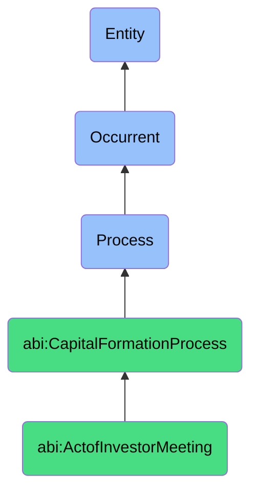

# ActofInvestorMeeting

## Definition
An act of investor meeting is an occurrent process that unfolds through time, involving a structured or semi-structured interaction between a company's representatives and current or potential investors, during which the company presents its business model, value proposition, financial performance, market opportunity, and funding requirements, while addressing questions, clarifying details, and establishing rapport to advance an investment relationship.

## Hierarchy in BFO


## Ontological Schema (TBox)
```turtle
abi:ActofInvestorMeeting a owl:Class ;
  rdfs:subClassOf abi:CapitalFormationProcess ;
  rdfs:label "Act of Investor Meeting" ;
  skos:definition "A formal process of presenting the business to potential or current investors." .

abi:CapitalFormationProcess a owl:Class ;
  rdfs:subClassOf bfo:0000015 ;
  rdfs:label "Capital Formation Process" ;
  skos:definition "A time-bound process related to attracting, securing, and managing financial investments from external sources." .

abi:has_company_presenter a owl:ObjectProperty ;
  rdfs:domain abi:ActofInvestorMeeting ;
  rdfs:range abi:CompanyPresenter ;
  rdfs:label "has company presenter" .

abi:engages_investor_participant a owl:ObjectProperty ;
  rdfs:domain abi:ActofInvestorMeeting ;
  rdfs:range abi:InvestorParticipant ;
  rdfs:label "engages investor participant" .

abi:follows_meeting_format a owl:ObjectProperty ;
  rdfs:domain abi:ActofInvestorMeeting ;
  rdfs:range abi:MeetingFormat ;
  rdfs:label "follows meeting format" .

abi:presents_company_information a owl:ObjectProperty ;
  rdfs:domain abi:ActofInvestorMeeting ;
  rdfs:range abi:CompanyInformation ;
  rdfs:label "presents company information" .

abi:utilizes_presentation_materials a owl:ObjectProperty ;
  rdfs:domain abi:ActofInvestorMeeting ;
  rdfs:range abi:PresentationMaterials ;
  rdfs:label "utilizes presentation materials" .

abi:addresses_investor_inquiry a owl:ObjectProperty ;
  rdfs:domain abi:ActofInvestorMeeting ;
  rdfs:range abi:InvestorInquiry ;
  rdfs:label "addresses investor inquiry" .

abi:results_in_meeting_outcome a owl:ObjectProperty ;
  rdfs:domain abi:ActofInvestorMeeting ;
  rdfs:range abi:MeetingOutcome ;
  rdfs:label "results in meeting outcome" .

abi:has_meeting_date a owl:DatatypeProperty ;
  rdfs:domain abi:ActofInvestorMeeting ;
  rdfs:range xsd:dateTime ;
  rdfs:label "has meeting date" .

abi:has_meeting_duration a owl:DatatypeProperty ;
  rdfs:domain abi:ActofInvestorMeeting ;
  rdfs:range xsd:duration ;
  rdfs:label "has meeting duration" .

abi:has_investor_interest_level a owl:DatatypeProperty ;
  rdfs:domain abi:ActofInvestorMeeting ;
  rdfs:range xsd:string ;
  rdfs:label "has investor interest level" .
```

## Ontological Instance (ABox)
```turtle
ex:SeriesAPartnerMeeting a abi:ActofInvestorMeeting ;
  rdfs:label "Series A Venture Capital Partner Meeting" ;
  abi:has_company_presenter ex:ChiefExecutiveOfficer, ex:ChiefTechnologyOfficer, ex:ChiefFinancialOfficer ;
  abi:engages_investor_participant ex:VentureCapitalManagingPartner, ex:PrincipalInvestor, ex:AssociateAnalyst ;
  abi:follows_meeting_format ex:FormalPitchPresentation, ex:QASession, ex:ProductDemonstration ;
  abi:presents_company_information ex:GrowthMetrics, ex:ProductRoadmap, ex:CompetitiveAnalysis, ex:FinancialProjections ;
  abi:utilizes_presentation_materials ex:InvestorPitchDeck, ex:LiveProductDemo, ex:MarketSizingAnalysis ;
  abi:addresses_investor_inquiry ex:ScalabilityQuestion, ex:UnitEconomicsQuestion, ex:DefensibilityQuestion ;
  abi:results_in_meeting_outcome ex:FollowupDueDiligenceRequest, ex:PartnerDiscussionInvitation ;
  abi:has_meeting_date "2023-07-12T14:00:00Z"^^xsd:dateTime ;
  abi:has_meeting_duration "PT1H30M"^^xsd:duration ;
  abi:has_investor_interest_level "High - Proceeding to IC discussion" .

ex:StrategicInvestorBoardroomMeeting a abi:ActofInvestorMeeting ;
  rdfs:label "Strategic Corporate Investor Boardroom Meeting" ;
  abi:has_company_presenter ex:FounderCEO, ex:HeadOfBusinessDevelopment ;
  abi:engages_investor_participant ex:CorporateVentureDirector, ex:HeadOfStrategy, ex:ProductIntegrationTeam ;
  abi:follows_meeting_format ex:ExecutiveBriefing, ex:StrategicSynergiesDiscussion, ex:TechnicalDeepDive ;
  abi:presents_company_information ex:StrategicVisionAlignment, ex:PartnershipOpportunities, ex:TechnologyIntegration ;
  abi:utilizes_presentation_materials ex:StrategicAlignmentDeck, ex:TechnicalArchitectureDiagrams, ex:MarketShareAnalysis ;
  abi:addresses_investor_inquiry ex:IntegrationTimelineQuestion, ex:ResourceRequirementsQuestion, ex:MarketPositioningQuestion ;
  abi:results_in_meeting_outcome ex:TechnicalTeamFollowup, ex:TermSheetPreparation ;
  abi:has_meeting_date "2023-08-25T10:00:00Z"^^xsd:dateTime ;
  abi:has_meeting_duration "PT2H"^^xsd:duration ;
  abi:has_investor_interest_level "Very High - Moving to term sheet negotiation" .
```

## Related Classes
- **abi:ActofCapitalRaising** - A broader process that includes investor meetings as a key component.
- **abi:ActofInvestorOutreach** - A process that typically precedes and facilitates investor meetings.
- **abi:ActofFundraisingCommunication** - A process that produces materials used in investor meetings.
- **abi:ActofDueDiligence** - A process that often follows a successful investor meeting.
- **abi:ActofTermSheetNegotiation** - A process that may be initiated after promising investor meetings.
- **abi:PresentationPreparationProcess** - A process for preparing for investor meetings.
- **abi:InvestorFollowupProcess** - A process that occurs after investor meetings to maintain momentum. 