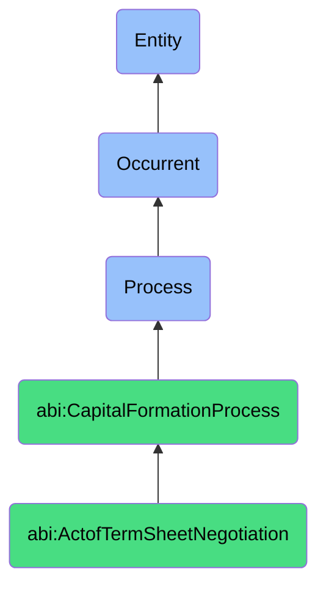

# ActofTermSheetNegotiation

## Definition
An act of term sheet negotiation is an occurrent process that unfolds through time, involving the iterative discussion, proposal, counter-proposal, and compromise between a company and potential investors regarding the key economic, governance, and legal parameters of an investment transaction, including valuation, investment amount, ownership stake, investor rights, board composition, liquidation preferences, and other critical terms that will form the basis of definitive investment agreements.

## Hierarchy in BFO


## Ontological Schema (TBox)
```turtle
abi:ActofTermSheetNegotiation a owl:Class ;
  rdfs:subClassOf abi:CapitalFormationProcess ;
  rdfs:label "Act of Term Sheet Negotiation" ;
  skos:definition "A process in which investment terms are discussed, revised, and agreed upon." .

abi:CapitalFormationProcess a owl:Class ;
  rdfs:subClassOf bfo:0000015 ;
  rdfs:label "Capital Formation Process" ;
  skos:definition "A time-bound process related to attracting, securing, and managing financial investments from external sources." .

abi:has_company_negotiator a owl:ObjectProperty ;
  rdfs:domain abi:ActofTermSheetNegotiation ;
  rdfs:range abi:CompanyNegotiator ;
  rdfs:label "has company negotiator" .

abi:has_investor_negotiator a owl:ObjectProperty ;
  rdfs:domain abi:ActofTermSheetNegotiation ;
  rdfs:range abi:InvestorNegotiator ;
  rdfs:label "has investor negotiator" .

abi:discusses_investment_term a owl:ObjectProperty ;
  rdfs:domain abi:ActofTermSheetNegotiation ;
  rdfs:range abi:InvestmentTerm ;
  rdfs:label "discusses investment term" .

abi:employs_negotiation_tactic a owl:ObjectProperty ;
  rdfs:domain abi:ActofTermSheetNegotiation ;
  rdfs:range abi:NegotiationTactic ;
  rdfs:label "employs negotiation tactic" .

abi:receives_legal_advice a owl:ObjectProperty ;
  rdfs:domain abi:ActofTermSheetNegotiation ;
  rdfs:range abi:LegalAdvice ;
  rdfs:label "receives legal advice" .

abi:produces_term_sheet_version a owl:ObjectProperty ;
  rdfs:domain abi:ActofTermSheetNegotiation ;
  rdfs:range abi:TermSheetVersion ;
  rdfs:label "produces term sheet version" .

abi:results_in_negotiation_outcome a owl:ObjectProperty ;
  rdfs:domain abi:ActofTermSheetNegotiation ;
  rdfs:range abi:NegotiationOutcome ;
  rdfs:label "results in negotiation outcome" .

abi:has_negotiation_start_date a owl:DatatypeProperty ;
  rdfs:domain abi:ActofTermSheetNegotiation ;
  rdfs:range xsd:date ;
  rdfs:label "has negotiation start date" .

abi:has_negotiation_round_count a owl:DatatypeProperty ;
  rdfs:domain abi:ActofTermSheetNegotiation ;
  rdfs:range xsd:integer ;
  rdfs:label "has negotiation round count" .

abi:has_final_valuation a owl:DatatypeProperty ;
  rdfs:domain abi:ActofTermSheetNegotiation ;
  rdfs:range xsd:decimal ;
  rdfs:label "has final valuation" .
```

## Ontological Instance (ABox)
```turtle
ex:SeriesBVentureCapitalTermNegotiation a abi:ActofTermSheetNegotiation ;
  rdfs:label "Series B Venture Capital Term Sheet Negotiation" ;
  abi:has_company_negotiator ex:CompanyCEO, ex:CompanyCFO, ex:OutsideCorporateCounsel ;
  abi:has_investor_negotiator ex:LeadVCPartner, ex:VCAssociate, ex:InvestorLegalCounsel ;
  abi:discusses_investment_term ex:PreMoneyValuation, ex:LiquidationPreference, ex:InvestorProtectiveProvisions, ex:BoardComposition, ex:VestingAcceleration ;
  abi:employs_negotiation_tactic ex:MultipleTermTradeoffs, ex:BenchmarkComparisons, ex:DemonstrationOfAlternatives ;
  abi:receives_legal_advice ex:InvestorRightsAnalysis, ex:DownsideProtectionReview, ex:ControlImplicationsAdvice ;
  abi:produces_term_sheet_version ex:InitialTermSheet, ex:CompanyCounterproposal, ex:InvestorRevision, ex:FinalAgreedTerms ;
  abi:results_in_negotiation_outcome ex:MutuallyAcceptedTermSheet ;
  abi:has_negotiation_start_date "2023-10-05"^^xsd:date ;
  abi:has_negotiation_round_count "4"^^xsd:integer ;
  abi:has_final_valuation "75000000.00"^^xsd:decimal .

ex:ConvertibleNoteTermNegotiation a abi:ActofTermSheetNegotiation ;
  rdfs:label "Convertible Note Bridge Financing Term Negotiation" ;
  abi:has_company_negotiator ex:StartupFounder, ex:CompanyAttorney ;
  abi:has_investor_negotiator ex:AngelInvestorGroup, ex:SeedFundPartner ;
  abi:discusses_investment_term ex:ConversionDiscount, ex:ValuationCap, ex:InterestRate, ex:MaturityDate, ex:QualifyingTransactionDefinition ;
  abi:employs_negotiation_tactic ex:RelationshipLeveraging, ex:UrgencyFraming, ex:CompetitiveTermPresentation ;
  abi:receives_legal_advice ex:StructuringOptions, ex:FutureDilutionImpactAnalysis ;
  abi:produces_term_sheet_version ex:StandardNoteTerms, ex:FounderRevisions, ex:FinalConvertibleNoteTerms ;
  abi:results_in_negotiation_outcome ex:SignedNoteTermSheet ;
  abi:has_negotiation_start_date "2023-07-15"^^xsd:date ;
  abi:has_negotiation_round_count "3"^^xsd:integer ;
  abi:has_final_valuation "8000000.00"^^xsd:decimal .
```

## Related Classes
- **abi:ActofCapitalRaising** - A broader process that includes term sheet negotiation as a key phase.
- **abi:ActofDueDiligence** - A process that typically precedes or occurs in parallel with term negotiation.
- **abi:ActofClosingInvestment** - A process that follows successful term sheet negotiation.
- **abi:LegalDocumentationProcess** - A process that formalizes the agreed terms into binding agreements.
- **abi:ValuationProcess** - A process that informs the financial terms being negotiated.
- **abi:CapTableModelingProcess** - A process for analyzing the impact of proposed terms on ownership.
- **abi:NegotiationStrategyDevelopmentProcess** - A process for planning negotiating positions and approaches. 