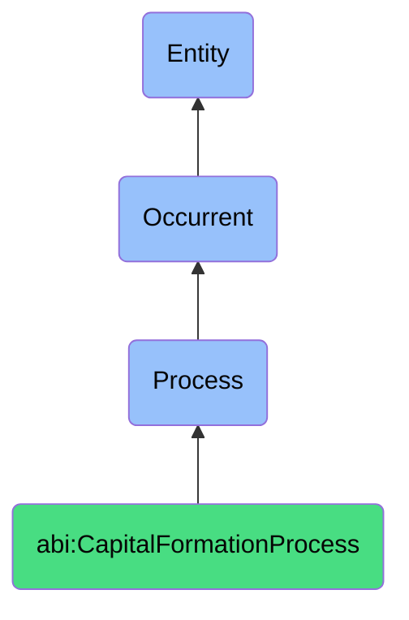

# CapitalFormationProcess

## Definition
A capital formation process is an occurrent that unfolds through time, involving structured activities aimed at attracting, securing, and managing financial investment from external sources to provide a company with the capital necessary for operations, growth, expansion, or other strategic initiatives, encompassing investor identification, engagement, negotiation, and transaction completion.

## Hierarchy in BFO


## Ontological Schema (TBox)
```turtle
abi:CapitalFormationProcess a owl:Class ;
  rdfs:subClassOf bfo:0000015 ;
  rdfs:label "Capital Formation Process" ;
  skos:definition "A time-bound process related to attracting, securing, and managing financial investments from external sources." .

abi:has_capital_formation_agent a owl:ObjectProperty ;
  rdfs:domain abi:CapitalFormationProcess ;
  rdfs:range abi:CapitalFormationAgent ;
  rdfs:label "has capital formation agent" .

abi:targets_investor_entity a owl:ObjectProperty ;
  rdfs:domain abi:CapitalFormationProcess ;
  rdfs:range abi:InvestorEntity ;
  rdfs:label "targets investor entity" .

abi:follows_investment_strategy a owl:ObjectProperty ;
  rdfs:domain abi:CapitalFormationProcess ;
  rdfs:range abi:InvestmentStrategy ;
  rdfs:label "follows investment strategy" .

abi:involves_financial_instrument a owl:ObjectProperty ;
  rdfs:domain abi:CapitalFormationProcess ;
  rdfs:range abi:FinancialInstrument ;
  rdfs:label "involves financial instrument" .

abi:operates_under_regulatory_framework a owl:ObjectProperty ;
  rdfs:domain abi:CapitalFormationProcess ;
  rdfs:range abi:RegulatoryFramework ;
  rdfs:label "operates under regulatory framework" .

abi:produces_investment_document a owl:ObjectProperty ;
  rdfs:domain abi:CapitalFormationProcess ;
  rdfs:range abi:InvestmentDocument ;
  rdfs:label "produces investment document" .

abi:results_in_capital_outcome a owl:ObjectProperty ;
  rdfs:domain abi:CapitalFormationProcess ;
  rdfs:range abi:CapitalOutcome ;
  rdfs:label "results in capital outcome" .

abi:has_capital_target_amount a owl:DatatypeProperty ;
  rdfs:domain abi:CapitalFormationProcess ;
  rdfs:range xsd:decimal ;
  rdfs:label "has capital target amount" .

abi:has_investment_time_horizon a owl:DatatypeProperty ;
  rdfs:domain abi:CapitalFormationProcess ;
  rdfs:range xsd:string ;
  rdfs:label "has investment time horizon" .

abi:has_valuation_parameter a owl:DatatypeProperty ;
  rdfs:domain abi:CapitalFormationProcess ;
  rdfs:range xsd:string ;
  rdfs:label "has valuation parameter" .
```

## Ontological Instance (ABox)
```turtle
# CapitalFormationProcess is a parent class with subclasses:
# - abi:ActofCapitalRaising
# - abi:ActofInvestorOutreach
# - abi:ActofFundraisingCommunication
# - abi:ActofInvestorMeeting
# - abi:ActofDueDiligence
# - abi:ActofTermSheetNegotiation
# - abi:ActofClosingInvestment
# and other capital formation-related processes
```

## Related Classes
- **abi:ActofCapitalRaising** - A process through which a company seeks and secures financial investment.
- **abi:ActofInvestorOutreach** - A process of initiating contact with potential investors.
- **abi:ActofFundraisingCommunication** - A process that generates and distributes investment narratives.
- **abi:ActofInvestorMeeting** - A process of presenting the business to potential investors.
- **abi:ActofDueDiligence** - A process in which documents are reviewed by potential investors.
- **abi:ActofTermSheetNegotiation** - A process in which investment terms are discussed and agreed upon.
- **abi:ActofClosingInvestment** - A process that completes legal signing and financial transfer. 