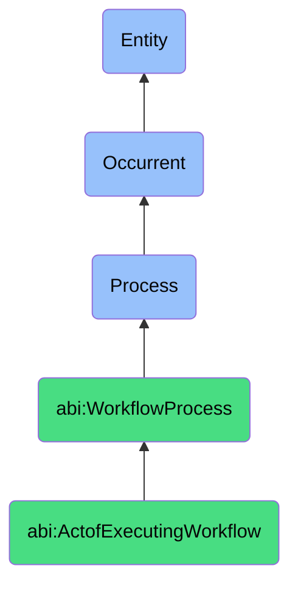

# ActofExecutingWorkflow

## Definition
An act of executing workflow is an occurrent process that unfolds through time, involving the systematic initiation, orchestration, and progression of a predefined series of interrelated tasks, steps, or activities in accordance with established business logic, sequence dependencies, and operational rules, transforming inputs into desired outputs while maintaining traceability, consistency, and adherence to process standards.

## Hierarchy in BFO


## Ontological Schema (TBox)
```turtle
abi:ActofExecutingWorkflow a owl:Class ;
  rdfs:subClassOf abi:WorkflowProcess ;
  rdfs:label "Act of Executing Workflow" ;
  skos:definition "A process that activates and progresses a predefined series of interrelated tasks." .

abi:WorkflowProcess a owl:Class ;
  rdfs:subClassOf bfo:0000015 ;
  rdfs:label "Workflow Process" ;
  skos:definition "A time-bound process related to the systematic execution, validation, or collaboration on structured tasks or activities." .

abi:has_workflow_executor a owl:ObjectProperty ;
  rdfs:domain abi:ActofExecutingWorkflow ;
  rdfs:range abi:WorkflowExecutor ;
  rdfs:label "has workflow executor" .

abi:executes_workflow_definition a owl:ObjectProperty ;
  rdfs:domain abi:ActofExecutingWorkflow ;
  rdfs:range abi:WorkflowDefinition ;
  rdfs:label "executes workflow definition" .

abi:processes_workflow_step a owl:ObjectProperty ;
  rdfs:domain abi:ActofExecutingWorkflow ;
  rdfs:range abi:WorkflowStep ;
  rdfs:label "processes workflow step" .

abi:consumes_workflow_input a owl:ObjectProperty ;
  rdfs:domain abi:ActofExecutingWorkflow ;
  rdfs:range abi:WorkflowInput ;
  rdfs:label "consumes workflow input" .

abi:applies_workflow_rule a owl:ObjectProperty ;
  rdfs:domain abi:ActofExecutingWorkflow ;
  rdfs:range abi:WorkflowRule ;
  rdfs:label "applies workflow rule" .

abi:uses_automation_tool a owl:ObjectProperty ;
  rdfs:domain abi:ActofExecutingWorkflow ;
  rdfs:range abi:AutomationTool ;
  rdfs:label "uses automation tool" .

abi:generates_workflow_output a owl:ObjectProperty ;
  rdfs:domain abi:ActofExecutingWorkflow ;
  rdfs:range abi:WorkflowOutput ;
  rdfs:label "generates workflow output" .

abi:has_execution_timestamp a owl:DatatypeProperty ;
  rdfs:domain abi:ActofExecutingWorkflow ;
  rdfs:range xsd:dateTime ;
  rdfs:label "has execution timestamp" .

abi:has_workflow_completion_status a owl:DatatypeProperty ;
  rdfs:domain abi:ActofExecutingWorkflow ;
  rdfs:range xsd:string ;
  rdfs:label "has workflow completion status" .

abi:has_execution_metrics a owl:DatatypeProperty ;
  rdfs:domain abi:ActofExecutingWorkflow ;
  rdfs:range xsd:string ;
  rdfs:label "has execution metrics" .
```

## Ontological Instance (ABox)
```turtle
ex:BlogToSocialPostAutomationExecution a abi:ActofExecutingWorkflow ;
  rdfs:label "Blog to Social Post Automation Pipeline Execution" ;
  abi:has_workflow_executor ex:ContentAssistantAI, ex:MarketingAutomationSystem ;
  abi:executes_workflow_definition ex:ContentRepurposingWorkflow ;
  abi:processes_workflow_step ex:BlogPostExtraction, ex:KeyPointIdentification, ex:PlatformSpecificFormatting, ex:HashtagGeneration, ex:ScheduledPublishing ;
  abi:consumes_workflow_input ex:PublishedBlogArticle, ex:BrandStyleGuide, ex:AudiencePreferences ;
  abi:applies_workflow_rule ex:CharacterLimitRule, ex:BrandVoiceConsistencyRule, ex:RelevanceFilteringRule ;
  abi:uses_automation_tool ex:NLPContentAnalyzer, ex:MediaProcessingAPI, ex:SocialMediaScheduler ;
  abi:generates_workflow_output ex:LinkedInPostDraft, ex:TwitterThreadContent, ex:InstagramCarouselImages ;
  abi:has_execution_timestamp "2023-11-15T09:30:00Z"^^xsd:dateTime ;
  abi:has_workflow_completion_status "Completed Successfully" ;
  abi:has_execution_metrics "Processing time: 4.2 minutes, 3 platforms, 7 content pieces generated" .

ex:QuarterlyFinancialReportingWorkflowExecution a abi:ActofExecutingWorkflow ;
  rdfs:label "Quarterly Financial Reporting Workflow Execution" ;
  abi:has_workflow_executor ex:FinanceAssistant, ex:ComplianceOfficer, ex:CFO ;
  abi:executes_workflow_definition ex:FinancialReportingWorkflow ;
  abi:processes_workflow_step ex:DataCollectionStep, ex:ReconciliationStep, ex:AnalysisPreparationStep, ex:ReportGenerationStep, ex:ApprovalStep ;
  abi:consumes_workflow_input ex:QuarterlyFinancialData, ex:PreviousReportTemplate, ex:RegulatoryRequirements ;
  abi:applies_workflow_rule ex:DataValidationRule, ex:ComplianceChecklistRule, ex:MaterialityThresholdRule ;
  abi:uses_automation_tool ex:FinancialDataPlatform, ex:ReportGenerator, ex:ApprovalWorkflowSystem ;
  abi:generates_workflow_output ex:QuarterlyFinancialReport, ex:ExecutiveSummaryDashboard, ex:RegulatoryFilingDocuments ;
  abi:has_execution_timestamp "2023-10-05T08:00:00Z"^^xsd:dateTime ;
  abi:has_workflow_completion_status "Completed with Approvals" ;
  abi:has_execution_metrics "Cycle time: 12 days, 8 stakeholders, 4 approval gates" .
```

## Related Classes
- **abi:ActofValidating** - A process that often occurs during or after workflow execution to verify outputs.
- **abi:ActofReviewing** - A process that examines workflow outputs for approval or improvement.
- **abi:ActofMeeting** - A process that may coordinate participants involved in complex workflows.
- **abi:WorkflowDesignProcess** - A process for creating and defining the workflows to be executed.
- **abi:ProcessAutomationProcess** - A specialized process focused on automating repetitive workflow steps.
- **abi:WorkflowOptimizationProcess** - A process for improving the efficiency of workflow execution.
- **abi:ErrorHandlingProcess** - A process for managing exceptions that occur during workflow execution. 