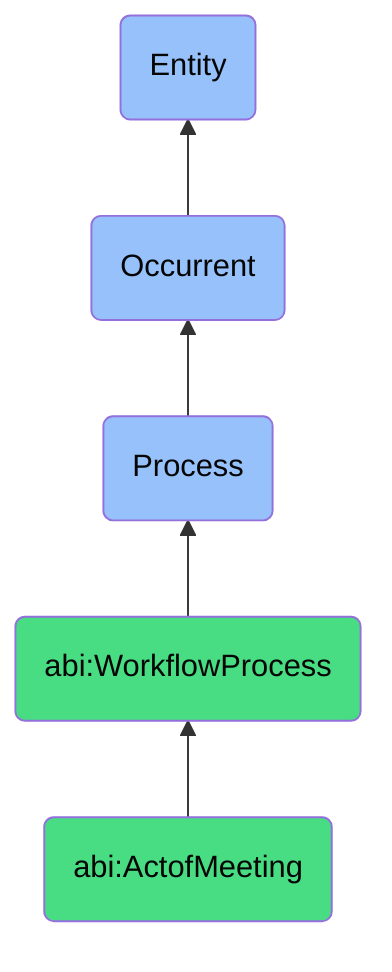

# ActofMeeting

## Definition
An act of meeting is an occurrent process that unfolds through time, involving the temporally bounded synchronous or asynchronous gathering of two or more participants for the purpose of information sharing, deliberation, problem solving, decision making, planning, or relationship building, typically following a structured or semi-structured format with defined roles, agenda items, and objectives, resulting in shared understanding, documented outcomes, or action commitments.

## Hierarchy in BFO


## Ontological Schema (TBox)
```turtle
abi:ActofMeeting a owl:Class ;
  rdfs:subClassOf abi:WorkflowProcess ;
  rdfs:label "Act of Meeting" ;
  skos:definition "A temporally bounded process where participants share information, resolve issues, or make decisions." .

abi:WorkflowProcess a owl:Class ;
  rdfs:subClassOf bfo:0000015 ;
  rdfs:label "Workflow Process" ;
  skos:definition "A time-bound process related to the systematic execution, validation, or collaboration on structured tasks or activities." .

abi:has_meeting_organizer a owl:ObjectProperty ;
  rdfs:domain abi:ActofMeeting ;
  rdfs:range abi:MeetingOrganizer ;
  rdfs:label "has meeting organizer" .

abi:has_meeting_participant a owl:ObjectProperty ;
  rdfs:domain abi:ActofMeeting ;
  rdfs:range abi:MeetingParticipant ;
  rdfs:label "has meeting participant" .

abi:follows_meeting_agenda a owl:ObjectProperty ;
  rdfs:domain abi:ActofMeeting ;
  rdfs:range abi:MeetingAgenda ;
  rdfs:label "follows meeting agenda" .

abi:addresses_discussion_topic a owl:ObjectProperty ;
  rdfs:domain abi:ActofMeeting ;
  rdfs:range abi:DiscussionTopic ;
  rdfs:label "addresses discussion topic" .

abi:uses_meeting_resource a owl:ObjectProperty ;
  rdfs:domain abi:ActofMeeting ;
  rdfs:range abi:MeetingResource ;
  rdfs:label "uses meeting resource" .

abi:produces_meeting_output a owl:ObjectProperty ;
  rdfs:domain abi:ActofMeeting ;
  rdfs:range abi:MeetingOutput ;
  rdfs:label "produces meeting output" .

abi:establishes_action_item a owl:ObjectProperty ;
  rdfs:domain abi:ActofMeeting ;
  rdfs:range abi:ActionItem ;
  rdfs:label "establishes action item" .

abi:has_meeting_start_time a owl:DatatypeProperty ;
  rdfs:domain abi:ActofMeeting ;
  rdfs:range xsd:dateTime ;
  rdfs:label "has meeting start time" .

abi:has_meeting_duration a owl:DatatypeProperty ;
  rdfs:domain abi:ActofMeeting ;
  rdfs:range xsd:duration ;
  rdfs:label "has meeting duration" .

abi:has_meeting_format a owl:DatatypeProperty ;
  rdfs:domain abi:ActofMeeting ;
  rdfs:range xsd:string ;
  rdfs:label "has meeting format" .
```

## Ontological Instance (ABox)
```turtle
ex:SprintPlanningMeeting a abi:ActofMeeting ;
  rdfs:label "Sprint Planning Meeting" ;
  abi:has_meeting_organizer ex:ProductOwner, ex:ScrumMaster ;
  abi:has_meeting_participant ex:DevelopmentTeamMember1, ex:DevelopmentTeamMember2, ex:DevelopmentTeamMember3, ex:QASpecialist, ex:UXDesigner ;
  abi:follows_meeting_agenda ex:SprintGoalSetting, ex:BacklogRefinement, ex:StoryPointEstimation, ex:CapacityPlanning, ex:SprintCommitment ;
  abi:addresses_discussion_topic ex:FeaturePrioritization, ex:TechnicalDependencies, ex:DeliveryRisks, ex:UserStoryReadiness ;
  abi:uses_meeting_resource ex:ProductBacklogBoard, ex:CapacityCalculationSpreadsheet, ex:UserStoryDocumentation ;
  abi:produces_meeting_output ex:SprintBacklog, ex:CommittedStoryPoints, ex:SprintGoalStatement ;
  abi:establishes_action_item ex:TechnicalSpikeTasks, ex:DesignClarifications, ex:DependencyResolution ;
  abi:has_meeting_start_time "2023-11-06T10:00:00Z"^^xsd:dateTime ;
  abi:has_meeting_duration "PT1H30M"^^xsd:duration ;
  abi:has_meeting_format "Hybrid - In-person and video conference" .

ex:ExecutiveStrategySession a abi:ActofMeeting ;
  rdfs:label "Executive Quarterly Strategy Session" ;
  abi:has_meeting_organizer ex:ChiefExecutiveOfficer ;
  abi:has_meeting_participant ex:ChiefFinancialOfficer, ex:ChiefOperatingOfficer, ex:ChiefTechnologyOfficer, ex:ChiefMarketingOfficer, ex:HeadOfSales ;
  abi:follows_meeting_agenda ex:QuarterlyPerformanceReview, ex:StrategicInitiativeUpdate, ex:MarketTrendDiscussion, ex:ResourceAllocationDecisions, ex:NextQuarterPlanning ;
  abi:addresses_discussion_topic ex:RevenueGrowthStrategies, ex:OperationalEfficiencies, ex:CompetitiveThreats, ex:ProductRoadmapAlignment ;
  abi:uses_meeting_resource ex:FinancialDashboard, ex:MarketAnalysisReport, ex:OperationalMetricsDeck, ex:StrategicPlanDocument ;
  abi:produces_meeting_output ex:StrategicPriorityRefinements, ex:BudgetAdjustments, ex:ExecutiveAlignment, ex:CrossFunctionalInitiatives ;
  abi:establishes_action_item ex:GrowthInitiativeApproval, ex:ResourceReallocation, ex:LeadershipCommunicationPlan, ex:PerformanceMetricTracking ;
  abi:has_meeting_start_time "2023-10-03T13:00:00Z"^^xsd:dateTime ;
  abi:has_meeting_duration "PT4H"^^xsd:duration ;
  abi:has_meeting_format "In-person offsite" .
```

## Related Classes
- **abi:ActofExecutingWorkflow** - A process that may be coordinated or monitored through meetings.
- **abi:ActofValidating** - A process whose results may be reviewed or discussed in meetings.
- **abi:ActofReviewing** - A process that may occur during specialized review meetings.
- **abi:MeetingPreparationProcess** - A process that precedes meetings to ensure readiness.
- **abi:DecisionMakingProcess** - A process that often occurs within the structure of meetings.
- **abi:CollaborationProcess** - A broader process that includes meetings as a key mechanism.
- **abi:ActionTrackingProcess** - A process for monitoring items established during meetings. 