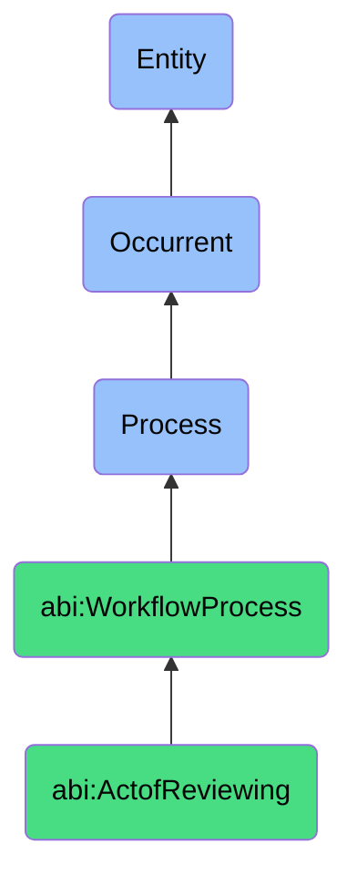

# ActofReviewing

## Definition
An act of reviewing is an occurrent process that unfolds through time, involving the critical examination, evaluation, and assessment of a deliverable, artifact, or output by a qualified human or agent to determine quality, accuracy, effectiveness, or appropriateness, providing constructive feedback, suggesting refinements, identifying improvement opportunities, and ultimately approving, rejecting, or requesting modifications to the subject under review.

## Hierarchy in BFO


## Ontological Schema (TBox)
```turtle
abi:ActofReviewing a owl:Class ;
  rdfs:subClassOf abi:WorkflowProcess ;
  rdfs:label "Act of Reviewing" ;
  skos:definition "A process where a human or agent examines a deliverable to suggest or approve changes." .

abi:WorkflowProcess a owl:Class ;
  rdfs:subClassOf bfo:0000015 ;
  rdfs:label "Workflow Process" ;
  skos:definition "A time-bound process related to the systematic execution, validation, or collaboration on structured tasks or activities." .

abi:has_reviewer a owl:ObjectProperty ;
  rdfs:domain abi:ActofReviewing ;
  rdfs:range abi:Reviewer ;
  rdfs:label "has reviewer" .

abi:reviews_content a owl:ObjectProperty ;
  rdfs:domain abi:ActofReviewing ;
  rdfs:range abi:ReviewContent ;
  rdfs:label "reviews content" .

abi:applies_review_criteria a owl:ObjectProperty ;
  rdfs:domain abi:ActofReviewing ;
  rdfs:range abi:ReviewCriteria ;
  rdfs:label "applies review criteria" .

abi:considers_context a owl:ObjectProperty ;
  rdfs:domain abi:ActofReviewing ;
  rdfs:range abi:ReviewContext ;
  rdfs:label "considers context" .

abi:provides_feedback a owl:ObjectProperty ;
  rdfs:domain abi:ActofReviewing ;
  rdfs:range abi:ReviewFeedback ;
  rdfs:label "provides feedback" .

abi:suggests_improvement a owl:ObjectProperty ;
  rdfs:domain abi:ActofReviewing ;
  rdfs:range abi:ImprovementSuggestion ;
  rdfs:label "suggests improvement" .

abi:makes_decision a owl:ObjectProperty ;
  rdfs:domain abi:ActofReviewing ;
  rdfs:range abi:ReviewDecision ;
  rdfs:label "makes decision" .

abi:has_review_timestamp a owl:DatatypeProperty ;
  rdfs:domain abi:ActofReviewing ;
  rdfs:range xsd:dateTime ;
  rdfs:label "has review timestamp" .

abi:has_review_duration a owl:DatatypeProperty ;
  rdfs:domain abi:ActofReviewing ;
  rdfs:range xsd:duration ;
  rdfs:label "has review duration" .

abi:has_review_outcome a owl:DatatypeProperty ;
  rdfs:domain abi:ActofReviewing ;
  rdfs:range xsd:string ;
  rdfs:label "has review outcome" .
```

## Ontological Instance (ABox)
```turtle
ex:MarketingCampaignMessageReview a abi:ActofReviewing ;
  rdfs:label "Marketing Campaign Message Review" ;
  abi:has_reviewer ex:MarketingDirector, ex:BrandManager, ex:ContentStrategist ;
  abi:reviews_content ex:CampaignCopy, ex:KeyMessaging, ex:ValuePropositions, ex:CallToActionText ;
  abi:applies_review_criteria ex:BrandAlignmentCriteria, ex:TargetAudienceRelevanceCriteria, ex:MessageClarityStandard ;
  abi:considers_context ex:CompetitiveEnvironment, ex:PreviousCampaignPerformance, ex:SeasonalFactors ;
  abi:provides_feedback ex:ToneRefinementFeedback, ex:ValueClarificationSuggestion, ex:EmotionalImpactAssessment ;
  abi:suggests_improvement ex:AudienceSegmentSpecificEdits, ex:BenefitStatementReframing, ex:CTAStrengthening ;
  abi:makes_decision ex:ApproveWithMinorEdits ;
  abi:has_review_timestamp "2023-11-08T13:45:00Z"^^xsd:dateTime ;
  abi:has_review_duration "PT2H30M"^^xsd:duration ;
  abi:has_review_outcome "Approved with suggested refinements for target segment clarity" .

ex:ProductFeatureDevelopmentReview a abi:ActofReviewing ;
  rdfs:label "Product Feature Development Review" ;
  abi:has_reviewer ex:ProductManager, ex:UXDesigner, ex:TechnicalLead, ex:CustomerSuccessRepresentative ;
  abi:reviews_content ex:FeatureSpecifications, ex:UserStories, ex:DesignPrototypes, ex:DevelopmentEstimates ;
  abi:applies_review_criteria ex:CustomerValueCriteria, ex:TechnicalFeasibilityStandard, ex:StrategicAlignmentMetric ;
  abi:considers_context ex:UserResearchFindings, ex:CompetitiveOfferings, ex:StrategicRoadmap ;
  abi:provides_feedback ex:UsabilityConcerns, ex:ImplmentationComplexityAssessment, ex:MarketFitAnalysis ;
  abi:suggests_improvement ex:ScopeRefinement, ex:PhasedImplementationApproach, ex:AdditionalUserTesting ;
  abi:makes_decision ex:ReviseAndResubmit ;
  abi:has_review_timestamp "2023-10-25T10:00:00Z"^^xsd:dateTime ;
  abi:has_review_duration "PT4H"^^xsd:duration ;
  abi:has_review_outcome "Revision required to address technical complexity and phasing considerations" .
```

## Related Classes
- **abi:ActofExecutingWorkflow** - A process that may produce deliverables requiring review.
- **abi:ActofValidating** - A process that often precedes review, focusing on objective criteria.
- **abi:ActofMeeting** - A process where multiple reviewers may gather to conduct collaborative reviews.
- **abi:FeedbackProcess** - A related process focused on collecting and organizing review comments.
- **abi:ApprovalProcess** - A process often following review to formalize acceptance of deliverables.
- **abi:RevisionProcess** - A process triggered by review feedback to improve deliverables.
- **abi:QualityControlProcess** - A broader process that includes reviewing as a component. 