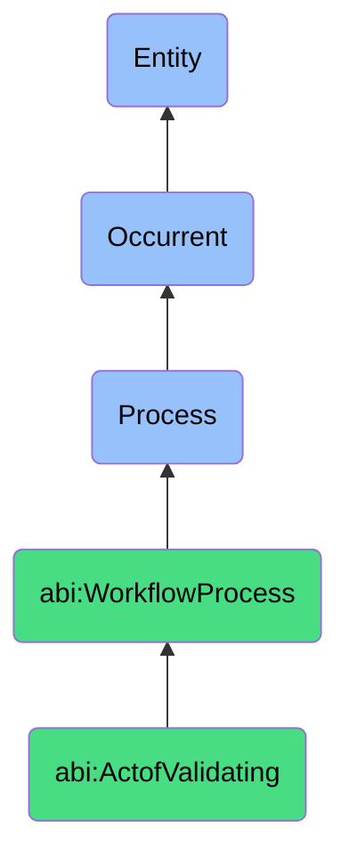

# ActofValidating

## Definition
An act of validating is an occurrent process that unfolds through time, involving the systematic examination, verification, and assessment of data, content, logic, or procedures against predetermined standards, constraints, or requirements to ensure accuracy, integrity, quality, security, or compliance, typically resulting in confirmation of correctness or identification of discrepancies requiring remediation.

## Hierarchy in BFO


## Ontological Schema (TBox)
```turtle
abi:ActofValidating a owl:Class ;
  rdfs:subClassOf abi:WorkflowProcess ;
  rdfs:label "Act of Validating" ;
  skos:definition "A process that checks data, content, or logic for correctness, quality, or policy conformance." .

abi:WorkflowProcess a owl:Class ;
  rdfs:subClassOf bfo:0000015 ;
  rdfs:label "Workflow Process" ;
  skos:definition "A time-bound process related to the systematic execution, validation, or collaboration on structured tasks or activities." .

abi:has_validation_agent a owl:ObjectProperty ;
  rdfs:domain abi:ActofValidating ;
  rdfs:range abi:ValidationAgent ;
  rdfs:label "has validation agent" .

abi:validates_subject a owl:ObjectProperty ;
  rdfs:domain abi:ActofValidating ;
  rdfs:range abi:ValidationSubject ;
  rdfs:label "validates subject" .

abi:applies_validation_rule a owl:ObjectProperty ;
  rdfs:domain abi:ActofValidating ;
  rdfs:range abi:ValidationRule ;
  rdfs:label "applies validation rule" .

abi:uses_validation_method a owl:ObjectProperty ;
  rdfs:domain abi:ActofValidating ;
  rdfs:range abi:ValidationMethod ;
  rdfs:label "uses validation method" .

abi:checks_against_reference a owl:ObjectProperty ;
  rdfs:domain abi:ActofValidating ;
  rdfs:range abi:ValidationReference ;
  rdfs:label "checks against reference" .

abi:detects_validation_issue a owl:ObjectProperty ;
  rdfs:domain abi:ActofValidating ;
  rdfs:range abi:ValidationIssue ;
  rdfs:label "detects validation issue" .

abi:produces_validation_result a owl:ObjectProperty ;
  rdfs:domain abi:ActofValidating ;
  rdfs:range abi:ValidationResult ;
  rdfs:label "produces validation result" .

abi:has_validation_timestamp a owl:DatatypeProperty ;
  rdfs:domain abi:ActofValidating ;
  rdfs:range xsd:dateTime ;
  rdfs:label "has validation timestamp" .

abi:has_validation_status a owl:DatatypeProperty ;
  rdfs:domain abi:ActofValidating ;
  rdfs:range xsd:string ;
  rdfs:label "has validation status" .

abi:has_validation_score a owl:DatatypeProperty ;
  rdfs:domain abi:ActofValidating ;
  rdfs:range xsd:decimal ;
  rdfs:label "has validation score" .
```

## Ontological Instance (ABox)
```turtle
ex:FinancialForecastValidation a abi:ActofValidating ;
  rdfs:label "Financial Forecast Data Validation Process" ;
  abi:has_validation_agent ex:FinancialAI, ex:FinancialAnalyst ;
  abi:validates_subject ex:QuarterlyRevenueProjections, ex:ExpenseForecasts, ex:GrowthAssumptions ;
  abi:applies_validation_rule ex:HistoricalConsistencyRule, ex:MarketTrendAlignmentRule, ex:MathematicalAccuracyRule ;
  abi:uses_validation_method ex:TimeSeriesToleranceChecking, ex:CrossReferenceValidation, ex:SensitivityAnalysis ;
  abi:checks_against_reference ex:PriorQuarterActuals, ex:IndustryBenchmarks, ex:ApprovedBudget ;
  abi:detects_validation_issue ex:OutdatedMarketAssumption, ex:InconsistentGrowthRate, ex:FormulaMiscalculation ;
  abi:produces_validation_result ex:ValidationAnnotatedSpreadsheet, ex:DiscrepancyReport, ex:CorrectionRecommendations ;
  abi:has_validation_timestamp "2023-11-10T14:35:00Z"^^xsd:dateTime ;
  abi:has_validation_status "Completed With Issues" ;
  abi:has_validation_score "0.82"^^xsd:decimal .

ex:ContentComplianceValidation a abi:ActofValidating ;
  rdfs:label "Marketing Content Compliance Validation Process" ;
  abi:has_validation_agent ex:ComplianceAI, ex:LegalReviewer ;
  abi:validates_subject ex:ProductCampaignCopy, ex:ClaimStatements, ex:OfferTerms ;
  abi:applies_validation_rule ex:RegulatoryComplianceRule, ex:BrandGuidelineRule, ex:LegalDisclosureRule ;
  abi:uses_validation_method ex:NLPComplianceScanning, ex:KeywordAnalysis, ex:ContextualReview ;
  abi:checks_against_reference ex:IndustryRegulations, ex:CompanyPolicyDatabase, ex:ApprovedClaimsList ;
  abi:detects_validation_issue ex:MissingDisclaimer, ex:UnsubstantiatedClaim, ex:ProhibitedTerminology ;
  abi:produces_validation_result ex:ComplianceReport, ex:RequiredEditsDocument, ex:ApprovalPathway ;
  abi:has_validation_timestamp "2023-10-28T09:15:00Z"^^xsd:dateTime ;
  abi:has_validation_status "Requires Revision" ;
  abi:has_validation_score "0.65"^^xsd:decimal .
```

## Related Classes
- **abi:ActofExecutingWorkflow** - A process that may include validation steps or require validation afterward.
- **abi:ActofReviewing** - A process that often follows validation to make human judgments on validated content.
- **abi:ActofMeeting** - A process where validation results may be discussed and addressed.
- **abi:QualityAssuranceProcess** - A broader process that includes validation as a key component.
- **abi:DataCleansingProcess** - A process that may be triggered based on validation findings.
- **abi:ComplianceCheckProcess** - A specialized validation focused on regulatory requirements.
- **abi:ErrorCorrectionProcess** - A process that remedies issues identified during validation. 