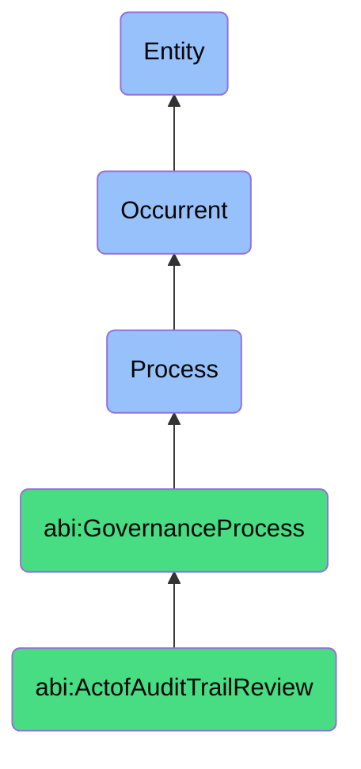

# ActofAuditTrailReview

## Definition
An act of audit trail review is an occurrent process that unfolds through time, involving the systematic examination, analysis, and interpretation of chronological records, logs, and documented sequences of activities, transactions, or system events to verify user actions, system operations, data modifications, authorization decisions, and other logged activities for the purpose of detecting anomalies, policy violations, suspicious patterns, unauthorized access, or unexpected behavior that may indicate security incidents, compliance failures, operational issues, or fraudulent activities.

## Hierarchy in BFO


## Ontological Schema (TBox)
```turtle
abi:ActofAuditTrailReview a owl:Class ;
  rdfs:subClassOf abi:GovernanceProcess ;
  rdfs:label "Act of Audit Trail Review" ;
  skos:definition "A process that analyzes the activity logs associated with sensitive actions or systems." .

abi:GovernanceProcess a owl:Class ;
  rdfs:subClassOf bfo:0000015 ;
  rdfs:label "Governance Process" ;
  skos:definition "A time-bound process related to the oversight, assessment, and management of organizational activities to ensure compliance with regulations, standards, and internal policies." .

abi:has_audit_reviewer a owl:ObjectProperty ;
  rdfs:domain abi:ActofAuditTrailReview ;
  rdfs:range abi:AuditReviewer ;
  rdfs:label "has audit reviewer" .

abi:reviews_audit_trail a owl:ObjectProperty ;
  rdfs:domain abi:ActofAuditTrailReview ;
  rdfs:range abi:AuditTrail ;
  rdfs:label "reviews audit trail" .

abi:applies_audit_criteria a owl:ObjectProperty ;
  rdfs:domain abi:ActofAuditTrailReview ;
  rdfs:range abi:AuditCriteria ;
  rdfs:label "applies audit criteria" .

abi:uses_analysis_method a owl:ObjectProperty ;
  rdfs:domain abi:ActofAuditTrailReview ;
  rdfs:range abi:AnalysisMethod ;
  rdfs:label "uses analysis method" .

abi:verifies_trail_completeness a owl:ObjectProperty ;
  rdfs:domain abi:ActofAuditTrailReview ;
  rdfs:range abi:CompletenessLevel ;
  rdfs:label "verifies trail completeness" .

abi:identifies_audit_finding a owl:ObjectProperty ;
  rdfs:domain abi:ActofAuditTrailReview ;
  rdfs:range abi:AuditFinding ;
  rdfs:label "identifies audit finding" .

abi:produces_review_report a owl:ObjectProperty ;
  rdfs:domain abi:ActofAuditTrailReview ;
  rdfs:range abi:ReviewReport ;
  rdfs:label "produces review report" .

abi:has_review_period_start a owl:DatatypeProperty ;
  rdfs:domain abi:ActofAuditTrailReview ;
  rdfs:range xsd:dateTime ;
  rdfs:label "has review period start" .

abi:has_review_period_end a owl:DatatypeProperty ;
  rdfs:domain abi:ActofAuditTrailReview ;
  rdfs:range xsd:dateTime ;
  rdfs:label "has review period end" .

abi:has_finding_severity a owl:DatatypeProperty ;
  rdfs:domain abi:ActofAuditTrailReview ;
  rdfs:range xsd:string ;
  rdfs:label "has finding severity" .
```

## Ontological Instance (ABox)
```turtle
ex:VendorAPIAuditTrailReview a abi:ActofAuditTrailReview ;
  rdfs:label "Vendor API Access Audit Log Review" ;
  abi:has_audit_reviewer ex:SecurityAnalyst, ex:DataPrivacyOfficer, ex:SystemAdministrator ;
  abi:reviews_audit_trail ex:VendorAPIAccessLogs, ex:AuthenticationEvents, ex:DataRetrievalLogs ;
  abi:applies_audit_criteria ex:AuthorizedUseCriteria, ex:DataAccessPolicyCriteria, ex:RateLimitCompliance ;
  abi:uses_analysis_method ex:PatternDetection, ex:UserBehaviorAnalytics, ex:SequenceAnalysis ;
  abi:verifies_trail_completeness ex:APIGatewayLogCompleteness, ex:AuthenticationSystemLogs, ex:DataLayerActions ;
  abi:identifies_audit_finding ex:UnauthorizedDataExport, ex:ExcessiveAccessFrequency, ex:OffHoursUsagePattern ;
  abi:produces_review_report ex:VendorAPIViolationReport, ex:UsageAnomalyDocumentation ;
  abi:has_review_period_start "2023-10-01T00:00:00Z"^^xsd:dateTime ;
  abi:has_review_period_end "2023-10-31T23:59:59Z"^^xsd:dateTime ;
  abi:has_finding_severity "Critical" .

ex:FinancialSystemAuditTrailReview a abi:ActofAuditTrailReview ;
  rdfs:label "Financial System Transactions Audit Review" ;
  abi:has_audit_reviewer ex:FinancialAuditor, ex:ComplianceManager, ex:FraudAnalyst ;
  abi:reviews_audit_trail ex:AccountingSystemLogs, ex:PaymentProcessingEvents, ex:ApprovalWorkflowHistory ;
  abi:applies_audit_criteria ex:SegregationOfDutiesCriteria, ex:AuthorizationLimitCompliance, ex:DocumentationRequirements ;
  abi:uses_analysis_method ex:TransactionSampling, ex:AnomalyDetection, ex:ChronologicalReconstruction ;
  abi:verifies_trail_completeness ex:TransactionLogCompleteness, ex:ApprovalChainIntegrity, ex:DocumentationLinkage ;
  abi:identifies_audit_finding ex:DuplicatePaymentApprovals, ex:MissingSecondaryAuthorization, ex:UndocumentedAdjustment ;
  abi:produces_review_report ex:FinancialControlsReport, ex:ProcessGapAnalysis ;
  abi:has_review_period_start "2023-09-01T00:00:00Z"^^xsd:dateTime ;
  abi:has_review_period_end "2023-09-30T23:59:59Z"^^xsd:dateTime ;
  abi:has_finding_severity "Moderate" .
```

## Related Classes
- **abi:ActofPolicyReview** - A process that may be triggered based on audit trail findings.
- **abi:ActofComplianceCheck** - A process that may use audit trail data as evidence for compliance verification.
- **abi:ForensicInvestigationProcess** - A more detailed process initiated when audit trails indicate potential incidents.
- **abi:LoggingConfigurationProcess** - A process for setting up the systems that generate audit trails.
- **abi:LogRetentionManagementProcess** - A process for maintaining audit trails for appropriate time periods.
- **abi:AnomalyDetectionProcess** - A specialized process for identifying unusual patterns in audit trails.
- **abi:SecurityIncidentResponseProcess** - A process triggered when audit trail review uncovers security incidents. 