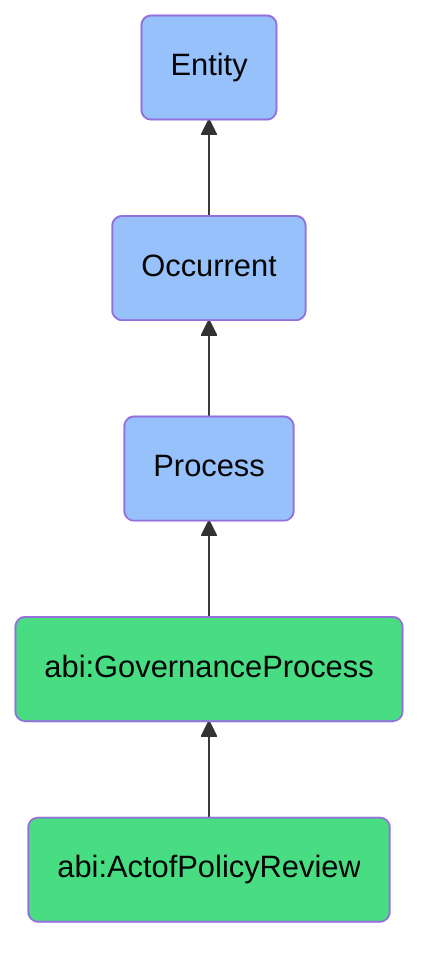

# ActofPolicyReview

## Definition
An act of policy review is an occurrent process that unfolds through time, involving the systematic examination, evaluation, and assessment of organizational policies, guidelines, and standards to ensure their continuing relevance, effectiveness, alignment with regulatory requirements, consistency with other internal policies, and adherence to best practices, resulting in documented recommendations for policy retention, revision, consolidation, or retirement to maintain organizational governance integrity and operational effectiveness.

## Hierarchy in BFO


## Ontological Schema (TBox)
```turtle
abi:ActofPolicyReview a owl:Class ;
  rdfs:subClassOf abi:GovernanceProcess ;
  rdfs:label "Act of Policy Review" ;
  skos:definition "A process where existing internal policies are checked for consistency, compliance, and current relevance." .

abi:GovernanceProcess a owl:Class ;
  rdfs:subClassOf bfo:0000015 ;
  rdfs:label "Governance Process" ;
  skos:definition "A time-bound process related to the oversight, assessment, and management of organizational activities to ensure compliance with regulations, standards, and internal policies." .

abi:has_policy_reviewer a owl:ObjectProperty ;
  rdfs:domain abi:ActofPolicyReview ;
  rdfs:range abi:PolicyReviewer ;
  rdfs:label "has policy reviewer" .

abi:reviews_policy a owl:ObjectProperty ;
  rdfs:domain abi:ActofPolicyReview ;
  rdfs:range abi:Policy ;
  rdfs:label "reviews policy" .

abi:applies_review_criteria a owl:ObjectProperty ;
  rdfs:domain abi:ActofPolicyReview ;
  rdfs:range abi:ReviewCriteria ;
  rdfs:label "applies review criteria" .

abi:compares_against_regulation a owl:ObjectProperty ;
  rdfs:domain abi:ActofPolicyReview ;
  rdfs:range abi:Regulation ;
  rdfs:label "compares against regulation" .

abi:validates_policy_alignment a owl:ObjectProperty ;
  rdfs:domain abi:ActofPolicyReview ;
  rdfs:range abi:PolicyAlignmentTarget ;
  rdfs:label "validates policy alignment" .

abi:identifies_policy_issue a owl:ObjectProperty ;
  rdfs:domain abi:ActofPolicyReview ;
  rdfs:range abi:PolicyIssue ;
  rdfs:label "identifies policy issue" .

abi:recommends_policy_action a owl:ObjectProperty ;
  rdfs:domain abi:ActofPolicyReview ;
  rdfs:range abi:PolicyAction ;
  rdfs:label "recommends policy action" .

abi:has_review_start_date a owl:DatatypeProperty ;
  rdfs:domain abi:ActofPolicyReview ;
  rdfs:range xsd:date ;
  rdfs:label "has review start date" .

abi:has_review_completion_date a owl:DatatypeProperty ;
  rdfs:domain abi:ActofPolicyReview ;
  rdfs:range xsd:date ;
  rdfs:label "has review completion date" .

abi:has_review_cycle a owl:DatatypeProperty ;
  rdfs:domain abi:ActofPolicyReview ;
  rdfs:range xsd:string ;
  rdfs:label "has review cycle" .
```

## Ontological Instance (ABox)
```turtle
ex:DEIPolicyReview a abi:ActofPolicyReview ;
  rdfs:label "Diversity, Equity and Inclusion Policy Annual Review" ;
  abi:has_policy_reviewer ex:HRDirector, ex:LegalCounsel, ex:DEICommitteeChair, ex:ExternalConsultant ;
  abi:reviews_policy ex:DiversityAndInclusionPolicy, ex:AntiDiscriminationPolicy, ex:RecruitmentEquityGuidelines ;
  abi:applies_review_criteria ex:IndustryBestPracticesCriteria, ex:LegalRequirementsCriteria, ex:OrganizationalCultureCriteria ;
  abi:compares_against_regulation ex:EEOCGuidelines, ex:NonDiscriminationLaws, ex:AccommodationRequirements ;
  abi:validates_policy_alignment ex:StrategicPlanAlignment, ex:CorporateValueAlignment, ex:StakeholderExpectations ;
  abi:identifies_policy_issue ex:OutdatedLanguage, ex:IncompleteAccommodationProcess, ex:LimitedMetrics ;
  abi:recommends_policy_action ex:LanguageModernization, ex:ProcessExpansion, ex:ImplementationOfMetrics ;
  abi:has_review_start_date "2023-09-01"^^xsd:date ;
  abi:has_review_completion_date "2023-09-30"^^xsd:date ;
  abi:has_review_cycle "Annual" .

ex:DataPrivacyPolicyReview a abi:ActofPolicyReview ;
  rdfs:label "Data Privacy Policy Quarterly Review" ;
  abi:has_policy_reviewer ex:ChiefPrivacyOfficer, ex:InformationSecurityManager, ex:DataGovernanceSpecialist, ex:ComplianceAnalyst ;
  abi:reviews_policy ex:DataPrivacyPolicy, ex:DataRetentionStandards, ex:InformationClassificationGuidelines ;
  abi:applies_review_criteria ex:RegulatoryComplianceCriteria, ex:SecurityEffectivenessCriteria, ex:ImplementationFeasibilityCriteria ;
  abi:compares_against_regulation ex:GDPRRequirements, ex:CCPAProvisions, ex:IndustryDataProtectionStandards ;
  abi:validates_policy_alignment ex:TechnicalImplementationCapabilities, ex:BusinessProcessCompatibility, ex:UserTrainingEffectiveness ;
  abi:identifies_policy_issue ex:CrossBorderDataTransferGaps, ex:UnclearDataSubjectRightsProcess, ex:InadequateConsentMechanisms ;
  abi:recommends_policy_action ex:ExpandTransferProtections, ex:DevelopRightsManagementWorkflow, ex:EnhanceConsentFramework ;
  abi:has_review_start_date "2023-10-15"^^xsd:date ;
  abi:has_review_completion_date "2023-11-15"^^xsd:date ;
  abi:has_review_cycle "Quarterly" .
```

## Related Classes
- **abi:ActofComplianceCheck** - A process that often follows policy review to verify implementation adherence.
- **abi:ActofAuditTrailReview** - A process that may inform policy review by examining actual system usage.
- **abi:PolicyCreationProcess** - A process that establishes new policies based on review findings.
- **abi:PolicyImplementationProcess** - A process that operationalizes policies after review and revision.
- **abi:StakeholderConsultationProcess** - A process for gathering input from affected parties during policy review.
- **abi:RegulatoryMonitoringProcess** - A process for tracking changes in regulations that impact policies.
- **abi:PolicyCommunicationProcess** - A process for disseminating policy updates following review. 