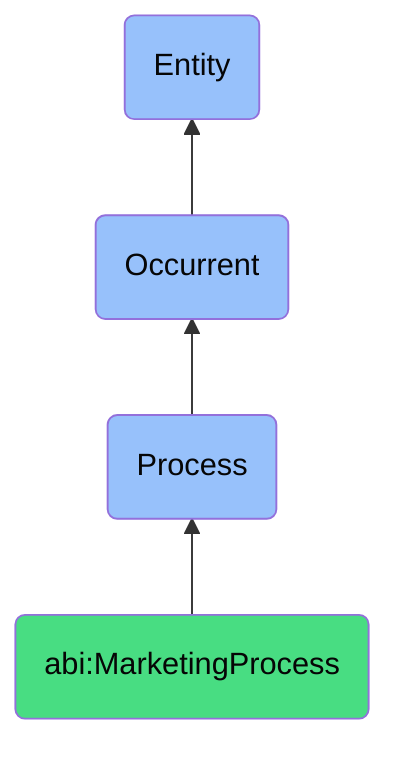

# MarketingProcess

## Definition
A marketing process is an occurrent that unfolds through time, involving the strategic planning, execution, measurement, or optimization of activities designed to promote products, services, or ideas, create customer engagement, generate demand, or build brand presence through coordinated communication and distribution efforts across selected channels and audiences.

## Hierarchy in BFO


## Ontological Schema (TBox)
```turtle
abi:MarketingProcess a owl:Class ;
  rdfs:subClassOf bfo:0000015 ;
  rdfs:label "Marketing Process" ;
  skos:definition "A process involving the strategic planning, execution, measurement, or optimization of activities designed to promote products, services, or ideas and create customer engagement." .

abi:has_marketer a owl:ObjectProperty ;
  rdfs:domain abi:MarketingProcess ;
  rdfs:range abi:Marketer ;
  rdfs:label "has marketer" .

abi:targets_audience a owl:ObjectProperty ;
  rdfs:domain abi:MarketingProcess ;
  rdfs:range abi:TargetAudience ;
  rdfs:label "targets audience" .

abi:promotes_offering a owl:ObjectProperty ;
  rdfs:domain abi:MarketingProcess ;
  rdfs:range abi:MarketingOffering ;
  rdfs:label "promotes offering" .

abi:applies_marketing_strategy a owl:ObjectProperty ;
  rdfs:domain abi:MarketingProcess ;
  rdfs:range abi:MarketingStrategy ;
  rdfs:label "applies marketing strategy" .

abi:utilizes_channel a owl:ObjectProperty ;
  rdfs:domain abi:MarketingProcess ;
  rdfs:range abi:MarketingChannel ;
  rdfs:label "utilizes channel" .

abi:produces_marketing_output a owl:ObjectProperty ;
  rdfs:domain abi:MarketingProcess ;
  rdfs:range abi:MarketingOutput ;
  rdfs:label "produces marketing output" .

abi:aligns_with_brand a owl:ObjectProperty ;
  rdfs:domain abi:MarketingProcess ;
  rdfs:range abi:Brand ;
  rdfs:label "aligns with brand" .

abi:has_time_frame a owl:DatatypeProperty ;
  rdfs:domain abi:MarketingProcess ;
  rdfs:range xsd:string ;
  rdfs:label "has time frame" .

abi:has_budget_allocation a owl:DatatypeProperty ;
  rdfs:domain abi:MarketingProcess ;
  rdfs:range xsd:decimal ;
  rdfs:label "has budget allocation" .

abi:has_success_metric a owl:DatatypeProperty ;
  rdfs:domain abi:MarketingProcess ;
  rdfs:range xsd:string ;
  rdfs:label "has success metric" .
```

## Ontological Instance (ABox)
```turtle
# MarketingProcess is a parent class with subclasses:
# - abi:ActofCampaignExecution
# - abi:ActofTrackingEngagement
# and other marketing-related processes
```

## Related Classes
- **abi:ActofCampaignExecution** - A specialized process for coordinating time-bound marketing actions.
- **abi:ActofTrackingEngagement** - A specialized process for monitoring reactions or interactions.
- **abi:CommunicationProcess** - A broader process that includes content creation and distribution elements used in marketing.
- **abi:AnalysisProcess** - A process that often informs marketing decisions through data examination.
- **abi:SalesProcess** - A related process that converts marketing-generated leads into customers. 