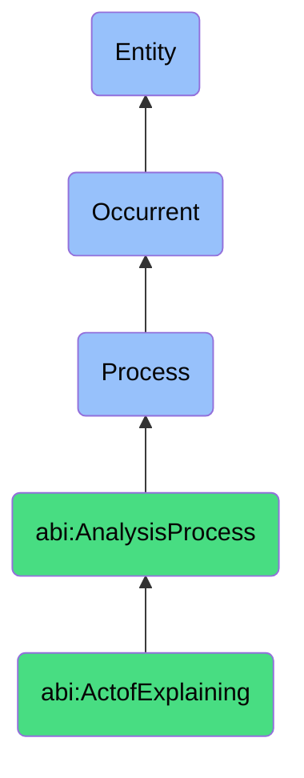

# ActofExplaining

## Definition
An act of explaining is an occurrent process that unfolds through time, involving the generation, articulation, or communication of interpretations, rationales, or causal accounts that connect observed phenomena, decisions, recommendations, or outcomes to their underlying factors, mechanisms, or reasoning chains, making complex or opaque matters more intelligible to specific audiences.

## Hierarchy in BFO


## Ontological Schema (TBox)
```turtle
abi:ActofExplaining a owl:Class ;
  rdfs:subClassOf abi:AnalysisProcess ;
  rdfs:label "Act of Explaining" ;
  skos:definition "A process that produces justifications or interpretations." .

abi:AnalysisProcess a owl:Class ;
  rdfs:subClassOf bfo:0000015 ;
  rdfs:label "Analysis Process" ;
  skos:definition "A process involving the systematic examination, evaluation, or interpretation of data or phenomena to extract insights or support decisions." .

abi:has_explainer a owl:ObjectProperty ;
  rdfs:domain abi:ActofExplaining ;
  rdfs:range abi:Explainer ;
  rdfs:label "has explainer" .

abi:explains_subject a owl:ObjectProperty ;
  rdfs:domain abi:ActofExplaining ;
  rdfs:range abi:ExplanationSubject ;
  rdfs:label "explains subject" .

abi:uses_explanation_method a owl:ObjectProperty ;
  rdfs:domain abi:ActofExplaining ;
  rdfs:range abi:ExplanationMethod ;
  rdfs:label "uses explanation method" .

abi:produces_explanation a owl:ObjectProperty ;
  rdfs:domain abi:ActofExplaining ;
  rdfs:range abi:Explanation ;
  rdfs:label "produces explanation" .

abi:targets_audience a owl:ObjectProperty ;
  rdfs:domain abi:ActofExplaining ;
  rdfs:range abi:ExplanationAudience ;
  rdfs:label "targets audience" .

abi:references_evidence a owl:ObjectProperty ;
  rdfs:domain abi:ActofExplaining ;
  rdfs:range abi:ExplanationEvidence ;
  rdfs:label "references evidence" .

abi:addresses_question a owl:ObjectProperty ;
  rdfs:domain abi:ActofExplaining ;
  rdfs:range abi:ExplanationQuestion ;
  rdfs:label "addresses question" .

abi:has_explanation_duration a owl:DatatypeProperty ;
  rdfs:domain abi:ActofExplaining ;
  rdfs:range xsd:duration ;
  rdfs:label "has explanation duration" .

abi:has_complexity_level a owl:DatatypeProperty ;
  rdfs:domain abi:ActofExplaining ;
  rdfs:range xsd:string ;
  rdfs:label "has complexity level" .

abi:has_transparency_score a owl:DatatypeProperty ;
  rdfs:domain abi:ActofExplaining ;
  rdfs:range xsd:decimal ;
  rdfs:label "has transparency score" .
```

## Ontological Instance (ABox)
```turtle
ex:AuditAgentRecommendationExplanationProcess a abi:ActofExplaining ;
  rdfs:label "Audit Agent Recommendation Explanation Process" ;
  abi:has_explainer ex:ComplianceAuditAgent ;
  abi:explains_subject ex:BusinessProcessModificationRecommendation, ex:RiskAssessmentOutcome ;
  abi:uses_explanation_method ex:CausalChainAnalysis, ex:RegulatoryRequirementMapping ;
  abi:produces_explanation ex:ComplianceRationaleExplanation, ex:RiskMitigationJustification ;
  abi:targets_audience ex:ComplianceOfficer, ex:DepartmentManager ;
  abi:references_evidence ex:HistoricalComplianceViolation, ex:PeerOrganizationBenchmark, ex:RegulatoryGuidanceDocument ;
  abi:addresses_question ex:BusinessImpactQuestion, ex:ImplementationRequirementQuestion ;
  abi:has_explanation_duration "PT5M"^^xsd:duration ;
  abi:has_complexity_level "Technical with business context" ;
  abi:has_transparency_score "0.89"^^xsd:decimal .

ex:DiagnosticSystemResultExplanationProcess a abi:ActofExplaining ;
  rdfs:label "Diagnostic System Result Explanation Process" ;
  abi:has_explainer ex:TechnicalDiagnosticSystem ;
  abi:explains_subject ex:SystemPerformanceAnomaly, ex:PredictiveMaintenanceAlert ;
  abi:uses_explanation_method ex:TimeSeriesCorrelation, ex:AnomalyDecomposition, ex:FeatureContributionAnalysis ;
  abi:produces_explanation ex:RootCauseExplanation, ex:FailurePredictionJustification ;
  abi:targets_audience ex:MaintenanceTechnician, ex:OperationsManager ;
  abi:references_evidence ex:SensorDataTimeline, ex:MaintenanceHistoryRecord, ex:ComponentSpecification ;
  abi:addresses_question ex:UrgencyAssessmentQuestion, ex:RepairPriorityQuestion ;
  abi:has_explanation_duration "PT90S"^^xsd:duration ;
  abi:has_complexity_level "Technical with visual aids" ;
  abi:has_transparency_score "0.93"^^xsd:decimal .
```

## Related Classes
- **abi:ActofObserving** - A process that provides the information that may require explanation.
- **abi:ActofScoring** - A process that generates evaluations that often need explanation.
- **abi:JustificationProcess** - A specialized explanation process focused on substantiating decisions or claims.
- **abi:TranslatingTechnicalContentProcess** - A process that converts technical information into accessible language.
- **abi:AudienceAdaptationProcess** - A process that adjusts explanations for specific audience needs and background. 