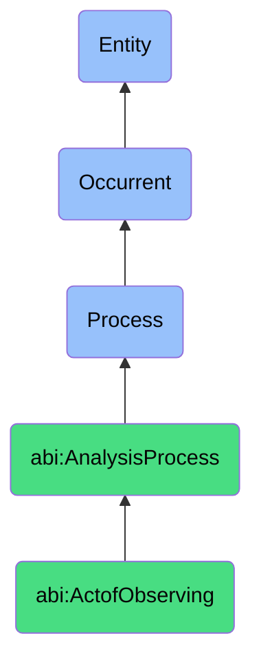

# ActofObserving

## Definition
An act of observing is an occurrent process that unfolds through time, involving the deliberate collection, perception, or recording of information about an entity, situation, signal, or phenomenon, characterized by attention to specific attributes, patterns, or behaviors to create a representation or record that can be further processed or analyzed.

## Hierarchy in BFO


## Ontological Schema (TBox)
```turtle
abi:ActofObserving a owl:Class ;
  rdfs:subClassOf abi:AnalysisProcess ;
  rdfs:label "Act of Observing" ;
  skos:definition "A process that gathers information or insight about an entity, situation, or signal." .

abi:AnalysisProcess a owl:Class ;
  rdfs:subClassOf bfo:0000015 ;
  rdfs:label "Analysis Process" ;
  skos:definition "A process involving the systematic examination, evaluation, or interpretation of data or phenomena to extract insights or support decisions." .

abi:has_observer a owl:ObjectProperty ;
  rdfs:domain abi:ActofObserving ;
  rdfs:range abi:Observer ;
  rdfs:label "has observer" .

abi:observes_target a owl:ObjectProperty ;
  rdfs:domain abi:ActofObserving ;
  rdfs:range abi:ObservationTarget ;
  rdfs:label "observes target" .

abi:uses_observation_method a owl:ObjectProperty ;
  rdfs:domain abi:ActofObserving ;
  rdfs:range abi:ObservationMethod ;
  rdfs:label "uses observation method" .

abi:focuses_on_attribute a owl:ObjectProperty ;
  rdfs:domain abi:ActofObserving ;
  rdfs:range abi:TargetAttribute ;
  rdfs:label "focuses on attribute" .

abi:creates_observation_record a owl:ObjectProperty ;
  rdfs:domain abi:ActofObserving ;
  rdfs:range abi:ObservationRecord ;
  rdfs:label "creates observation record" .

abi:occurs_in_observation_context a owl:ObjectProperty ;
  rdfs:domain abi:ActofObserving ;
  rdfs:range abi:ObservationContext ;
  rdfs:label "occurs in observation context" .

abi:is_subject_to_bias a owl:ObjectProperty ;
  rdfs:domain abi:ActofObserving ;
  rdfs:range abi:ObservationBias ;
  rdfs:label "is subject to bias" .

abi:has_observation_duration a owl:DatatypeProperty ;
  rdfs:domain abi:ActofObserving ;
  rdfs:range xsd:duration ;
  rdfs:label "has observation duration" .

abi:has_observation_frequency a owl:DatatypeProperty ;
  rdfs:domain abi:ActofObserving ;
  rdfs:range xsd:string ;
  rdfs:label "has observation frequency" .

abi:has_completeness_level a owl:DatatypeProperty ;
  rdfs:domain abi:ActofObserving ;
  rdfs:range xsd:decimal ;
  rdfs:label "has completeness level" .
```

## Ontological Instance (ABox)
```turtle
ex:LinkedInProfileObservationProcess a abi:ActofObserving ;
  rdfs:label "LinkedIn Profile Observation Process" ;
  abi:has_observer ex:ProspectingAgent ;
  abi:observes_target ex:LinkedInProfile, ex:ProfessionalHistory, ex:ConnectionNetwork ;
  abi:uses_observation_method ex:StructuredDataExtraction, ex:PatternRecognition ;
  abi:focuses_on_attribute ex:JobTitleAttribute, ex:CompanyAffiliationAttribute, ex:IndustryExperienceAttribute ;
  abi:creates_observation_record ex:ProspectProfileRecord ;
  abi:occurs_in_observation_context ex:SalesProspectingContext ;
  abi:is_subject_to_bias ex:VisibilityBias, ex:RecencyBias ;
  abi:has_observation_duration "PT3M"^^xsd:duration ;
  abi:has_observation_frequency "One-time with periodic updates" ;
  abi:has_completeness_level "0.85"^^xsd:decimal .

ex:MarketTrendObservationProcess a abi:ActofObserving ;
  rdfs:label "Market Trend Observation Process" ;
  abi:has_observer ex:MarketAnalysisSystem ;
  abi:observes_target ex:IndustryNewsFeeds, ex:SocialMediaConversations, ex:CompetitorAnnouncements ;
  abi:uses_observation_method ex:NaturalLanguageProcessing, ex:SentimentAnalysis, ex:TrendIdentification ;
  abi:focuses_on_attribute ex:TopicFrequencyAttribute, ex:EmotionalToneAttribute, ex:KeyInfluencerEngagementAttribute ;
  abi:creates_observation_record ex:MarketSentimentReport, ex:EmergingTrendSummary ;
  abi:occurs_in_observation_context ex:StrategicPlanningContext ;
  abi:is_subject_to_bias ex:ConfirmationBias, ex:MediaCoverageBias ;
  abi:has_observation_duration "P7D"^^xsd:duration ;
  abi:has_observation_frequency "Continuous with weekly synthesis" ;
  abi:has_completeness_level "0.72"^^xsd:decimal .
```

## Related Classes
- **abi:ActofScoring** - A process that often follows observation to evaluate the collected information.
- **abi:ActofExplaining** - A process that may interpret the significance of observations.
- **abi:DataCollectionProcess** - A broader process that may include multiple acts of observing.
- **abi:PatternRecognitionProcess** - A specialized process that identifies patterns within observations.
- **abi:ObservationValidationProcess** - A process that verifies the accuracy and reliability of observations. 