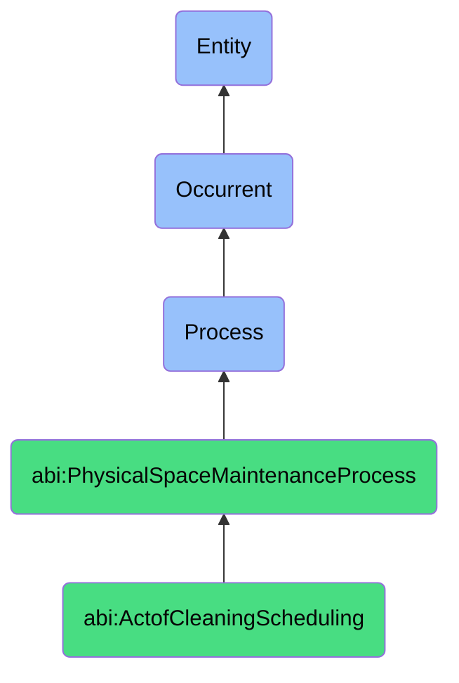

# ActofCleaningScheduling

## Definition
An act of cleaning scheduling is an occurrent process that unfolds through time, involving the planning, coordination, assignment, and temporal arrangement of cleaning activities for physical spaces, facilities, or workplaces, establishing when, how, and by whom cleaning tasks will be performed in response to routine maintenance requirements, special circumstances, or organizational policies, ensuring appropriate cleanliness standards are maintained through systematic allocation of cleaning resources, personnel, and time slots within operational constraints.

## Hierarchy in BFO


## Ontological Schema (TBox)
```turtle
abi:ActofCleaningScheduling a owl:Class ;
  rdfs:subClassOf abi:PhysicalSpaceMaintenanceProcess ;
  rdfs:label "Act of Cleaning Scheduling" ;
  skos:definition "A process that defines the routine or reactive cleaning of office or facility spaces." .

abi:PhysicalSpaceMaintenanceProcess a owl:Class ;
  rdfs:subClassOf bfo:0000015 ;
  rdfs:label "Physical Space Maintenance Process" ;
  skos:definition "A time-bound process related to the management, maintenance, scheduling, or allocation of physical spaces, facilities, or infrastructure." .

abi:has_scheduling_authority a owl:ObjectProperty ;
  rdfs:domain abi:ActofCleaningScheduling ;
  rdfs:range abi:SchedulingAuthority ;
  rdfs:label "has scheduling authority" .

abi:schedules_cleaning_task a owl:ObjectProperty ;
  rdfs:domain abi:ActofCleaningScheduling ;
  rdfs:range abi:CleaningTask ;
  rdfs:label "schedules cleaning task" .

abi:designates_target_area a owl:ObjectProperty ;
  rdfs:domain abi:ActofCleaningScheduling ;
  rdfs:range abi:TargetArea ;
  rdfs:label "designates target area" .

abi:allocates_cleaning_resource a owl:ObjectProperty ;
  rdfs:domain abi:ActofCleaningScheduling ;
  rdfs:range abi:CleaningResource ;
  rdfs:label "allocates cleaning resource" .

abi:follows_cleaning_standard a owl:ObjectProperty ;
  rdfs:domain abi:ActofCleaningScheduling ;
  rdfs:range abi:CleaningStandard ;
  rdfs:label "follows cleaning standard" .

abi:responds_to_trigger_event a owl:ObjectProperty ;
  rdfs:domain abi:ActofCleaningScheduling ;
  rdfs:range abi:TriggerEvent ;
  rdfs:label "responds to trigger event" .

abi:produces_cleaning_schedule a owl:ObjectProperty ;
  rdfs:domain abi:ActofCleaningScheduling ;
  rdfs:range abi:CleaningSchedule ;
  rdfs:label "produces cleaning schedule" .

abi:has_schedule_creation_date a owl:DatatypeProperty ;
  rdfs:domain abi:ActofCleaningScheduling ;
  rdfs:range xsd:date ;
  rdfs:label "has schedule creation date" .

abi:has_cleaning_frequency a owl:DatatypeProperty ;
  rdfs:domain abi:ActofCleaningScheduling ;
  rdfs:range xsd:string ;
  rdfs:label "has cleaning frequency" .

abi:has_scheduling_trigger a owl:DatatypeProperty ;
  rdfs:domain abi:ActofCleaningScheduling ;
  rdfs:range xsd:string ;
  rdfs:label "has scheduling trigger" .
```

## Ontological Instance (ABox)
```turtle
ex:OnboardingTriggeredOfficeCleaningSchedule a abi:ActofCleaningScheduling ;
  rdfs:label "New Employee Onboarding-Triggered Office Cleaning Schedule" ;
  abi:has_scheduling_authority ex:FacilitiesManager, ex:OfficeAdministrator ;
  abi:schedules_cleaning_task ex:WorkstationSanitization, ex:CommonAreaCleanup, ex:FloorCleaning ;
  abi:designates_target_area ex:NewEmployeeWorkstation, ex:SurroundingArea, ex:DepartmentCommonSpace ;
  abi:allocates_cleaning_resource ex:CleaningStaff, ex:SanitizationSupplies, ex:CleaningEquipment ;
  abi:follows_cleaning_standard ex:WorkplaceHygienePolicy, ex:NewEmployeeReadinessStandard ;
  abi:responds_to_trigger_event ex:NewEmployeeOnboarding, ex:WorkspaceAssignment ;
  abi:produces_cleaning_schedule ex:PriorityCleaningOrder, ex:StaffTaskAssignment, ex:CompletionVerificationChecklist ;
  abi:has_schedule_creation_date "2023-11-15"^^xsd:date ;
  abi:has_cleaning_frequency "One-time (pre-arrival)" ;
  abi:has_scheduling_trigger "New employee onboarding process completion" .

ex:RegularOfficeMaintenanceSchedule a abi:ActofCleaningScheduling ;
  rdfs:label "Quarterly Deep Cleaning Schedule for Office Complex" ;
  abi:has_scheduling_authority ex:MaintenanceDirector, ex:CleaningServiceProvider ;
  abi:schedules_cleaning_task ex:CarpetExtraction, ex:WindowWashing, ex:AirVentCleaning, ex:FurnitureSanitization ;
  abi:designates_target_area ex:EntireOfficeFloor, ex:MeetingRooms, ex:Kitchenettes, ex:Restrooms ;
  abi:allocates_cleaning_resource ex:SpecializedCleaningTeam, ex:IndustrialEquipment, ex:EcoFriendlySolutions ;
  abi:follows_cleaning_standard ex:CommercialCleaningGuidelines, ex:IndoorAirQualityStandards, ex:SustainabilityRequirements ;
  abi:responds_to_trigger_event ex:QuarterlyMaintenanceCycle, ex:SeasonalRequirements ;
  abi:produces_cleaning_schedule ex:QuarterlyCleaningCalendar, ex:StaffingRotation, ex:MaterialsInventoryPlan ;
  abi:has_schedule_creation_date "2023-10-01"^^xsd:date ;
  abi:has_cleaning_frequency "Quarterly" ;
  abi:has_scheduling_trigger "Regular maintenance cycle" .
```

## Related Classes
- **abi:ActofSpaceReservation** - A process that may prompt special cleaning activities for reserved spaces.
- **abi:ActofMaintenanceRequest** - A process that might include cleaning tasks as part of broader maintenance.
- **abi:WorkplaceHealthSafetyProcess** - A process that sets standards that cleaning schedules must support.
- **abi:CleaningExecutionProcess** - A process that executes the cleaning activities defined in the schedule.
- **abi:CleaningQualityAssessmentProcess** - A process that evaluates the effectiveness of cleaning activities.
- **abi:SupplyManagementProcess** - A process for managing cleaning supplies and materials.
- **abi:WorkforceSchedulingProcess** - A broader process that includes scheduling of cleaning personnel. 