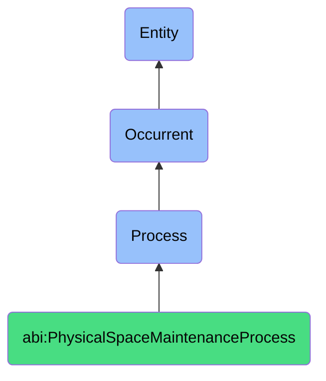

# PhysicalSpaceMaintenanceProcess

## Definition
A physical space maintenance process is an occurrent that unfolds through time, involving the systematic management, coordination, scheduling, or execution of activities related to physical environments, facilities, workspaces, or infrastructure, ensuring optimal functionality, cleanliness, availability, or condition of material spaces through standardized procedures that govern space utilization, environmental maintenance, resource allocation, or facility operations while supporting organizational activities, compliance requirements, and occupant well-being.

## Hierarchy in BFO


## Ontological Schema (TBox)
```turtle
abi:PhysicalSpaceMaintenanceProcess a owl:Class ;
  rdfs:subClassOf bfo:0000015 ;
  rdfs:label "Physical Space Maintenance Process" ;
  skos:definition "A time-bound process related to the management, maintenance, scheduling, or allocation of physical spaces, facilities, or infrastructure." .

abi:has_space_agent a owl:ObjectProperty ;
  rdfs:domain abi:PhysicalSpaceMaintenanceProcess ;
  rdfs:range abi:SpaceAgent ;
  rdfs:label "has space agent" .

abi:involves_physical_location a owl:ObjectProperty ;
  rdfs:domain abi:PhysicalSpaceMaintenanceProcess ;
  rdfs:range abi:PhysicalLocation ;
  rdfs:label "involves physical location" .

abi:requires_facility_resource a owl:ObjectProperty ;
  rdfs:domain abi:PhysicalSpaceMaintenanceProcess ;
  rdfs:range abi:FacilityResource ;
  rdfs:label "requires facility resource" .

abi:follows_facility_policy a owl:ObjectProperty ;
  rdfs:domain abi:PhysicalSpaceMaintenanceProcess ;
  rdfs:range abi:FacilityPolicy ;
  rdfs:label "follows facility policy" .

abi:applies_maintenance_procedure a owl:ObjectProperty ;
  rdfs:domain abi:PhysicalSpaceMaintenanceProcess ;
  rdfs:range abi:MaintenanceProcedure ;
  rdfs:label "applies maintenance procedure" .

abi:manages_space_condition a owl:ObjectProperty ;
  rdfs:domain abi:PhysicalSpaceMaintenanceProcess ;
  rdfs:range abi:SpaceCondition ;
  rdfs:label "manages space condition" .

abi:produces_facility_record a owl:ObjectProperty ;
  rdfs:domain abi:PhysicalSpaceMaintenanceProcess ;
  rdfs:range abi:FacilityRecord ;
  rdfs:label "produces facility record" .

abi:has_process_timestamp a owl:DatatypeProperty ;
  rdfs:domain abi:PhysicalSpaceMaintenanceProcess ;
  rdfs:range xsd:dateTime ;
  rdfs:label "has process timestamp" .

abi:has_process_status a owl:DatatypeProperty ;
  rdfs:domain abi:PhysicalSpaceMaintenanceProcess ;
  rdfs:range xsd:string ;
  rdfs:label "has process status" .

abi:has_priority_level a owl:DatatypeProperty ;
  rdfs:domain abi:PhysicalSpaceMaintenanceProcess ;
  rdfs:range xsd:string ;
  rdfs:label "has priority level" .
```

## Ontological Instance (ABox)
```turtle
# PhysicalSpaceMaintenanceProcess is a parent class with subclasses:
# - abi:ActofCleaningScheduling
# - abi:ActofSpaceReservation
# - abi:ActofMaintenanceRequest
# and other physical space and maintenance-related processes
```

## Related Classes
- **abi:ActofCleaningScheduling** - A process that defines the routine or reactive cleaning of office or facility spaces.
- **abi:ActofSpaceReservation** - A process that manages requests and approvals for using physical spaces.
- **abi:ActofMaintenanceRequest** - A process that initiates repair or inspection tasks in physical infrastructure.
- **abi:FacilityInventoryProcess** - A process for tracking and managing physical assets within a facility.
- **abi:SpaceAllocationProcess** - A process for assigning workspaces or areas to organizational units.
- **abi:BuildingSecurityProcess** - A process that manages physical security aspects of facilities.
- **abi:WorkplaceHealthSafetyProcess** - A process for ensuring healthy and safe working environments. 