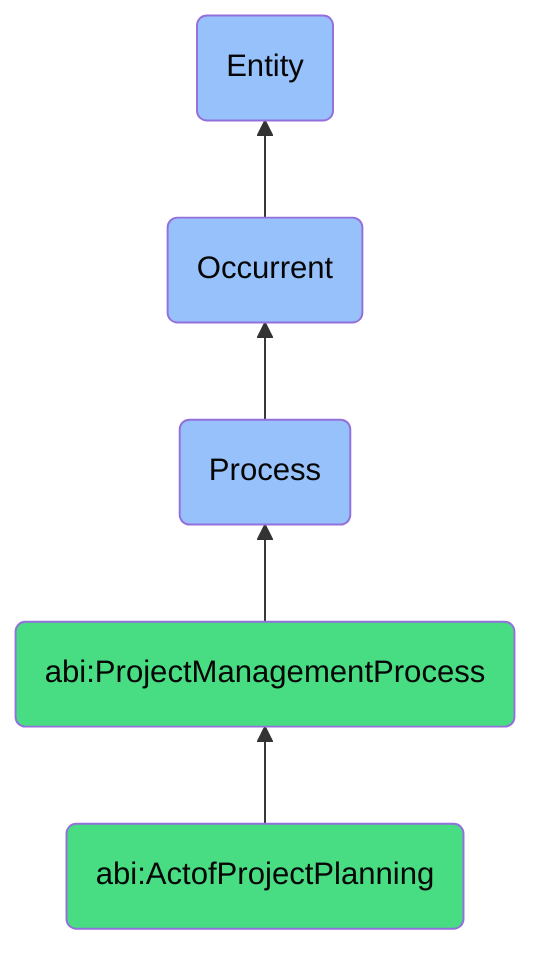

# ActofProjectPlanning

## Definition
An act of project planning is an occurrent process that unfolds through time, involving the deliberate definition, articulation, and organization of project objectives, deliverables, requirements, scope boundaries, resources, timelines, milestones, budgets, quality standards, and potential constraints, creating a structured framework and roadmap that serves as a baseline for execution, enables effective resource allocation, supports stakeholder alignment, facilitates decision-making, and establishes measurable criteria for evaluating project progress and success.

## Hierarchy in BFO


## Ontological Schema (TBox)
```turtle
abi:ActofProjectPlanning a owl:Class ;
  rdfs:subClassOf abi:ProjectManagementProcess ;
  rdfs:label "Act of Project Planning" ;
  skos:definition "A process that defines the goals, milestones, resources, scope, and timeline for a bounded set of coordinated activities." .

abi:ProjectManagementProcess a owl:Class ;
  rdfs:subClassOf bfo:0000015 ;
  rdfs:label "Project Management Process" ;
  skos:definition "A time-bound process related to the planning, execution, monitoring, and control of project activities to achieve specific objectives." .

abi:has_planning_lead a owl:ObjectProperty ;
  rdfs:domain abi:ActofProjectPlanning ;
  rdfs:range abi:PlanningLead ;
  rdfs:label "has planning lead" .

abi:involves_planning_stakeholder a owl:ObjectProperty ;
  rdfs:domain abi:ActofProjectPlanning ;
  rdfs:range abi:PlanningStakeholder ;
  rdfs:label "involves planning stakeholder" .

abi:defines_project_objective a owl:ObjectProperty ;
  rdfs:domain abi:ActofProjectPlanning ;
  rdfs:range abi:ProjectObjective ;
  rdfs:label "defines project objective" .

abi:establishes_project_scope a owl:ObjectProperty ;
  rdfs:domain abi:ActofProjectPlanning ;
  rdfs:range abi:ProjectScope ;
  rdfs:label "establishes project scope" .

abi:allocates_project_resource a owl:ObjectProperty ;
  rdfs:domain abi:ActofProjectPlanning ;
  rdfs:range abi:ProjectResource ;
  rdfs:label "allocates project resource" .

abi:determines_project_timeline a owl:ObjectProperty ;
  rdfs:domain abi:ActofProjectPlanning ;
  rdfs:range abi:ProjectTimeline ;
  rdfs:label "determines project timeline" .

abi:identifies_project_milestone a owl:ObjectProperty ;
  rdfs:domain abi:ActofProjectPlanning ;
  rdfs:range abi:ProjectMilestone ;
  rdfs:label "identifies project milestone" .

abi:produces_project_plan a owl:ObjectProperty ;
  rdfs:domain abi:ActofProjectPlanning ;
  rdfs:range abi:ProjectPlan ;
  rdfs:label "produces project plan" .

abi:has_planning_start_date a owl:DatatypeProperty ;
  rdfs:domain abi:ActofProjectPlanning ;
  rdfs:range xsd:date ;
  rdfs:label "has planning start date" .

abi:has_planning_completion_date a owl:DatatypeProperty ;
  rdfs:domain abi:ActofProjectPlanning ;
  rdfs:range xsd:date ;
  rdfs:label "has planning completion date" .

abi:has_project_budget a owl:DatatypeProperty ;
  rdfs:domain abi:ActofProjectPlanning ;
  rdfs:range xsd:decimal ;
  rdfs:label "has project budget" .
```

## Ontological Instance (ABox)
```turtle
ex:AIAuditOnboardingPlanning a abi:ActofProjectPlanning ;
  rdfs:label "AI Audit Onboarding Project Planning Session" ;
  abi:has_planning_lead ex:DeliveryLead, ex:AIGovernanceManager ;
  abi:involves_planning_stakeholder ex:ClientStakeholders, ex:AIEthicsSpecialist, ex:ComplianceTeam, ex:TechnicalAuditor ;
  abi:defines_project_objective ex:AISystemInventory, ex:RiskAssessmentFramework, ex:ComplianceDocumentation, ex:RemediationPlan ;
  abi:establishes_project_scope ex:InScopeAISystems, ex:ExcludedLegacySystems, ex:RegulatoryRequirements, ex:BusinessUnitsInScope ;
  abi:allocates_project_resource ex:AuditTeamMembers, ex:StakeholderTime, ex:DocumentationPlatform, ex:AuditTools ;
  abi:determines_project_timeline ex:ThreeMonthProject, ex:DiscoveryPhase, ex:AssessmentPhase, ex:ReportingPhase ;
  abi:identifies_project_milestone ex:KickoffCompletion, ex:SystemInventoryFinalization, ex:RiskAssessmentCompletion, ex:FinalReportDelivery ;
  abi:produces_project_plan ex:AIAuditProjectCharter, ex:DetailedWorkPlan, ex:StakeholderCommunicationPlan, ex:RiskRegister ;
  abi:has_planning_start_date "2023-10-01"^^xsd:date ;
  abi:has_planning_completion_date "2023-10-15"^^xsd:date ;
  abi:has_project_budget "150000.00"^^xsd:decimal .

ex:ProductRebrandingPlanning a abi:ActofProjectPlanning ;
  rdfs:label "Product Rebranding Initiative Planning" ;
  abi:has_planning_lead ex:BrandDirector, ex:ProductManager ;
  abi:involves_planning_stakeholder ex:MarketingTeam, ex:DesignTeam, ex:SalesLeadership, ex:CustomerAdvocacyGroup ;
  abi:defines_project_objective ex:BrandIdentityRefresh, ex:UIRealignment, ex:MarketRepositioning, ex:CustomerPerceptionShift ;
  abi:establishes_project_scope ex:ProductSuiteInScope, ex:MarketingAssets, ex:DigitalPresence, ex:SalesEnablement ;
  abi:allocates_project_resource ex:DesignAgencyBudget, ex:MarketingTeamTime, ex:DevelopmentSprints, ex:UserResearch ;
  abi:determines_project_timeline ex:SixMonthRollout, ex:DiscoveryPhase, ex:DesignPhase, ex:ImplementationPhase, ex:LaunchPhase ;
  abi:identifies_project_milestone ex:BrandConceptApproval, ex:DesignSystemCompletion, ex:WebsiteRedesignApproval, ex:MarketLaunch ;
  abi:produces_project_plan ex:RebrandingProjectBrief, ex:AssetInventory, ex:StakeholderApprovalProcess, ex:RolloutStrategy ;
  abi:has_planning_start_date "2023-09-15"^^xsd:date ;
  abi:has_planning_completion_date "2023-10-20"^^xsd:date ;
  abi:has_project_budget "275000.00"^^xsd:decimal .
```

## Related Classes
- **abi:ActofTaskScheduling** - A process that follows project planning to assign specific timeframes and owners.
- **abi:ActofProjectTracking** - A process that monitors progress against the plan established in project planning.
- **abi:ActofMilestoneReview** - A process that verifies achievement of milestones defined during project planning.
- **abi:ActofRetrospectiveReview** - A process that evaluates the effectiveness of the planning process itself.
- **abi:ScopeDefinitionProcess** - A specialized process focused specifically on defining project boundaries.
- **abi:ResourceEstimationProcess** - A process for determining resource requirements for project activities.
- **abi:RiskPlanningProcess** - A process for identifying and planning responses to potential project risks. 