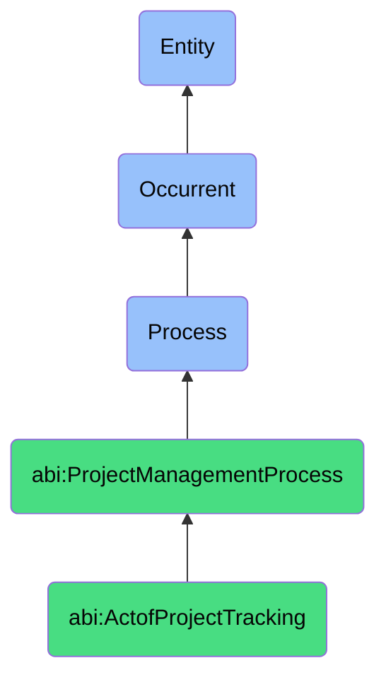

# ActofProjectTracking

## Definition
An act of project tracking is an occurrent process that unfolds through time, involving the regular, systematic collection, analysis, visualization, and communication of project performance data related to task completion, milestone achievement, resource utilization, impediment identification, and progress metrics, facilitating proactive management intervention, transparent stakeholder reporting, early identification of deviations from baseline plans, and informed decision-making to maintain project momentum and health through continuous monitoring and feedback loops.

## Hierarchy in BFO


## Ontological Schema (TBox)
```turtle
abi:ActofProjectTracking a owl:Class ;
  rdfs:subClassOf abi:ProjectManagementProcess ;
  rdfs:label "Act of Project Tracking" ;
  skos:definition "A recurring process that monitors task completion, blockers, status updates, and burndown velocity." .

abi:ProjectManagementProcess a owl:Class ;
  rdfs:subClassOf bfo:0000015 ;
  rdfs:label "Project Management Process" ;
  skos:definition "A time-bound process related to the planning, execution, monitoring, and control of project activities to achieve specific objectives." .

abi:has_tracking_facilitator a owl:ObjectProperty ;
  rdfs:domain abi:ActofProjectTracking ;
  rdfs:range abi:TrackingFacilitator ;
  rdfs:label "has tracking facilitator" .

abi:monitors_project_task a owl:ObjectProperty ;
  rdfs:domain abi:ActofProjectTracking ;
  rdfs:range abi:ProjectTask ;
  rdfs:label "monitors project task" .

abi:collects_status_update a owl:ObjectProperty ;
  rdfs:domain abi:ActofProjectTracking ;
  rdfs:range abi:StatusUpdate ;
  rdfs:label "collects status update" .

abi:identifies_blocker a owl:ObjectProperty ;
  rdfs:domain abi:ActofProjectTracking ;
  rdfs:range abi:Blocker ;
  rdfs:label "identifies blocker" .

abi:measures_progress_metric a owl:ObjectProperty ;
  rdfs:domain abi:ActofProjectTracking ;
  rdfs:range abi:ProgressMetric ;
  rdfs:label "measures progress metric" .

abi:initiates_corrective_action a owl:ObjectProperty ;
  rdfs:domain abi:ActofProjectTracking ;
  rdfs:range abi:CorrectiveAction ;
  rdfs:label "initiates corrective action" .

abi:generates_tracking_report a owl:ObjectProperty ;
  rdfs:domain abi:ActofProjectTracking ;
  rdfs:range abi:TrackingReport ;
  rdfs:label "generates tracking report" .

abi:has_tracking_frequency a owl:DatatypeProperty ;
  rdfs:domain abi:ActofProjectTracking ;
  rdfs:range xsd:string ;
  rdfs:label "has tracking frequency" .

abi:has_tracking_date a owl:DatatypeProperty ;
  rdfs:domain abi:ActofProjectTracking ;
  rdfs:range xsd:date ;
  rdfs:label "has tracking date" .

abi:has_project_completion_percentage a owl:DatatypeProperty ;
  rdfs:domain abi:ActofProjectTracking ;
  rdfs:range xsd:decimal ;
  rdfs:label "has project completion percentage" .
```

## Ontological Instance (ABox)
```turtle
ex:ProductRoadmapDailyStandupTracking a abi:ActofProjectTracking ;
  rdfs:label "Product Roadmap Daily Standup Tracking Process" ;
  abi:has_tracking_facilitator ex:ProductManager, ex:ScrumMaster ;
  abi:monitors_project_task ex:FeatureA_Development, ex:FeatureB_Testing, ex:FeatureC_Design, ex:DocumentationUpdate ;
  abi:collects_status_update ex:DeveloperProgressUpdate, ex:QATestingResults, ex:DesignReviewFeedback, ex:StakeholderInput ;
  abi:identifies_blocker ex:APIIntegrationIssue, ex:ResourceConstraint, ex:TechnicalDebtImpediment, ex:DependencyDelay ;
  abi:measures_progress_metric ex:StoryPointsCompleted, ex:TestCaseCoverage, ex:BurndownRate, ex:VelocityTrend ;
  abi:initiates_corrective_action ex:TeamCapacityAdjustment, ex:TechnicalDebtSpike, ex:ScopeRefinement, ex:ResourceReallocation ;
  abi:generates_tracking_report ex:DailyStandupLog, ex:JiraBoardUpdate, ex:SlackChannelSummary, ex:WeeklyStatusEmail ;
  abi:has_tracking_frequency "Daily" ;
  abi:has_tracking_date "2023-11-15"^^xsd:date ;
  abi:has_project_completion_percentage "0.68"^^xsd:decimal .

ex:MarketingCampaignWeeklyTracking a abi:ActofProjectTracking ;
  rdfs:label "Marketing Campaign Weekly Progress Tracking" ;
  abi:has_tracking_facilitator ex:MarketingDirector, ex:CampaignCoordinator ;
  abi:monitors_project_task ex:ContentProduction, ex:ChannelSetup, ex:AudienceSegmentation, ex:CreativeApproval ;
  abi:collects_status_update ex:ContentTeamUpdate, ex:ChannelManagerReport, ex:CreativeTeamStatus, ex:VendorDeliverableStatus ;
  abi:identifies_blocker ex:ContentApprovalDelay, ex:ChannelConfigurationIssue, ex:ResourceBandwidthConstraint, ex:AssetQualityIssue ;
  abi:measures_progress_metric ex:ContentCompletionRate, ex:PrelaunchChecklist, ex:DeliverableQuality, ex:TimelineAdherence ;
  abi:initiates_corrective_action ex:ApprovalProcessAcceleration, ex:AdditionalResourceAllocation, ex:DeadlineRenegotiation, ex:ProcessSimplification ;
  abi:generates_tracking_report ex:WeeklyStatusDashboard, ex:ExecutiveSummary, ex:RedFlaggedItemsAlert, ex:AssetCompletionMatrix ;
  abi:has_tracking_frequency "Weekly" ;
  abi:has_tracking_date "2023-11-10"^^xsd:date ;
  abi:has_project_completion_percentage "0.45"^^xsd:decimal .
```

## Related Classes
- **abi:ActofProjectPlanning** - A process that establishes the baseline against which tracking compares actual progress.
- **abi:ActofTaskScheduling** - A process that creates the task assignments and timelines monitored during tracking.
- **abi:ActofMilestoneReview** - A process that provides formal verification of progress tracked over time.
- **abi:ActofRetrospectiveReview** - A process that evaluates the effectiveness of tracking processes after completion.
- **abi:StatusReportingProcess** - A specialized process for communicating tracking information to stakeholders.
- **abi:PerformanceAnalysisProcess** - A process for analyzing tracked data to identify patterns and trends.
- **abi:EscalationManagementProcess** - A process triggered when tracking identifies critical issues requiring intervention. 