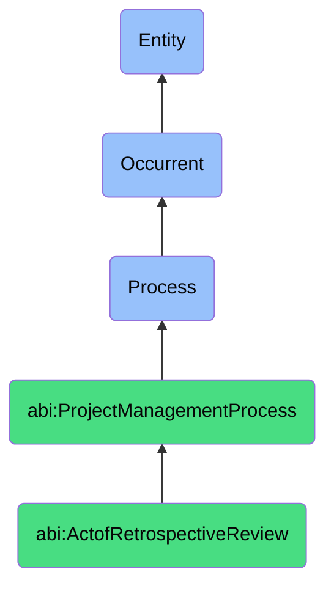

# ActofRetrospectiveReview

## Definition
An act of retrospective review is an occurrent process that unfolds through time, involving the structured reflection, analysis, and discussion of a completed project, sprint, or significant work episode by the participating team members and stakeholders, to identify strengths, weaknesses, challenges, successes, learning opportunities, and areas for improvement through candid examination of processes, practices, interactions, and outcomes, resulting in actionable insights and adjustments intended to enhance performance, collaboration, and effectiveness in future work.

## Hierarchy in BFO


## Ontological Schema (TBox)
```turtle
abi:ActofRetrospectiveReview a owl:Class ;
  rdfs:subClassOf abi:ProjectManagementProcess ;
  rdfs:label "Act of Retrospective Review" ;
  skos:definition "A process conducted after a project or sprint to extract learnings, feedback, and future optimizations." .

abi:ProjectManagementProcess a owl:Class ;
  rdfs:subClassOf bfo:0000015 ;
  rdfs:label "Project Management Process" ;
  skos:definition "A time-bound process related to the planning, execution, monitoring, and control of project activities to achieve specific objectives." .

abi:has_retrospective_facilitator a owl:ObjectProperty ;
  rdfs:domain abi:ActofRetrospectiveReview ;
  rdfs:range abi:RetrospectiveFacilitator ;
  rdfs:label "has retrospective facilitator" .

abi:involves_retrospective_participant a owl:ObjectProperty ;
  rdfs:domain abi:ActofRetrospectiveReview ;
  rdfs:range abi:RetrospectiveParticipant ;
  rdfs:label "involves retrospective participant" .

abi:reviews_project_element a owl:ObjectProperty ;
  rdfs:domain abi:ActofRetrospectiveReview ;
  rdfs:range abi:ProjectElement ;
  rdfs:label "reviews project element" .

abi:uses_retrospective_method a owl:ObjectProperty ;
  rdfs:domain abi:ActofRetrospectiveReview ;
  rdfs:range abi:RetrospectiveMethod ;
  rdfs:label "uses retrospective method" .

abi:identifies_success_factor a owl:ObjectProperty ;
  rdfs:domain abi:ActofRetrospectiveReview ;
  rdfs:range abi:SuccessFactor ;
  rdfs:label "identifies success factor" .

abi:identifies_improvement_opportunity a owl:ObjectProperty ;
  rdfs:domain abi:ActofRetrospectiveReview ;
  rdfs:range abi:ImprovementOpportunity ;
  rdfs:label "identifies improvement opportunity" .

abi:produces_retrospective_artifact a owl:ObjectProperty ;
  rdfs:domain abi:ActofRetrospectiveReview ;
  rdfs:range abi:RetrospectiveArtifact ;
  rdfs:label "produces retrospective artifact" .

abi:has_retrospective_date a owl:DatatypeProperty ;
  rdfs:domain abi:ActofRetrospectiveReview ;
  rdfs:range xsd:date ;
  rdfs:label "has retrospective date" .

abi:has_retrospective_duration a owl:DatatypeProperty ;
  rdfs:domain abi:ActofRetrospectiveReview ;
  rdfs:range xsd:duration ;
  rdfs:label "has retrospective duration" .

abi:has_actionable_items_count a owl:DatatypeProperty ;
  rdfs:domain abi:ActofRetrospectiveReview ;
  rdfs:range xsd:integer ;
  rdfs:label "has actionable items count" .
```

## Ontological Instance (ABox)
```turtle
ex:SprintRetrospectiveMeeting a abi:ActofRetrospectiveReview ;
  rdfs:label "Cross-Functional Team Sprint Retrospective" ;
  abi:has_retrospective_facilitator ex:ScrumMaster, ex:AgileCoach ;
  abi:involves_retrospective_participant ex:DevelopmentTeam, ex:ProductOwner, ex:QATeam, ex:DesignLead, ex:BusinessStakeholder ;
  abi:reviews_project_element ex:SprintDeliverables, ex:TeamCollaboration, ex:DevelopmentProcess, ex:FeatureImplementation, ex:QualityMetrics ;
  abi:uses_retrospective_method ex:StartStopContinueFormat, ex:TimelinedRetrospective, ex:MadSadGladExercise ;
  abi:identifies_success_factor ex:ImprovedTestAutomation, ex:CrossTeamCollaboration, ex:EarlyStakeholderFeedback, ex:ClearAcceptanceCriteria ;
  abi:identifies_improvement_opportunity ex:RequirementsRefinementProcess, ex:DevelopmentEnvironmentSetup, ex:DocumentationCompleteness, ex:TestCoverage ;
  abi:produces_retrospective_artifact ex:RetrospectiveNotes, ex:ActionItemsList, ex:ProcessImprovementProposal, ex:TeamSentimentChart ;
  abi:has_retrospective_date "2023-11-17"^^xsd:date ;
  abi:has_retrospective_duration "PT2H"^^xsd:duration ;
  abi:has_actionable_items_count "7"^^xsd:integer .

ex:ProjectCompletionRetrospective a abi:ActofRetrospectiveReview ;
  rdfs:label "Six-Month Platform Migration Project Retrospective" ;
  abi:has_retrospective_facilitator ex:ProjectDirector, ex:ExternalConsultant ;
  abi:involves_retrospective_participant ex:TechnicalTeamLeads, ex:ProjectManagementOffice, ex:BusinessOwners, ex:VendorPartners, ex:SupportTeam ;
  abi:reviews_project_element ex:MigrationApproach, ex:RiskManagementEffectiveness, ex:TimelineManagement, ex:BudgetAdherence, ex:StakeholderCommunication ;
  abi:uses_retrospective_method ex:FishboneAnalysis, ex:RootCauseDiscussion, ex:ProjectJourneyMap, ex:MetricsReview ;
  abi:identifies_success_factor ex:PhaseGatedApproach, ex:StrongExecutiveSponsorship, ex:ComprehensiveTestingStrategy, ex:UserInvolvement ;
  abi:identifies_improvement_opportunity ex:VendorManagementProcess, ex:CrossDependencyVisibility, ex:EnvironmentParity, ex:KnowledgeTransferProcess ;
  abi:produces_retrospective_artifact ex:ComprehensiveProjectReview, ex:LessonsLearnedDocument, ex:SuccessMetricsAnalysis, ex:FutureProjectRecommendations ;
  abi:has_retrospective_date "2023-10-30"^^xsd:date ;
  abi:has_retrospective_duration "P2D"^^xsd:duration ;
  abi:has_actionable_items_count "23"^^xsd:integer .
```

## Related Classes
- **abi:ActofProjectPlanning** - A process that establishes the objectives against which retrospectives evaluate outcomes.
- **abi:ActofTaskScheduling** - A process that creates work assignments evaluated during retrospectives.
- **abi:ActofProjectTracking** - A process that generates performance data used in retrospective analysis.
- **abi:ActofMilestoneReview** - A process that provides formal checkpoint data for retrospective evaluation.
- **abi:ContinuousImprovementProcess** - A process that implements action items identified in retrospectives.
- **abi:TeamDevelopmentProcess** - A process for enhancing team capabilities based on retrospective insights.
- **abi:ProcessOptimizationProcess** - A specialized process for refining work methods identified in retrospectives. 