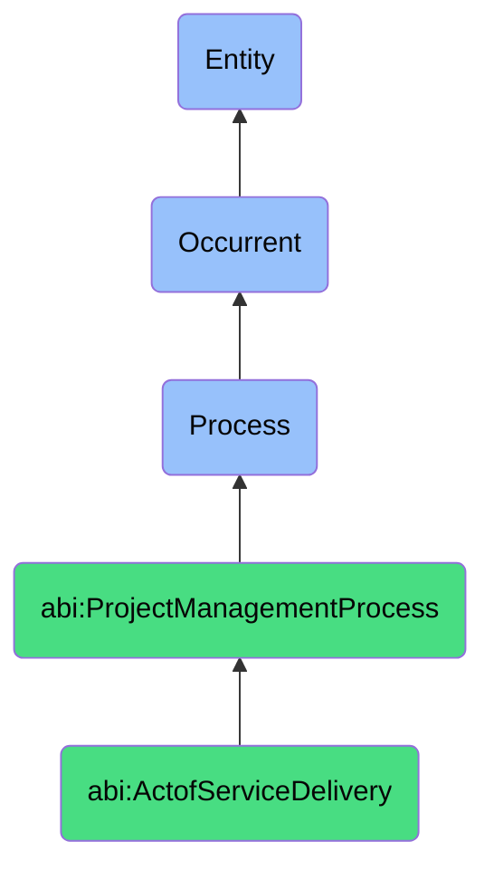

# ActofServiceDelivery

## Definition
An act of service delivery is an occurrent process that unfolds through time, involving the systematic provision, execution, and fulfillment of agreed-upon services, deliverables, or outcomes to clients, customers, or stakeholders according to established specifications, service level agreements, contractual obligations, or operational workflows, ensuring value creation through the coordinated application of resources, expertise, capabilities, and processes while maintaining quality standards, timeliness, and stakeholder satisfaction.

## Hierarchy in BFO


## Ontological Schema (TBox)
```turtle
abi:ActofServiceDelivery a owl:Class ;
  rdfs:subClassOf abi:ProjectManagementProcess ;
  rdfs:label "Act of Service Delivery" ;
  skos:definition "A process that provides agreed value to a client or stakeholder based on deliverables, SLAs, or workflows." .

abi:ProjectManagementProcess a owl:Class ;
  rdfs:subClassOf bfo:0000015 ;
  rdfs:label "Project Management Process" ;
  skos:definition "A time-bound process related to the planning, execution, monitoring, and control of project activities to achieve specific objectives." .

abi:has_service_provider a owl:ObjectProperty ;
  rdfs:domain abi:ActofServiceDelivery ;
  rdfs:range abi:ServiceProvider ;
  rdfs:label "has service provider" .

abi:serves_service_recipient a owl:ObjectProperty ;
  rdfs:domain abi:ActofServiceDelivery ;
  rdfs:range abi:ServiceRecipient ;
  rdfs:label "serves service recipient" .

abi:delivers_service_component a owl:ObjectProperty ;
  rdfs:domain abi:ActofServiceDelivery ;
  rdfs:range abi:ServiceComponent ;
  rdfs:label "delivers service component" .

abi:follows_service_specification a owl:ObjectProperty ;
  rdfs:domain abi:ActofServiceDelivery ;
  rdfs:range abi:ServiceSpecification ;
  rdfs:label "follows service specification" .

abi:utilizes_delivery_resource a owl:ObjectProperty ;
  rdfs:domain abi:ActofServiceDelivery ;
  rdfs:range abi:DeliveryResource ;
  rdfs:label "utilizes delivery resource" .

abi:adheres_to_service_level a owl:ObjectProperty ;
  rdfs:domain abi:ActofServiceDelivery ;
  rdfs:range abi:ServiceLevel ;
  rdfs:label "adheres to service level" .

abi:produces_delivery_artifact a owl:ObjectProperty ;
  rdfs:domain abi:ActofServiceDelivery ;
  rdfs:range abi:DeliveryArtifact ;
  rdfs:label "produces delivery artifact" .

abi:has_delivery_timestamp a owl:DatatypeProperty ;
  rdfs:domain abi:ActofServiceDelivery ;
  rdfs:range xsd:dateTime ;
  rdfs:label "has delivery timestamp" .

abi:has_delivery_frequency a owl:DatatypeProperty ;
  rdfs:domain abi:ActofServiceDelivery ;
  rdfs:range xsd:string ;
  rdfs:label "has delivery frequency" .

abi:has_delivery_status a owl:DatatypeProperty ;
  rdfs:domain abi:ActofServiceDelivery ;
  rdfs:range xsd:string ;
  rdfs:label "has delivery status" .
```

## Ontological Instance (ABox)
```turtle
ex:ClientWeeklyReportingDelivery a abi:ActofServiceDelivery ;
  rdfs:label "Client Weekly Reporting Service Delivery" ;
  abi:has_service_provider ex:ClientSuccessTeam, ex:DataAnalyticsTeam ;
  abi:serves_service_recipient ex:EnterpriseClient, ex:ClientProjectManager, ex:ClientStakeholders ;
  abi:delivers_service_component ex:PerformanceMetricsReport, ex:ActionItemsUpdate, ex:RoadmapProgressDashboard, ex:ResourceAllocationSummary ;
  abi:follows_service_specification ex:ReportingServiceAgreement, ex:DataVisualizationStandards, ex:ClientCommunicationProtocol ;
  abi:utilizes_delivery_resource ex:ReportingPlatform, ex:DataAnalytics, ex:VisualizationTools, ex:CommunicationChannels ;
  abi:adheres_to_service_level ex:DeliveryTimelineSLA, ex:DataAccuracyRequirement, ex:ResponseTimeSLA ;
  abi:produces_delivery_artifact ex:WeeklyStatusReport, ex:PerformanceDashboard, ex:DeliveryConfirmation ;
  abi:has_delivery_timestamp "2023-11-17T14:30:00Z"^^xsd:dateTime ;
  abi:has_delivery_frequency "Weekly" ;
  abi:has_delivery_status "Completed" .

ex:AIAssistantMultiStakeholderDelivery a abi:ActofServiceDelivery ;
  rdfs:label "RunOps AI Assistant Delivery Across Multiple Stakeholders" ;
  abi:has_service_provider ex:AIOperationsTeam, ex:AIAssistantSystem ;
  abi:serves_service_recipient ex:ProductTeam, ex:MarketingDepartment, ex:CustomerSuccessTeam ;
  abi:delivers_service_component ex:AutomatedDataProcessing, ex:ContentGeneration, ex:InsightRecommendations, ex:WorkflowAutomation ;
  abi:follows_service_specification ex:AIServiceAgreement, ex:DataProcessingStandards, ex:OutputQualityGuidelines ;
  abi:utilizes_delivery_resource ex:AIProcessingEngine, ex:DataConnectors, ex:APIIntegrations, ex:MachineLearningModels ;
  abi:adheres_to_service_level ex:ResponseTimeSLA, ex:AccuracyThresholds, ex:AvailabilityRequirements ;
  abi:produces_delivery_artifact ex:DeliveryTrackingDashboard, ex:StakeholderServiceReport, ex:UtilizationMetrics ;
  abi:has_delivery_timestamp "2023-11-15T08:00:00Z"^^xsd:dateTime ;
  abi:has_delivery_frequency "Continuous" ;
  abi:has_delivery_status "Active" .
```

## Related Classes
- **abi:ActofUptimeMonitoring** - A process that verifies whether systems supporting service delivery are performing as expected.
- **abi:ActofIncidentEscalation** - A process that may be triggered when service delivery encounters problems.
- **abi:ActofRunbookExecution** - A process that may guide standardized aspects of service delivery.
- **abi:ActofServiceLevelReview** - A process for evaluating whether service delivery met agreed standards.
- **abi:ActofProjectTracking** - A process for monitoring progress of service delivery activities.
- **abi:CustomerSatisfactionAssessmentProcess** - A process for evaluating recipient satisfaction with service delivery.
- **abi:DeliveryOptimizationProcess** - A process for improving efficiency and effectiveness of service delivery. 