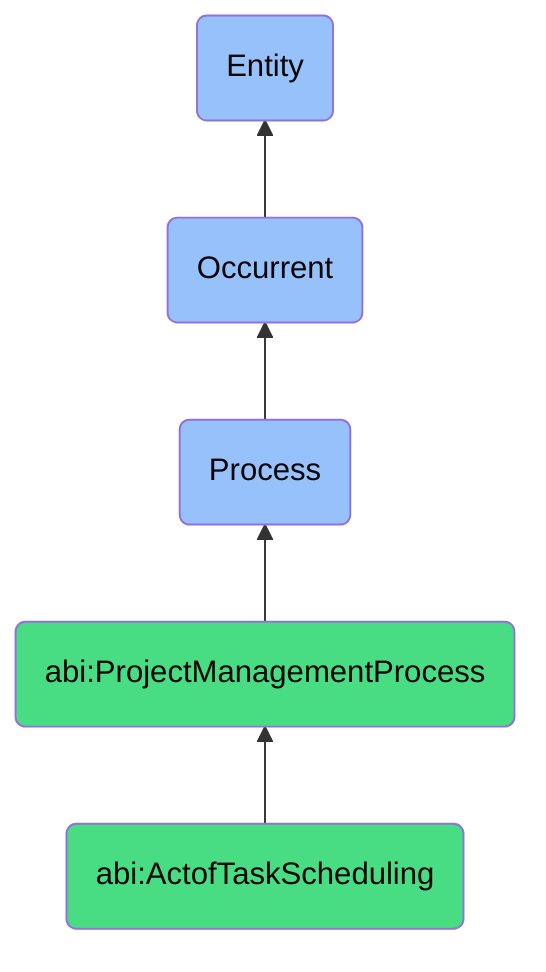

# ActofTaskScheduling

## Definition
An act of task scheduling is an occurrent process that unfolds through time, involving the systematic assignment, sequencing, and allocation of discrete work activities to specific timeframes, responsible agents, and available resources, while accounting for dependencies, constraints, and priorities to create a coordinated execution plan that optimizes workflow efficiency, manages critical paths, balances resource utilization, and establishes a temporal framework for tracking progress and meeting project deadlines.

## Hierarchy in BFO


## Ontological Schema (TBox)
```turtle
abi:ActofTaskScheduling a owl:Class ;
  rdfs:subClassOf abi:ProjectManagementProcess ;
  rdfs:label "Act of Task Scheduling" ;
  skos:definition "A process that assigns timeframes, dependencies, and owners to tasks within a project." .

abi:ProjectManagementProcess a owl:Class ;
  rdfs:subClassOf bfo:0000015 ;
  rdfs:label "Project Management Process" ;
  skos:definition "A time-bound process related to the planning, execution, monitoring, and control of project activities to achieve specific objectives." .

abi:has_scheduler a owl:ObjectProperty ;
  rdfs:domain abi:ActofTaskScheduling ;
  rdfs:range abi:Scheduler ;
  rdfs:label "has scheduler" .

abi:schedules_task a owl:ObjectProperty ;
  rdfs:domain abi:ActofTaskScheduling ;
  rdfs:range abi:Task ;
  rdfs:label "schedules task" .

abi:assigns_task_owner a owl:ObjectProperty ;
  rdfs:domain abi:ActofTaskScheduling ;
  rdfs:range abi:TaskOwner ;
  rdfs:label "assigns task owner" .

abi:determines_task_duration a owl:ObjectProperty ;
  rdfs:domain abi:ActofTaskScheduling ;
  rdfs:range abi:TaskDuration ;
  rdfs:label "determines task duration" .

abi:establishes_task_dependency a owl:ObjectProperty ;
  rdfs:domain abi:ActofTaskScheduling ;
  rdfs:range abi:TaskDependency ;
  rdfs:label "establishes task dependency" .

abi:allocates_task_resource a owl:ObjectProperty ;
  rdfs:domain abi:ActofTaskScheduling ;
  rdfs:range abi:TaskResource ;
  rdfs:label "allocates task resource" .

abi:sets_task_priority a owl:ObjectProperty ;
  rdfs:domain abi:ActofTaskScheduling ;
  rdfs:range abi:TaskPriority ;
  rdfs:label "sets task priority" .

abi:produces_schedule_artifact a owl:ObjectProperty ;
  rdfs:domain abi:ActofTaskScheduling ;
  rdfs:range abi:ScheduleArtifact ;
  rdfs:label "produces schedule artifact" .

abi:has_scheduling_date a owl:DatatypeProperty ;
  rdfs:domain abi:ActofTaskScheduling ;
  rdfs:range xsd:date ;
  rdfs:label "has scheduling date" .

abi:uses_scheduling_method a owl:DatatypeProperty ;
  rdfs:domain abi:ActofTaskScheduling ;
  rdfs:range xsd:string ;
  rdfs:label "uses scheduling method" .

abi:has_schedule_horizon a owl:DatatypeProperty ;
  rdfs:domain abi:ActofTaskScheduling ;
  rdfs:range xsd:duration ;
  rdfs:label "has schedule horizon" .
```

## Ontological Instance (ABox)
```turtle
ex:MarketingWorkbackScheduling a abi:ActofTaskScheduling ;
  rdfs:label "Marketing Campaign Workback Plan Scheduling in Notion" ;
  abi:has_scheduler ex:MarketingProjectManager, ex:ContentCoordinator ;
  abi:schedules_task ex:ContentBriefCreation, ex:AssetDesign, ex:CopyReview, ex:StakeholderApproval, ex:ChannelSetup, ex:LaunchExecution ;
  abi:assigns_task_owner ex:ContentStrategist, ex:DesignTeam, ex:CopyEditor, ex:BrandDirector, ex:ChannelSpecialists ;
  abi:determines_task_duration ex:BriefingWeekDuration, ex:TwoWeekAssetProduction, ex:ThreeDayReviewCycle, ex:OneDayApprovalWindow ;
  abi:establishes_task_dependency ex:BriefBeforeDesign, ex:DesignBeforeReview, ex:ApprovalBeforeSetup, ex:SetupBeforeLaunch ;
  abi:allocates_task_resource ex:DesignerHours, ex:CopyriterTime, ex:ReviewerAvailability, ex:DigitalAssetSystem ;
  abi:sets_task_priority ex:CriticalPathItems, ex:FlexibleTimelineItems, ex:ContingencyTasks ;
  abi:produces_schedule_artifact ex:NotionGanttChart, ex:DependencyMatrix, ex:ResourceAllocationTable, ex:DeliverableTimeline ;
  abi:has_scheduling_date "2023-11-01"^^xsd:date ;
  abi:uses_scheduling_method "Workback Planning with Critical Path Analysis" ;
  abi:has_schedule_horizon "P3M"^^xsd:duration .

ex:AIAssistedDevelopmentScheduling a abi:ActofTaskScheduling ;
  rdfs:label "AI-Assisted Development Sprint Task Scheduling" ;
  abi:has_scheduler ex:ScrumMaster, ex:ProductOwner, ex:TechLead ;
  abi:schedules_task ex:RequirementRefinement, ex:ArchitectureDesign, ex:FeatureDevelopment, ex:UnitTesting, ex:IntegrationTesting, ex:Documentation ;
  abi:assigns_task_owner ex:BusinessAnalyst, ex:SolutionArchitect, ex:DevelopmentTeam, ex:QATeam, ex:TechnicalWriter ;
  abi:determines_task_duration ex:TwoDayRefinement, ex:ThreeDayArchitecture, ex:TenDayDevelopment, ex:FiveDayTesting, ex:TwoDayDocumentation ;
  abi:establishes_task_dependency ex:RefinementBeforeArchitecture, ex:ArchitectureBeforeDevelopment, ex:DevelopmentBeforeTesting, ex:TestingBeforeDocumentation ;
  abi:allocates_task_resource ex:DeveloperCapacity, ex:ComputingResources, ex:TestingEnvironments, ex:DocumentationTools ;
  abi:sets_task_priority ex:MustHaveFeatures, ex:ShouldHaveFeatures, ex:CouldHaveFeatures ;
  abi:produces_schedule_artifact ex:JiraSprint, ex:DependencyGraph, ex:BurndownChart, ex:CapacityAllocation ;
  abi:has_scheduling_date "2023-10-15"^^xsd:date ;
  abi:uses_scheduling_method "Agile Sprint Planning with Temporal Logic Alignment" ;
  abi:has_schedule_horizon "P2W"^^xsd:duration .
```

## Related Classes
- **abi:ActofProjectPlanning** - A process that precedes task scheduling by defining the overall project framework.
- **abi:ActofProjectTracking** - A process that monitors progress of scheduled tasks during execution.
- **abi:ActofMilestoneReview** - A process that verifies achievement of milestones composed of scheduled tasks.
- **abi:ActofRetrospectiveReview** - A process that evaluates the effectiveness of task scheduling after completion.
- **abi:ResourceLevelingProcess** - A specialized process for optimizing resource allocation across scheduled tasks.
- **abi:CriticalPathAnalysisProcess** - A process for identifying and managing the sequence of tasks that determines project duration.
- **abi:ScheduleOptimizationProcess** - A process for improving task sequences and timelines to enhance efficiency. 