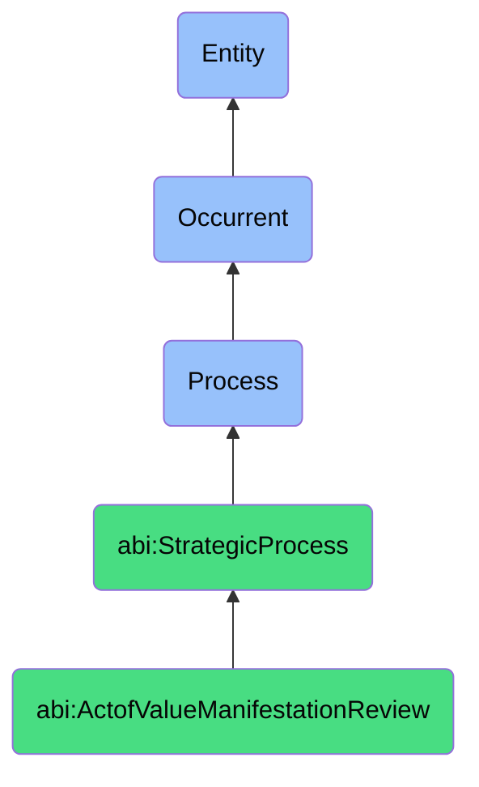

# ActofValueManifestationReview

## Definition
An act of value manifestation review is an occurrent process that unfolds through time, involving the systematic observation, analysis, and evaluation of organizational behaviors, decisions, communications, and artifacts to determine the extent to which they authentically embody and demonstrate the organization's stated core values, identifying instances of value alignment, conflict, or absence in operational practices, assessing the lived reality of value commitments, and providing feedback for corrective actions or reinforcement of value-aligned behaviors.

## Hierarchy in BFO


## Ontological Schema (TBox)
```turtle
abi:ActofValueManifestationReview a owl:Class ;
  rdfs:subClassOf abi:StrategicProcess ;
  rdfs:label "Act of Value Manifestation Review" ;
  skos:definition "A process that assesses how visible behavior aligns or misaligns with core organizational values." .

abi:StrategicProcess a owl:Class ;
  rdfs:subClassOf bfo:0000015 ;
  rdfs:label "Strategic Process" ;
  skos:definition "A time-bound process related to the assessment, alignment, articulation, or evolution of organizational purpose, principles, direction, and capabilities." .

abi:has_value_reviewer a owl:ObjectProperty ;
  rdfs:domain abi:ActofValueManifestationReview ;
  rdfs:range abi:ValueReviewer ;
  rdfs:label "has value reviewer" .

abi:examines_core_value a owl:ObjectProperty ;
  rdfs:domain abi:ActofValueManifestationReview ;
  rdfs:range abi:CoreValue ;
  rdfs:label "examines core value" .

abi:assesses_behavioral_manifestation a owl:ObjectProperty ;
  rdfs:domain abi:ActofValueManifestationReview ;
  rdfs:range abi:BehavioralManifestation ;
  rdfs:label "assesses behavioral manifestation" .

abi:applies_value_assessment_method a owl:ObjectProperty ;
  rdfs:domain abi:ActofValueManifestationReview ;
  rdfs:range abi:ValueAssessmentMethod ;
  rdfs:label "applies value assessment method" .

abi:identifies_value_alignment_pattern a owl:ObjectProperty ;
  rdfs:domain abi:ActofValueManifestationReview ;
  rdfs:range abi:ValueAlignmentPattern ;
  rdfs:label "identifies value alignment pattern" .

abi:recommends_value_reinforcement a owl:ObjectProperty ;
  rdfs:domain abi:ActofValueManifestationReview ;
  rdfs:range abi:ValueReinforcement ;
  rdfs:label "recommends value reinforcement" .

abi:produces_value_assessment_artifact a owl:ObjectProperty ;
  rdfs:domain abi:ActofValueManifestationReview ;
  rdfs:range abi:ValueAssessmentArtifact ;
  rdfs:label "produces value assessment artifact" .

abi:has_assessment_date a owl:DatatypeProperty ;
  rdfs:domain abi:ActofValueManifestationReview ;
  rdfs:range xsd:date ;
  rdfs:label "has assessment date" .

abi:has_value_alignment_level a owl:DatatypeProperty ;
  rdfs:domain abi:ActofValueManifestationReview ;
  rdfs:range xsd:decimal ;
  rdfs:label "has value alignment level" .

abi:has_assessment_scope a owl:DatatypeProperty ;
  rdfs:domain abi:ActofValueManifestationReview ;
  rdfs:range xsd:string ;
  rdfs:label "has assessment scope" .
```

## Ontological Instance (ABox)
```turtle
ex:ContentTransparencyValueReview a abi:ActofValueManifestationReview ;
  rdfs:label "Content Transparency Value Assessment Following User Feedback" ;
  abi:has_value_reviewer ex:EthicsCommittee, ex:ContentModeration, ex:UserExperienceTeam, ex:LegalAdvisor ;
  abi:examines_core_value ex:TransparencyValue, ex:UserTrustValue, ex:AccountabilityValue ;
  abi:assesses_behavioral_manifestation ex:ContentDisclosurePractices, ex:AlgorithmicRecommendationTransparency, ex:PrivacyNoticeClarity ;
  abi:applies_value_assessment_method ex:UserFeedbackAnalysis, ex:ExpertEvaluation, ex:CompetitiveBenchmarking, ex:CommunicationAudit ;
  abi:identifies_value_alignment_pattern ex:InconsistentInformationDisclosure, ex:TechnicalLanguageOveruse, ex:DelayedNotificationIssues ;
  abi:recommends_value_reinforcement ex:TransparencyFrameworkRevision, ex:PlainLanguageContentInitiative, ex:ProactiveDisclosurePolicy ;
  abi:produces_value_assessment_artifact ex:TransparencyAssessmentReport, ex:UserTrustActionPlan, ex:ContentGuidelinesUpdate ;
  abi:has_assessment_date "2023-10-12"^^xsd:date ;
  abi:has_value_alignment_level "0.64"^^xsd:decimal ;
  abi:has_assessment_scope "Content Creation and Distribution Processes" .

ex:TeamCollaborationValueReview a abi:ActofValueManifestationReview ;
  rdfs:label "Cross-Functional Collaboration Value Manifestation Assessment" ;
  abi:has_value_reviewer ex:OrganizationalDevelopmentLead, ex:DepartmentHeads, ex:CollaborationConsultant ;
  abi:examines_core_value ex:CollaborationValue, ex:RespectValue, ex:InclusivityValue, ex:InnovationValue ;
  abi:assesses_behavioral_manifestation ex:MeetingBehaviors, ex:CreditAttribution, ex:InformationSharing, ex:DecisionMakingProcesses ;
  abi:applies_value_assessment_method ex:ObservationalStudy, ex:EmployeeSurvey, ex:CommunicationPatternsAnalysis, ex:ProjectOutcomeReview ;
  abi:identifies_value_alignment_pattern ex:SiloedInformationHolding, ex:HierarchicalDecisionDominance, ex:SelectiveCollaboration ;
  abi:recommends_value_reinforcement ex:CrossFunctionalProcessRedesign, ex:CollaborationMetricsIntroduction, ex:RecognitionProgramEnhancement ;
  abi:produces_value_assessment_artifact ex:TeamDynamicsReport, ex:CollaborationGuidelines, ex:OrganizationalNetworkMap ;
  abi:has_assessment_date "2023-08-22"^^xsd:date ;
  abi:has_value_alignment_level "0.58"^^xsd:decimal ;
  abi:has_assessment_scope "Cross-Departmental Collaboration Processes" .
```

## Related Classes
- **abi:ActofMissionReview** - A complementary process examining alignment with organizational mission.
- **abi:ActofStrategySync** - A follow-up process to realign plans based on value alignment assessment.
- **abi:ValueDefinitionProcess** - A process for establishing or revising organizational values.
- **abi:CultureAssessmentProcess** - A broader process that includes value manifestation as a component.
- **abi:ValueCommunicationProcess** - A process for articulating values to stakeholders.
- **abi:BehavioralExpectationSettingProcess** - A process for defining value-aligned behaviors.
- **abi:CultureChangeInitiativeProcess** - A process for transforming organizational culture to better embody values. 