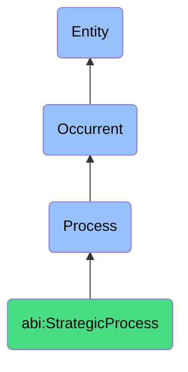

# StrategicProcess

## Definition
A strategic process is an occurrent that unfolds through time, involving the systematic assessment, alignment, articulation, or evolution of organizational purpose, principles, direction, and capabilities, through structured reflection, dialogue, and decision-making mechanisms that connect abstract aspirational elements with concrete operational realities, enabling coherent organizational identity, consistent prioritization frameworks, and adaptive responses to changing environments.

## Hierarchy in BFO


## Ontological Schema (TBox)
```turtle
abi:StrategicProcess a owl:Class ;
  rdfs:subClassOf bfo:0000015 ;
  rdfs:label "Strategic Process" ;
  skos:definition "A time-bound process related to the assessment, alignment, articulation, or evolution of organizational purpose, principles, direction, and capabilities." .

abi:has_strategic_agent a owl:ObjectProperty ;
  rdfs:domain abi:StrategicProcess ;
  rdfs:range abi:StrategicAgent ;
  rdfs:label "has strategic agent" .

abi:evaluates_strategic_element a owl:ObjectProperty ;
  rdfs:domain abi:StrategicProcess ;
  rdfs:range abi:StrategicElement ;
  rdfs:label "evaluates strategic element" .

abi:applies_strategic_framework a owl:ObjectProperty ;
  rdfs:domain abi:StrategicProcess ;
  rdfs:range abi:StrategicFramework ;
  rdfs:label "applies strategic framework" .

abi:occurs_in_strategic_context a owl:ObjectProperty ;
  rdfs:domain abi:StrategicProcess ;
  rdfs:range abi:StrategicContext ;
  rdfs:label "occurs in strategic context" .

abi:uses_strategic_method a owl:ObjectProperty ;
  rdfs:domain abi:StrategicProcess ;
  rdfs:range abi:StrategicMethod ;
  rdfs:label "uses strategic method" .

abi:produces_strategic_output a owl:ObjectProperty ;
  rdfs:domain abi:StrategicProcess ;
  rdfs:range abi:StrategicOutput ;
  rdfs:label "produces strategic output" .

abi:addresses_strategic_gap a owl:ObjectProperty ;
  rdfs:domain abi:StrategicProcess ;
  rdfs:range abi:StrategicGap ;
  rdfs:label "addresses strategic gap" .

abi:has_strategic_timestamp a owl:DatatypeProperty ;
  rdfs:domain abi:StrategicProcess ;
  rdfs:range xsd:dateTime ;
  rdfs:label "has strategic timestamp" .

abi:has_strategic_frequency a owl:DatatypeProperty ;
  rdfs:domain abi:StrategicProcess ;
  rdfs:range xsd:string ;
  rdfs:label "has strategic frequency" .

abi:has_strategic_impact_level a owl:DatatypeProperty ;
  rdfs:domain abi:StrategicProcess ;
  rdfs:range xsd:string ;
  rdfs:label "has strategic impact level" .
```

## Ontological Instance (ABox)
```turtle
# StrategicProcess is a parent class with subclasses:
# - abi:ActofMissionReview
# - abi:ActofValueManifestationReview
# - abi:ActofStrategySync
# and other strategy-related processes
```

## Related Classes
- **abi:ActofMissionReview** - A process that evaluates whether actions, strategies, or behaviors align with the declared mission.
- **abi:ActofValueManifestationReview** - A process that assesses how visible behavior aligns or misaligns with core organizational values.
- **abi:ActofStrategySync** - A scheduled or ad hoc process in which leadership or assistants realign plans with strategic intent.
- **abi:StrategicPlanningProcess** - A process for developing formal organizational direction and objectives.
- **abi:OrganizationalDesignProcess** - A process for structuring roles and responsibilities to support strategic aims.
- **abi:CapabilityMappingProcess** - A process for identifying and developing organizational abilities needed for strategy.
- **abi:StrategicRetreatProcess** - A dedicated time period for intensive strategic reflection and planning. 