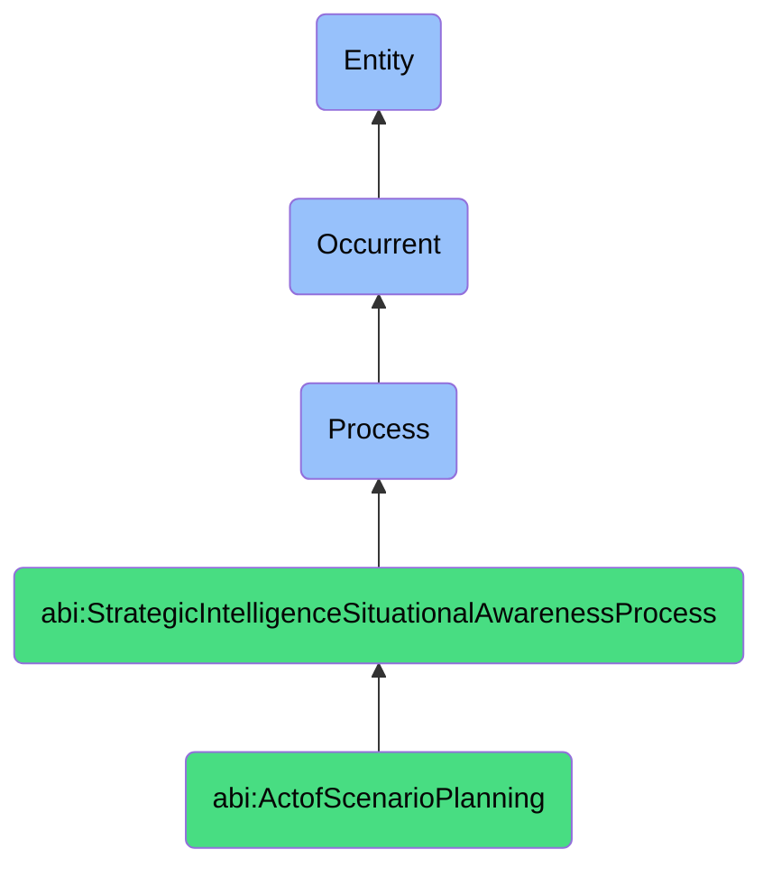

# ActofScenarioPlanning

## Definition
An act of scenario planning is an occurrent process that unfolds through time, involving the systematic development, elaboration, and analysis of multiple plausible future states or conditions that an organization, system, or environment might encounter, incorporating key driving forces, critical uncertainties, and potential causal relationships to create coherent narratives or models of alternative futures that expand thinking beyond linear projections, challenge assumptions, and prepare decision-makers to recognize, adapt to, or shape emerging conditions through enhanced strategic foresight.

## Hierarchy in BFO


## Ontological Schema (TBox)
```turtle
abi:ActofScenarioPlanning a owl:Class ;
  rdfs:subClassOf abi:StrategicIntelligenceSituationalAwarenessProcess ;
  rdfs:label "Act of Scenario Planning" ;
  skos:definition "A process that develops and analyzes multiple plausible future states to enhance strategic foresight and decision-making." .

abi:has_scenario_planner a owl:ObjectProperty ;
  rdfs:domain abi:ActofScenarioPlanning ;
  rdfs:range abi:ScenarioPlanner ;
  rdfs:label "has scenario planner" .

abi:focuses_on_planning_horizon a owl:ObjectProperty ;
  rdfs:domain abi:ActofScenarioPlanning ;
  rdfs:range abi:PlanningHorizon ;
  rdfs:label "focuses on planning horizon" .

abi:identifies_driving_force a owl:ObjectProperty ;
  rdfs:domain abi:ActofScenarioPlanning ;
  rdfs:range abi:DrivingForce ;
  rdfs:label "identifies driving force" .

abi:maps_critical_uncertainty a owl:ObjectProperty ;
  rdfs:domain abi:ActofScenarioPlanning ;
  rdfs:range abi:CriticalUncertainty ;
  rdfs:label "maps critical uncertainty" .

abi:applies_scenario_methodology a owl:ObjectProperty ;
  rdfs:domain abi:ActofScenarioPlanning ;
  rdfs:range abi:ScenarioMethodology ;
  rdfs:label "applies scenario methodology" .

abi:constructs_future_scenario a owl:ObjectProperty ;
  rdfs:domain abi:ActofScenarioPlanning ;
  rdfs:range abi:FutureScenario ;
  rdfs:label "constructs future scenario" .

abi:identifies_scenario_implications a owl:ObjectProperty ;
  rdfs:domain abi:ActofScenarioPlanning ;
  rdfs:range abi:ScenarioImplication ;
  rdfs:label "identifies scenario implications" .

abi:develops_scenario_indicator a owl:ObjectProperty ;
  rdfs:domain abi:ActofScenarioPlanning ;
  rdfs:range abi:ScenarioIndicator ;
  rdfs:label "develops scenario indicator" .

abi:produces_scenario_artifact a owl:ObjectProperty ;
  rdfs:domain abi:ActofScenarioPlanning ;
  rdfs:range abi:ScenarioArtifact ;
  rdfs:label "produces scenario artifact" .

abi:has_planning_timestamp a owl:DatatypeProperty ;
  rdfs:domain abi:ActofScenarioPlanning ;
  rdfs:range xsd:dateTime ;
  rdfs:label "has planning timestamp" .

abi:has_scenario_count a owl:DatatypeProperty ;
  rdfs:domain abi:ActofScenarioPlanning ;
  rdfs:range xsd:integer ;
  rdfs:label "has scenario count" .

abi:has_time_horizon_years a owl:DatatypeProperty ;
  rdfs:domain abi:ActofScenarioPlanning ;
  rdfs:range xsd:integer ;
  rdfs:label "has time horizon years" .
```

## Ontological Instance (ABox)
```turtle
ex:DigitalTransformationScenarioPlanning a abi:ActofScenarioPlanning ;
  rdfs:label "Enterprise Digital Transformation Scenario Planning" ;
  abi:has_scenario_planner ex:ChiefDigitalOfficer, ex:StrategyConsultant, ex:EnterpriseArchitect, ex:BusinessLineLeaders ;
  abi:focuses_on_planning_horizon ex:FiveYearTransformation, ex:TechnologyAdoptionCycles ;
  abi:identifies_driving_force ex:CustomerExpectationShift, ex:CompetitiveDisruption, ex:TechnologyEvolution, ex:WorkforceCapabilities ;
  abi:maps_critical_uncertainty ex:AdoptionRate, ex:RegulatoryResponse, ex:CapabilityGap, ex:DisruptionPace ;
  abi:applies_scenario_methodology ex:TwoAxisUncertaintyMatrix, ex:SystemsDynamicsModeling, ex:CrossImpactAnalysis ;
  abi:constructs_future_scenario ex:IncrementalEvolutionScenario, ex:RadicalDisruptionScenario, ex:HybridTransformationScenario, ex:RegulatedInnovationScenario ;
  abi:identifies_scenario_implications ex:CapabilityRequirements, ex:InvestmentProfiles, ex:OrganizationalImpacts, ex:CompetitivePositioning ;
  abi:develops_scenario_indicator ex:CustomerAdoptionMetrics, ex:TechnologyReadinessSignals, ex:CompetitorMoves ;
  abi:produces_scenario_artifact ex:ScenarioNarratives, ex:StrategicImplicationMatrix, ex:RiskMitigationPlan, ex:CapabilityRoadmap ;
  abi:has_planning_timestamp "2023-10-05T09:30:00Z"^^xsd:dateTime ;
  abi:has_scenario_count "4"^^xsd:integer ;
  abi:has_time_horizon_years "5"^^xsd:integer .

ex:GeopoliticalSupplyChainScenarioPlanning a abi:ActofScenarioPlanning ;
  rdfs:label "Geopolitical Supply Chain Resilience Scenario Planning" ;
  abi:has_scenario_planner ex:ChiefSupplyChainOfficer, ex:GeopoliticalAnalyst, ex:RiskManager, ex:GlobalOperationsTeam ;
  abi:focuses_on_planning_horizon ex:ThreeYearResilience, ex:GlobalTradeShifts ;
  abi:identifies_driving_force ex:TradeBarriers, ex:RegionalConflicts, ex:ResourceNationalism, ex:ClimateImpacts ;
  abi:maps_critical_uncertainty ex:TradeRelationshipStability, ex:SupplierNationalization, ex:ResourceAccessibility ;
  abi:applies_scenario_methodology ex:BranchingAnalysis, ex:DelphistMethods, ex:MorphologicalAnalysis ;
  abi:constructs_future_scenario ex:DeglobalizationScenario, ex:RegionalBlocksScenario, ex:ResilienceNetworkScenario, ex:NewGlobalOrderScenario ;
  abi:identifies_scenario_implications ex:SupplierDiversification, ex:InventoryStrategies, ex:ManufacturingFootprint, ex:TransportationAlternatives ;
  abi:develops_scenario_indicator ex:TradeFlowMetrics, ex:PoliticalStabilityIndices, ex:ResourcePriceVolatility ;
  abi:produces_scenario_artifact ex:ResilienceStrategyDocument, ex:ScenarioResponsePlaybooks, ex:EarlyWarningSystem ;
  abi:has_planning_timestamp "2023-11-12T14:15:00Z"^^xsd:dateTime ;
  abi:has_scenario_count "4"^^xsd:integer ;
  abi:has_time_horizon_years "3"^^xsd:integer .
```

## Related Classes
- **abi:ActofSituationAssessment** - A process that establishes the current state before projecting scenarios.
- **abi:ActofSituationalAwarenessGeneration** - A process that creates awareness of the present situation from which scenarios extend.
- **abi:ActofSimulation** - A process that may test or explore specific aspects of scenarios.
- **abi:ActofStrategicOptionGeneration** - A process that develops options that may be derived from scenario implications.
- **abi:ActofNextBestMoveSelection** - A process that selects strategic moves informed by scenario planning.
- **abi:ForecastingProcess** - A process related to predicting future states, which may complement scenario planning.
- **abi:StrategicRiskManagementProcess** - A process for identifying and managing risks, which scenario planning informs. 