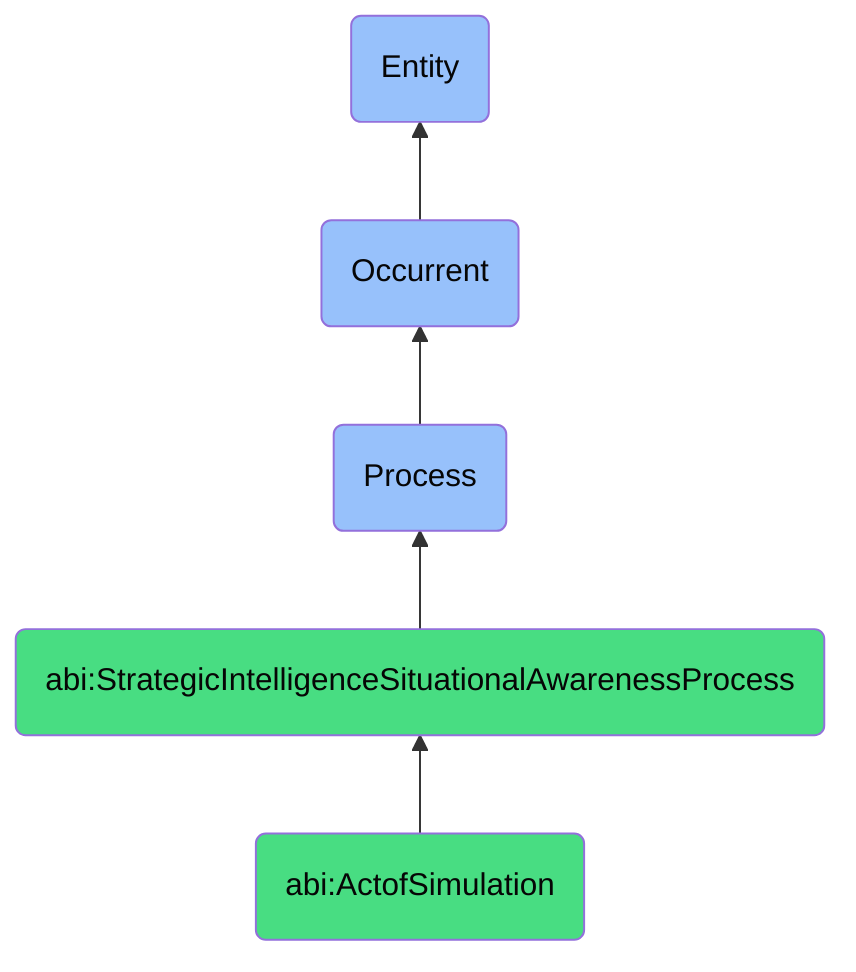

# ActofSimulation

## Definition
An act of simulation is an occurrent process that unfolds through time, involving the creation of a controlled, virtual reproduction of a complex system, process, or environment where key parameters, conditions, or factors can be manipulated to generate hypothetical scenarios or outcomes that reveal potential dynamics, emergent properties, or responses to different inputs, allowing the modeler to explore "what if" questions, test hypotheses, validate assumptions, or surface non-intuitive consequences within a safe experimental space before decisions are made or investments are allocated.

## Hierarchy in BFO


## Ontological Schema (TBox)
```turtle
abi:ActofSimulation a owl:Class ;
  rdfs:subClassOf abi:StrategicIntelligenceSituationalAwarenessProcess ;
  rdfs:label "Act of Simulation" ;
  skos:definition "A process that creates a controlled virtual reproduction of a system to explore hypothetical scenarios and outcomes." .

abi:has_simulation_designer a owl:ObjectProperty ;
  rdfs:domain abi:ActofSimulation ;
  rdfs:range abi:SimulationDesigner ;
  rdfs:label "has simulation designer" .

abi:simulates_target_system a owl:ObjectProperty ;
  rdfs:domain abi:ActofSimulation ;
  rdfs:range abi:TargetSystem ;
  rdfs:label "simulates target system" .

abi:implements_simulation_model a owl:ObjectProperty ;
  rdfs:domain abi:ActofSimulation ;
  rdfs:range abi:SimulationModel ;
  rdfs:label "implements simulation model" .

abi:incorporates_system_parameter a owl:ObjectProperty ;
  rdfs:domain abi:ActofSimulation ;
  rdfs:range abi:SystemParameter ;
  rdfs:label "incorporates system parameter" .

abi:varies_experimental_condition a owl:ObjectProperty ;
  rdfs:domain abi:ActofSimulation ;
  rdfs:range abi:ExperimentalCondition ;
  rdfs:label "varies experimental condition" .

abi:generates_simulated_scenario a owl:ObjectProperty ;
  rdfs:domain abi:ActofSimulation ;
  rdfs:range abi:SimulatedScenario ;
  rdfs:label "generates simulated scenario" .

abi:produces_simulation_outcome a owl:ObjectProperty ;
  rdfs:domain abi:ActofSimulation ;
  rdfs:range abi:SimulationOutcome ;
  rdfs:label "produces simulation outcome" .

abi:reveals_system_behavior a owl:ObjectProperty ;
  rdfs:domain abi:ActofSimulation ;
  rdfs:range abi:SystemBehavior ;
  rdfs:label "reveals system behavior" .

abi:has_simulation_runtime a owl:DatatypeProperty ;
  rdfs:domain abi:ActofSimulation ;
  rdfs:range xsd:duration ;
  rdfs:label "has simulation runtime" .

abi:has_simulation_fidelity a owl:DatatypeProperty ;
  rdfs:domain abi:ActofSimulation ;
  rdfs:range xsd:decimal ;
  rdfs:label "has simulation fidelity" .

abi:has_simulation_timestamp a owl:DatatypeProperty ;
  rdfs:domain abi:ActofSimulation ;
  rdfs:range xsd:dateTime ;
  rdfs:label "has simulation timestamp" .
```

## Ontological Instance (ABox)
```turtle
ex:PricingStrategySimulation a abi:ActofSimulation ;
  rdfs:label "Dynamic Pricing Strategy Simulation" ;
  abi:has_simulation_designer ex:PricingAnalyst, ex:DataScientist, ex:MarketingStrategist ;
  abi:simulates_target_system ex:EcommerceMarketplace, ex:CompetitivePricingDynamics, ex:ConsumerPurchaseBehavior ;
  abi:implements_simulation_model ex:ElasticityModel, ex:AgentBasedMarketModel, ex:CompetitorResponseModel ;
  abi:incorporates_system_parameter ex:PricePoint, ex:PromotionTiming, ex:CompetitorPricing, ex:SeasonalDemand ;
  abi:varies_experimental_condition ex:PremiumPositioning, ex:DisruptiveUndercutting, ex:ValueOptimization ;
  abi:generates_simulated_scenario ex:AggressiveDiscountScenario, ex:PremiumPositioningScenario, ex:SeasonalPromotionScenario ;
  abi:produces_simulation_outcome ex:RevenueForecast, ex:MarketShareProjection, ex:ProfitabilityAnalysis ;
  abi:reveals_system_behavior ex:PriceElasticityThreshold, ex:CompetitorRetaliationPattern, ex:LoyaltyDynamics ;
  abi:has_simulation_runtime "P2D"^^xsd:duration ;
  abi:has_simulation_fidelity "0.87"^^xsd:decimal ;
  abi:has_simulation_timestamp "2023-10-15T09:30:00Z"^^xsd:dateTime .

ex:SupplyChainDisruptionSimulation a abi:ActofSimulation ;
  rdfs:label "Global Supply Chain Disruption Resilience Simulation" ;
  abi:has_simulation_designer ex:SupplyChainManager, ex:RiskAnalyst, ex:LogisticsConsultant ;
  abi:simulates_target_system ex:GlobalLogisticsNetwork, ex:ManufacturingEcosystem, ex:DistributionChannels ;
  abi:implements_simulation_model ex:NetworkFlowModel, ex:DisruptionPropagationModel, ex:InventoryManagementModel ;
  abi:incorporates_system_parameter ex:ShippingLanes, ex:InventoryLevels, ex:SupplierRedundancy, ex:ManufacturingCapacity ;
  abi:varies_experimental_condition ex:PortClosure, ex:RawMaterialShortage, ex:TransportationConstraint ;
  abi:generates_simulated_scenario ex:AsiaPacificDisruptionScenario, ex:KeySupplierFailureScenario, ex:MultipleConcurrentDisruptionsScenario ;
  abi:produces_simulation_outcome ex:DeliveryDelayForecast, ex:InventoryRiskAssessment, ex:BusinessContinuityProjection ;
  abi:reveals_system_behavior ex:CascadingFailureThreshold, ex:RecoveryTimePattern, ex:ResilienceGapAnalysis ;
  abi:has_simulation_runtime "P5D"^^xsd:duration ;
  abi:has_simulation_fidelity "0.92"^^xsd:decimal ;
  abi:has_simulation_timestamp "2023-11-05T14:00:00Z"^^xsd:dateTime .
```

## Related Classes
- **abi:ActofModelCalibration** - A process for tuning and validating simulation models against real-world data.
- **abi:ActofSituationAssessment** - A process that provides contextual inputs for simulation design.
- **abi:ActofSituationalAwarenessGeneration** - A process that creates situational context that simulations may extend.
- **abi:ActofScenarioPlanning** - A process that may use simulation outputs to develop strategic scenarios.
- **abi:ActofStrategicOptionGeneration** - A process that may leverage simulation insights to generate strategic options.
- **abi:ForecastingProcess** - A process related to predicting future states, which may utilize simulation techniques.
- **abi:RiskAnalysisProcess** - A process that assesses potential risks, often incorporating simulation approaches. 