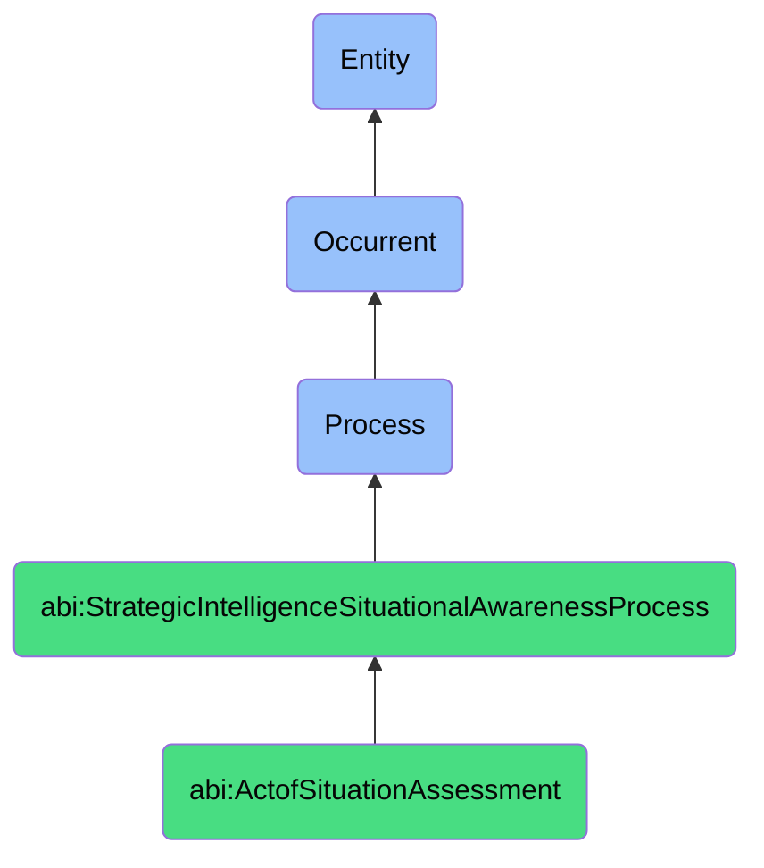

# ActofSituationAssessment

## Definition
An act of situation assessment is an occurrent process that unfolds through time, involving the systematic collection, aggregation, integration, and contextualization of signals, data points, indicators, or information from diverse sources about a system, environment, market, or domain, to establish a comprehensive, accurate understanding of current conditions, states, patterns, or relationships, through methodologies that transform raw observations into meaningful insights about existing realities, enabling informed awareness of the present context in which decisions must be made.

## Hierarchy in BFO


## Ontological Schema (TBox)
```turtle
abi:ActofSituationAssessment a owl:Class ;
  rdfs:subClassOf abi:StrategicIntelligenceSituationalAwarenessProcess ;
  rdfs:label "Act of Situation Assessment" ;
  skos:definition "A process that collects, aggregates, and contextualizes signals to define the current state of a system or environment." .

abi:StrategicIntelligenceSituationalAwarenessProcess a owl:Class ;
  rdfs:subClassOf bfo:0000015 ;
  rdfs:label "Strategic Intelligence Situational Awareness Process" ;
  skos:definition "A time-bound process related to the collection, analysis, and synthesis of information to develop understanding of current situations, evaluate options, or support strategic decision-making." .

abi:has_assessment_performer a owl:ObjectProperty ;
  rdfs:domain abi:ActofSituationAssessment ;
  rdfs:range abi:AssessmentPerformer ;
  rdfs:label "has assessment performer" .

abi:collects_situational_signal a owl:ObjectProperty ;
  rdfs:domain abi:ActofSituationAssessment ;
  rdfs:range abi:SituationalSignal ;
  rdfs:label "collects situational signal" .

abi:assesses_system_state a owl:ObjectProperty ;
  rdfs:domain abi:ActofSituationAssessment ;
  rdfs:range abi:SystemState ;
  rdfs:label "assesses system state" .

abi:employs_data_source a owl:ObjectProperty ;
  rdfs:domain abi:ActofSituationAssessment ;
  rdfs:range abi:DataSource ;
  rdfs:label "employs data source" .

abi:applies_assessment_technique a owl:ObjectProperty ;
  rdfs:domain abi:ActofSituationAssessment ;
  rdfs:range abi:AssessmentTechnique ;
  rdfs:label "applies assessment technique" .

abi:identifies_situational_factor a owl:ObjectProperty ;
  rdfs:domain abi:ActofSituationAssessment ;
  rdfs:range abi:SituationalFactor ;
  rdfs:label "identifies situational factor" .

abi:produces_situation_assessment a owl:ObjectProperty ;
  rdfs:domain abi:ActofSituationAssessment ;
  rdfs:range abi:SituationAssessment ;
  rdfs:label "produces situation assessment" .

abi:has_assessment_timestamp a owl:DatatypeProperty ;
  rdfs:domain abi:ActofSituationAssessment ;
  rdfs:range xsd:dateTime ;
  rdfs:label "has assessment timestamp" .

abi:has_signal_aggregation_level a owl:DatatypeProperty ;
  rdfs:domain abi:ActofSituationAssessment ;
  rdfs:range xsd:string ;
  rdfs:label "has signal aggregation level" .

abi:has_assessment_completeness a owl:DatatypeProperty ;
  rdfs:domain abi:ActofSituationAssessment ;
  rdfs:range xsd:decimal ;
  rdfs:label "has assessment completeness" .
```

## Ontological Instance (ABox)
```turtle
ex:OrganizationalStateAssessment a abi:ActofSituationAssessment ;
  rdfs:label "Multi-Source Organizational State Assessment" ;
  abi:has_assessment_performer ex:StrategicAIAssistant, ex:BusinessIntelligenceSystem, ex:OperationsAnalyst ;
  abi:collects_situational_signal ex:CRMCustomerMetrics, ex:MarketTrendSignals, ex:InternalBlockerReports ;
  abi:assesses_system_state ex:SalesPerformance, ex:MarketPosition, ex:OperationalEfficiency, ex:ResourceAvailability ;
  abi:employs_data_source ex:CustomerRelationshipManagement, ex:MarketIntelligenceDatabase, ex:InternalTicketingSystem ;
  abi:applies_assessment_technique ex:SignalCorrelation, ex:TrendIdentification, ex:AnomalyDetection, ex:PatternRecognition ;
  abi:identifies_situational_factor ex:DecreasingCustomerEngagement, ex:CompetitiveMarketPositioning, ex:ResourceConstraints ;
  abi:produces_situation_assessment ex:CurrentStateAssessmentReport, ex:StatusDashboard, ex:PerformanceIndicators ;
  abi:has_assessment_timestamp "2023-11-20T09:30:00Z"^^xsd:dateTime ;
  abi:has_signal_aggregation_level "Cross-functional, organization-wide" ;
  abi:has_assessment_completeness "0.92"^^xsd:decimal .

ex:ProductLaunchReadinessAssessment a abi:ActofSituationAssessment ;
  rdfs:label "Product Launch Readiness Situation Assessment" ;
  abi:has_assessment_performer ex:ProductManager, ex:MarketingAnalyst, ex:EngineeringLead ;
  abi:collects_situational_signal ex:FeatureCompletionMetrics, ex:QualityTestResults, ex:MarketReceptivenessIndicators ;
  abi:assesses_system_state ex:ProductDevelopmentStatus, ex:TeamReadiness, ex:MarketConditions, ex:CompetitorPositioning ;
  abi:employs_data_source ex:ProjectManagementSystem, ex:QualityAssurancePlatform, ex:MarketResearchReports ;
  abi:applies_assessment_technique ex:MilestoneEvaluation, ex:RiskAssessment, ex:ReadinessScoring, ex:MarketTimingAnalysis ;
  abi:identifies_situational_factor ex:DevelopmentDelay, ex:QualityIssues, ex:FavorableMarketCondition ;
  abi:produces_situation_assessment ex:LaunchReadinessReport, ex:GoNoGoDecisionMatrix, ex:LaunchRiskRegister ;
  abi:has_assessment_timestamp "2023-11-15T16:45:00Z"^^xsd:dateTime ;
  abi:has_signal_aggregation_level "Product development ecosystem" ;
  abi:has_assessment_completeness "0.85"^^xsd:decimal .
```

## Related Classes
- **abi:ActofSituationalAwarenessGeneration** - A process that builds on situation assessment to create shareable awareness models.
- **abi:ActofSimulation** - A process that uses situation assessment as input for modeling future scenarios.
- **abi:ActofModelCalibration** - A process that may refine models based on situation assessment outcomes.
- **abi:ActofStrategicOptionGeneration** - A process that develops options based on situation assessment findings.
- **abi:DataCollectionProcess** - A supportive process that gathers inputs for situation assessment.
- **abi:SignalProcessingProcess** - A process for filtering and transforming raw signals before assessment.
- **abi:EnvironmentalScanningProcess** - A broader process that includes ongoing situation assessment activities. 