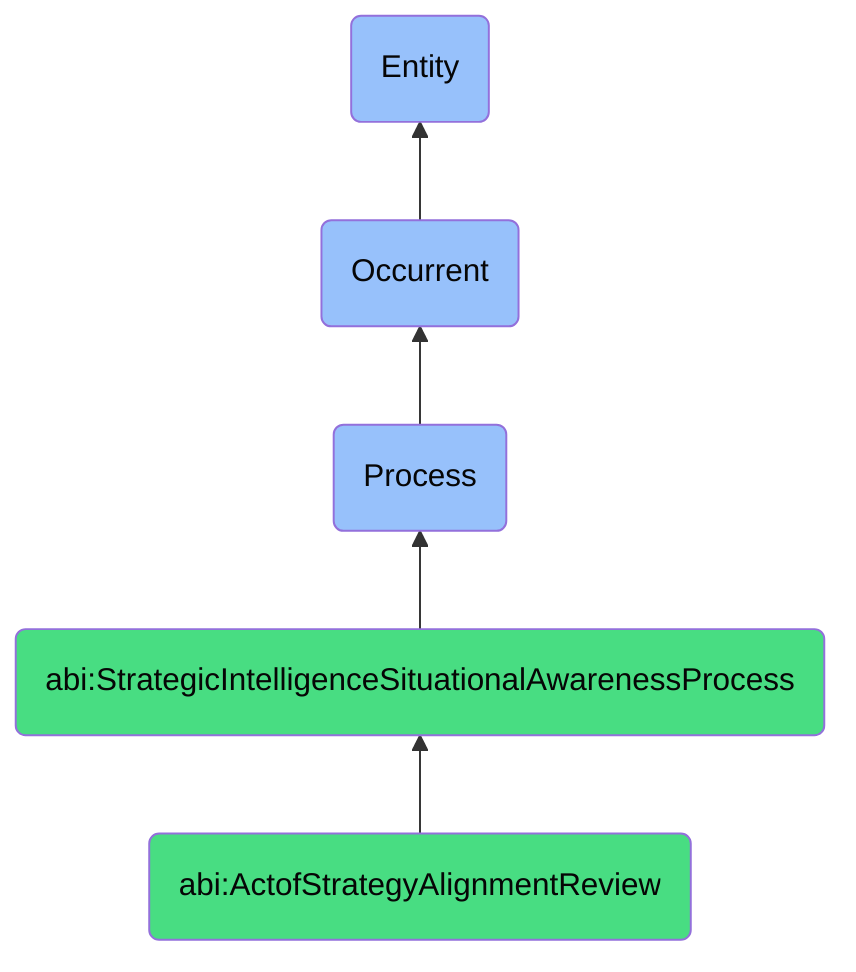

# ActofStrategyAlignmentReview

## Definition
An act of strategy alignment review is an occurrent process that unfolds through time, involving the systematic examination, evaluation, and assessment of how well an organization's actions, initiatives, resource allocations, and operational decisions conform to and advance its stated strategic objectives, vision, and priorities, identifying gaps, inconsistencies, or misalignments between strategic intent and actual execution in order to recommend corrective adjustments, reinforce strategic coherence, and ensure that tactical activities collectively contribute to the achievement of longer-term strategic goals.

## Hierarchy in BFO


## Ontological Schema (TBox)
```turtle
abi:ActofStrategyAlignmentReview a owl:Class ;
  rdfs:subClassOf abi:StrategicIntelligenceSituationalAwarenessProcess ;
  rdfs:label "Act of Strategy Alignment Review" ;
  skos:definition "A process that systematically evaluates how well an organization's actions and initiatives conform to its strategic objectives and priorities." .

abi:has_review_conductor a owl:ObjectProperty ;
  rdfs:domain abi:ActofStrategyAlignmentReview ;
  rdfs:range abi:ReviewConductor ;
  rdfs:label "has review conductor" .

abi:examines_strategic_objective a owl:ObjectProperty ;
  rdfs:domain abi:ActofStrategyAlignmentReview ;
  rdfs:range abi:StrategicObjective ;
  rdfs:label "examines strategic objective" .

abi:assesses_organizational_initiative a owl:ObjectProperty ;
  rdfs:domain abi:ActofStrategyAlignmentReview ;
  rdfs:range abi:OrganizationalInitiative ;
  rdfs:label "assesses organizational initiative" .

abi:evaluates_resource_allocation a owl:ObjectProperty ;
  rdfs:domain abi:ActofStrategyAlignmentReview ;
  rdfs:range abi:ResourceAllocation ;
  rdfs:label "evaluates resource allocation" .

abi:applies_alignment_framework a owl:ObjectProperty ;
  rdfs:domain abi:ActofStrategyAlignmentReview ;
  rdfs:range abi:AlignmentFramework ;
  rdfs:label "applies alignment framework" .

abi:identifies_alignment_gap a owl:ObjectProperty ;
  rdfs:domain abi:ActofStrategyAlignmentReview ;
  rdfs:range abi:AlignmentGap ;
  rdfs:label "identifies alignment gap" .

abi:measures_strategic_coherence a owl:ObjectProperty ;
  rdfs:domain abi:ActofStrategyAlignmentReview ;
  rdfs:range abi:StrategicCoherence ;
  rdfs:label "measures strategic coherence" .

abi:recommends_alignment_action a owl:ObjectProperty ;
  rdfs:domain abi:ActofStrategyAlignmentReview ;
  rdfs:range abi:AlignmentAction ;
  rdfs:label "recommends alignment action" .

abi:produces_alignment_artifact a owl:ObjectProperty ;
  rdfs:domain abi:ActofStrategyAlignmentReview ;
  rdfs:range abi:AlignmentArtifact ;
  rdfs:label "produces alignment artifact" .

abi:has_review_timestamp a owl:DatatypeProperty ;
  rdfs:domain abi:ActofStrategyAlignmentReview ;
  rdfs:range xsd:dateTime ;
  rdfs:label "has review timestamp" .

abi:has_alignment_score a owl:DatatypeProperty ;
  rdfs:domain abi:ActofStrategyAlignmentReview ;
  rdfs:range xsd:decimal ;
  rdfs:label "has alignment score" .

abi:has_review_period a owl:DatatypeProperty ;
  rdfs:domain abi:ActofStrategyAlignmentReview ;
  rdfs:range xsd:string ;
  rdfs:label "has review period" .
```

## Ontological Instance (ABox)
```turtle
ex:AnnualStrategicPlanReview a abi:ActofStrategyAlignmentReview ;
  rdfs:label "Annual Corporate Strategy Alignment Review" ;
  abi:has_review_conductor ex:ExecutiveLeadershipTeam, ex:ChiefStrategyOfficer, ex:BusinessUnitHeads ;
  abi:examines_strategic_objective ex:MarketShareGrowth, ex:ProductInnovation, ex:CustomerExperienceTransformation, ex:OperationalEfficiency ;
  abi:assesses_organizational_initiative ex:DigitalTransformationProgram, ex:MarketExpansionInitiative, ex:ProductPortfolioRestructuring ;
  abi:evaluates_resource_allocation ex:TechnologyInvestment, ex:RDFunding, ex:MarketingBudget, ex:TalentAcquisition ;
  abi:applies_alignment_framework ex:BalancedScorecard, ex:StrategyMap, ex:OKRSystem ;
  abi:identifies_alignment_gap ex:ResourceMisallocation, ex:ConflictingPriorities, ex:ExecutionCapabilityGap ;
  abi:measures_strategic_coherence ex:CrossfunctionalAlignment, ex:ResourceAllocationFit, ex:StrategicNarrativeConsistency ;
  abi:recommends_alignment_action ex:InitiativeReprioritization, ex:ResourceReallocation, ex:CapabilityInvestment ;
  abi:produces_alignment_artifact ex:StrategicAlignmentDashboard, ex:GapAnalysisReport, ex:ActionRecommendations ;
  abi:has_review_timestamp "2023-12-15T09:00:00Z"^^xsd:dateTime ;
  abi:has_alignment_score "0.76"^^xsd:decimal ;
  abi:has_review_period "FY 2023" .

ex:QuarterlyProductStrategyReview a abi:ActofStrategyAlignmentReview ;
  rdfs:label "Quarterly Product Strategy Alignment Review" ;
  abi:has_review_conductor ex:ProductLeadership, ex:EngineeringManagement, ex:CustomerSuccessTeam, ex:ProductOperations ;
  abi:examines_strategic_objective ex:UserGrowthTargets, ex:RetentionImprovement, ex:PlatformScalability, ex:RevenuePerUser ;
  abi:assesses_organizational_initiative ex:CoreFeatureRedesign, ex:NewMarketEntry, ex:PricingRestructure, ex:UserExperienceOptimization ;
  abi:evaluates_resource_allocation ex:EngineeringCapacity, ex:UXResources, ex:MarketingChannels, ex:CustomerSupportInvestment ;
  abi:applies_alignment_framework ex:ProductOKRs, ex:UserJourneyMapping, ex:ValueDeliveryAssessment ;
  abi:identifies_alignment_gap ex:FeaturePrioritizationIssues, ex:MarketFeedbackDisconnect, ex:TechnicalDebtImbalance ;
  abi:measures_strategic_coherence ex:ProductRoadmapAlignment, ex:UserNeedsFit, ex:GoToMarketConsistency ;
  abi:recommends_alignment_action ex:BacklogRefinement, ex:ResourceRebalancing, ex:MetricsAdjustment, ex:CapabilityFocus ;
  abi:produces_alignment_artifact ex:ProductStrategyAlignmentMatrix, ex:ResourceUtilizationMap, ex:StrategicOutcomeTracker ;
  abi:has_review_timestamp "2023-10-05T13:30:00Z"^^xsd:dateTime ;
  abi:has_alignment_score "0.82"^^xsd:decimal ;
  abi:has_review_period "Q3 2023" .
```

## Related Classes
- **abi:ActofSituationAssessment** - A process that provides context for strategy alignment evaluation.
- **abi:ActofSituationalAwarenessGeneration** - A process that creates understanding of current situations that strategy must address.
- **abi:ActofStrategicOptionGeneration** - A process that develops options that strategy alignment reviews may evaluate.
- **abi:ActofNextBestMoveSelection** - A process that selects immediate actions that should align with strategy.
- **abi:ActofScenarioPlanning** - A process that develops scenarios that may inform strategic priorities.
- **abi:StrategicPlanningProcess** - A process for developing the strategies that alignment reviews evaluate against.
- **abi:PerformanceManagementProcess** - A process for measuring and managing performance against strategic objectives. 