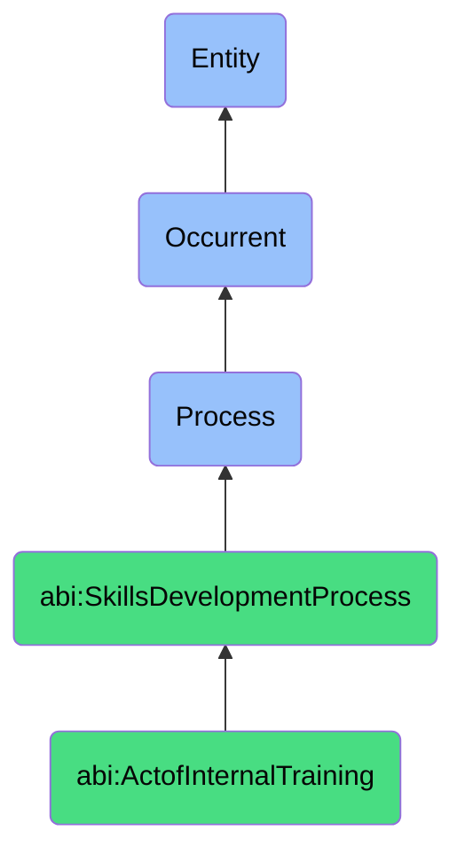

# ActofInternalTraining

## Definition
An act of internal training is an occurrent process that unfolds through time, involving the structured, intentional transfer of organization-specific knowledge, methodologies, procedures, tools, or systems from knowledgeable agents to learners within the same organizational context, using formal or informal instructional methods to enable proficiency, standardization, compliance, or improvement in job-related tasks and responsibilities while maintaining organizational continuity and building internal capability.

## Hierarchy in BFO


## Ontological Schema (TBox)
```turtle
abi:ActofInternalTraining a owl:Class ;
  rdfs:subClassOf abi:SkillsDevelopmentProcess ;
  rdfs:label "Act of Internal Training" ;
  skos:definition "A structured process in which contributors are instructed on company-specific systems, tools, or methods." .

abi:SkillsDevelopmentProcess a owl:Class ;
  rdfs:subClassOf bfo:0000015 ;
  rdfs:label "Skills Development Process" ;
  skos:definition "A time-bound process related to the identification, acquisition, cultivation, enhancement, or transfer of knowledge, capabilities, competencies, or expertise within individuals or organizational contexts." .

abi:has_training_instructor a owl:ObjectProperty ;
  rdfs:domain abi:ActofInternalTraining ;
  rdfs:range abi:TrainingInstructor ;
  rdfs:label "has training instructor" .

abi:trains_participant a owl:ObjectProperty ;
  rdfs:domain abi:ActofInternalTraining ;
  rdfs:range abi:TrainingParticipant ;
  rdfs:label "trains participant" .

abi:covers_subject_matter a owl:ObjectProperty ;
  rdfs:domain abi:ActofInternalTraining ;
  rdfs:range abi:SubjectMatter ;
  rdfs:label "covers subject matter" .

abi:employs_training_method a owl:ObjectProperty ;
  rdfs:domain abi:ActofInternalTraining ;
  rdfs:range abi:TrainingMethod ;
  rdfs:label "employs training method" .

abi:uses_training_material a owl:ObjectProperty ;
  rdfs:domain abi:ActofInternalTraining ;
  rdfs:range abi:TrainingMaterial ;
  rdfs:label "uses training material" .

abi:addresses_capability_requirement a owl:ObjectProperty ;
  rdfs:domain abi:ActofInternalTraining ;
  rdfs:range abi:CapabilityRequirement ;
  rdfs:label "addresses capability requirement" .

abi:produces_training_outcome a owl:ObjectProperty ;
  rdfs:domain abi:ActofInternalTraining ;
  rdfs:range abi:TrainingOutcome ;
  rdfs:label "produces training outcome" .

abi:has_training_date a owl:DatatypeProperty ;
  rdfs:domain abi:ActofInternalTraining ;
  rdfs:range xsd:date ;
  rdfs:label "has training date" .

abi:has_training_duration a owl:DatatypeProperty ;
  rdfs:domain abi:ActofInternalTraining ;
  rdfs:range xsd:duration ;
  rdfs:label "has training duration" .

abi:has_proficiency_target a owl:DatatypeProperty ;
  rdfs:domain abi:ActofInternalTraining ;
  rdfs:range xsd:string ;
  rdfs:label "has proficiency target" .
```

## Ontological Instance (ABox)
```turtle
ex:ComplianceSOPTraining a abi:ActofInternalTraining ;
  rdfs:label "Compliance Team SOP Training Session" ;
  abi:has_training_instructor ex:ComplianceManager, ex:QualityAssuranceSpecialist ;
  abi:trains_participant ex:NewTeamMembers, ex:ExistingStaffRequiringUpdate ;
  abi:covers_subject_matter ex:StandardOperatingProcedures, ex:ComplianceRequirements, ex:DocumentationStandards ;
  abi:employs_training_method ex:WorkshopFormat, ex:HandsOnExercises, ex:CaseStudyAnalysis ;
  abi:uses_training_material ex:SOPManual, ex:ComplianceChecklistTemplate, ex:TrainingSlides ;
  abi:addresses_capability_requirement ex:RegulatoryCompliance, ex:ProcessConsistency, ex:QualityAssurance ;
  abi:produces_training_outcome ex:CertifiedSOPPractitioners, ex:UpdatedSkillsRegistry, ex:CompletionCertificates ;
  abi:has_training_date "2023-11-10"^^xsd:date ;
  abi:has_training_duration "P2D"^^xsd:duration ;
  abi:has_proficiency_target "Operational Competence" .

ex:DataArchitectureToolsTraining a abi:ActofInternalTraining ;
  rdfs:label "Proprietary Data Architecture Tools Training" ;
  abi:has_training_instructor ex:SeniorDataArchitect, ex:ToolDeveloper ;
  abi:trains_participant ex:DataAnalysisTeam, ex:BusinessIntelligenceGroup, ex:NewDataScientists ;
  abi:covers_subject_matter ex:ProprietaryDataPipeline, ex:CustomVisualizationTools, ex:DataGovernanceProtocols ;
  abi:employs_training_method ex:LiveDemonstration, ex:GuidedPractice, ex:PeerLearning, ex:TechnicalLabs ;
  abi:uses_training_material ex:ToolDocumentation, ex:SampleDatasets, ex:WorkflowDiagrams, ex:TroubleshootingGuides ;
  abi:addresses_capability_requirement ex:DataProcessingEfficiency, ex:AnalyticalAccuracy, ex:SystemUtilization ;
  abi:produces_training_outcome ex:ToolCertifications, ex:PerformanceImprovement, ex:ReducedSupportTickets ;
  abi:has_training_date "2023-10-05"^^xsd:date ;
  abi:has_training_duration "P5D"^^xsd:duration ;
  abi:has_proficiency_target "Advanced User Proficiency" .
```

## Related Classes
- **abi:ActofHiring** - A process that may identify training needs for new contributors.
- **abi:ActofOnboarding** - A process that often includes internal training components.
- **abi:ActofMentoring** - A complementary process that provides ongoing support after formal training.
- **abi:ActofSkillAssessment** - A process that may precede or follow training to evaluate effectiveness.
- **abi:ActofSkillRecognition** - A process that formally acknowledges skills acquired through training.
- **abi:CurriculumDevelopmentProcess** - A process for creating internal training materials.
- **abi:TrainingEffectivenessAssessmentProcess** - A process that evaluates the impact of internal training. 