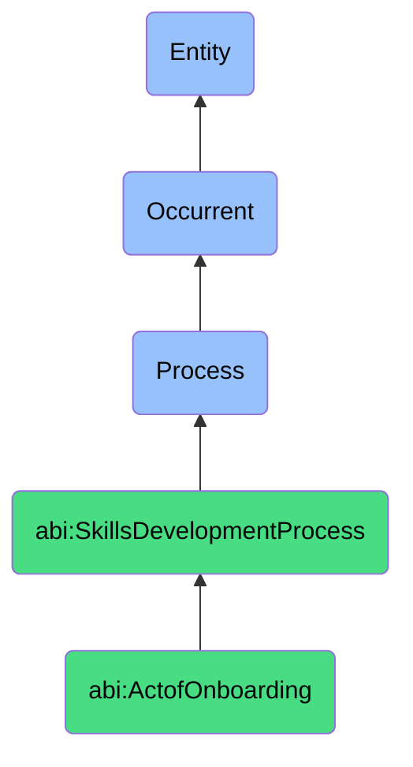

# ActofOnboarding

## Definition
An act of onboarding is an occurrent process that unfolds through time, involving the structured integration, orientation, acculturation, and enablement of new contributors into an organization, team, or role, through systematic introduction to systems, tools, processes, people, cultural norms, expectations, and knowledge resources, facilitating the efficient transfer of essential information, establishment of working relationships, alignment with organizational values, and acceleration toward productive contribution while providing necessary support to ensure successful adaptation and engagement.

## Hierarchy in BFO


## Ontological Schema (TBox)
```turtle
abi:ActofOnboarding a owl:Class ;
  rdfs:subClassOf abi:SkillsDevelopmentProcess ;
  rdfs:label "Act of Onboarding" ;
  skos:definition "A process that introduces a new contributor to systems, culture, tools, and expectations." .

abi:SkillsDevelopmentProcess a owl:Class ;
  rdfs:subClassOf bfo:0000015 ;
  rdfs:label "Skills Development Process" ;
  skos:definition "A time-bound process related to the identification, acquisition, cultivation, enhancement, or transfer of knowledge, capabilities, competencies, or expertise within individuals or organizational contexts." .

abi:has_onboarding_facilitator a owl:ObjectProperty ;
  rdfs:domain abi:ActofOnboarding ;
  rdfs:range abi:OnboardingFacilitator ;
  rdfs:label "has onboarding facilitator" .

abi:onboards_new_contributor a owl:ObjectProperty ;
  rdfs:domain abi:ActofOnboarding ;
  rdfs:range abi:NewContributor ;
  rdfs:label "onboards new contributor" .

abi:introduces_organizational_element a owl:ObjectProperty ;
  rdfs:domain abi:ActofOnboarding ;
  rdfs:range abi:OrganizationalElement ;
  rdfs:label "introduces organizational element" .

abi:follows_onboarding_plan a owl:ObjectProperty ;
  rdfs:domain abi:ActofOnboarding ;
  rdfs:range abi:OnboardingPlan ;
  rdfs:label "follows onboarding plan" .

abi:transfers_domain_knowledge a owl:ObjectProperty ;
  rdfs:domain abi:ActofOnboarding ;
  rdfs:range abi:DomainKnowledge ;
  rdfs:label "transfers domain knowledge" .

abi:provisions_system_access a owl:ObjectProperty ;
  rdfs:domain abi:ActofOnboarding ;
  rdfs:range abi:SystemAccess ;
  rdfs:label "provisions system access" .

abi:produces_onboarding_artifact a owl:ObjectProperty ;
  rdfs:domain abi:ActofOnboarding ;
  rdfs:range abi:OnboardingArtifact ;
  rdfs:label "produces onboarding artifact" .

abi:has_onboarding_start_date a owl:DatatypeProperty ;
  rdfs:domain abi:ActofOnboarding ;
  rdfs:range xsd:date ;
  rdfs:label "has onboarding start date" .

abi:has_onboarding_duration a owl:DatatypeProperty ;
  rdfs:domain abi:ActofOnboarding ;
  rdfs:range xsd:duration ;
  rdfs:label "has onboarding duration" .

abi:has_onboarding_phase a owl:DatatypeProperty ;
  rdfs:domain abi:ActofOnboarding ;
  rdfs:range xsd:string ;
  rdfs:label "has onboarding phase" .
```

## Ontological Instance (ABox)
```turtle
ex:ABI_DataArchitectureOnboarding a abi:ActofOnboarding ;
  rdfs:label "Week 1 ABI Data Architecture Onboarding Program" ;
  abi:has_onboarding_facilitator ex:DataArchitectureTeamLead, ex:OnboardingSpecialist ;
  abi:onboards_new_contributor ex:NewDataScientist, ex:NewAnalyst ;
  abi:introduces_organizational_element ex:ABIOntologyFramework, ex:DataStorageSystems, ex:QueryTools, ex:DataGovernancePolicies ;
  abi:follows_onboarding_plan ex:TechnicalTeamOnboardingProcess, ex:DataScienceIntegrationPath ;
  abi:transfers_domain_knowledge ex:OntologicalModeling, ex:DataStructures, ex:SemanticStandards, ex:QueryPatterns ;
  abi:provisions_system_access ex:DataWarehouseAccess, ex:AnalyticsToolsAccess, ex:DocumentationRepository, ex:DevelopmentEnvironment ;
  abi:produces_onboarding_artifact ex:CompletedOnboardingChecklist, ex:KnowledgeAssessment, ex:InitialProjectAssignment ;
  abi:has_onboarding_start_date "2023-11-06"^^xsd:date ;
  abi:has_onboarding_duration "P5D"^^xsd:duration ;
  abi:has_onboarding_phase "Technical Foundation" .

ex:ProductTeamOnboarding a abi:ActofOnboarding ;
  rdfs:label "Product Management Team Integration Program" ;
  abi:has_onboarding_facilitator ex:SeniorProductManager, ex:PeopleOperationsPartner ;
  abi:onboards_new_contributor ex:NewProductManager, ex:ProductSpecialist ;
  abi:introduces_organizational_element ex:ProductDevelopmentProcess, ex:StakeholderCommunicationChannels, ex:RoadmapTools, ex:CompanyCulture ;
  abi:follows_onboarding_plan ex:ProductTeamIntegrationPlan, ex:SixtyDayRampUpPlan ;
  abi:transfers_domain_knowledge ex:ProductStrategyFramework, ex:MarketAnalysisMethods, ex:FeaturePrioritization, ex:UserResearchPractices ;
  abi:provisions_system_access ex:ProductManagementSuite, ex:AnalyticsAccess, ex:CustomerFeedbackSystem, ex:DocumentationPlatform ;
  abi:produces_onboarding_artifact ex:FirstNinetyDaysPlan, ex:MentorAssignment, ex:InitialProductInsight ;
  abi:has_onboarding_start_date "2023-10-02"^^xsd:date ;
  abi:has_onboarding_duration "P90D"^^xsd:duration ;
  abi:has_onboarding_phase "Comprehensive Integration" .
```

## Related Classes
- **abi:ActofHiring** - A process that precedes onboarding by bringing new contributors into the organization.
- **abi:MentoringProcess** - A process often incorporated into onboarding for knowledge transfer.
- **abi:SkillAssessmentProcess** - A process for evaluating initial capabilities during onboarding.
- **abi:CulturalIntegrationProcess** - A process focused on aligning contributors with organizational values.
- **abi:SystemAccessProvisioningProcess** - A process for establishing necessary technical access during onboarding.
- **abi:PerformanceExpectationSettingProcess** - A process for establishing role success criteria during onboarding.
- **abi:FeedbackCollectionProcess** - A process for gathering input on the effectiveness of onboarding. 