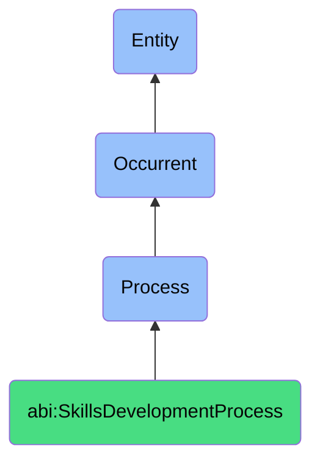

# SkillsDevelopmentProcess

## Definition
A skills development process is an occurrent that unfolds through time, involving the systematic identification, acquisition, cultivation, enhancement, or transfer of knowledge, capabilities, competencies, or expertise within individuals or organizational contexts, through structured learning, experiential activities, social interactions, or formalized mechanisms that facilitate the growth of human capital, role-specific proficiencies, or domain expertise to meet current or anticipated skill requirements, performance standards, and organizational objectives.

## Hierarchy in BFO


## Ontological Schema (TBox)
```turtle
abi:SkillsDevelopmentProcess a owl:Class ;
  rdfs:subClassOf bfo:0000015 ;
  rdfs:label "Skills Development Process" ;
  skos:definition "A time-bound process related to the identification, acquisition, cultivation, enhancement, or transfer of knowledge, capabilities, competencies, or expertise within individuals or organizational contexts." .

abi:has_skill_developer a owl:ObjectProperty ;
  rdfs:domain abi:SkillsDevelopmentProcess ;
  rdfs:range abi:SkillDeveloper ;
  rdfs:label "has skill developer" .

abi:develops_skill a owl:ObjectProperty ;
  rdfs:domain abi:SkillsDevelopmentProcess ;
  rdfs:range abi:Skill ;
  rdfs:label "develops skill" .

abi:involves_learning_subject a owl:ObjectProperty ;
  rdfs:domain abi:SkillsDevelopmentProcess ;
  rdfs:range abi:LearningSubject ;
  rdfs:label "involves learning subject" .

abi:follows_development_methodology a owl:ObjectProperty ;
  rdfs:domain abi:SkillsDevelopmentProcess ;
  rdfs:range abi:DevelopmentMethodology ;
  rdfs:label "follows development methodology" .

abi:uses_development_resource a owl:ObjectProperty ;
  rdfs:domain abi:SkillsDevelopmentProcess ;
  rdfs:range abi:DevelopmentResource ;
  rdfs:label "uses development resource" .

abi:produces_development_artifact a owl:ObjectProperty ;
  rdfs:domain abi:SkillsDevelopmentProcess ;
  rdfs:range abi:DevelopmentArtifact ;
  rdfs:label "produces development artifact" .

abi:addresses_competency_gap a owl:ObjectProperty ;
  rdfs:domain abi:SkillsDevelopmentProcess ;
  rdfs:range abi:CompetencyGap ;
  rdfs:label "addresses competency gap" .

abi:has_development_start_date a owl:DatatypeProperty ;
  rdfs:domain abi:SkillsDevelopmentProcess ;
  rdfs:range xsd:date ;
  rdfs:label "has development start date" .

abi:has_development_status a owl:DatatypeProperty ;
  rdfs:domain abi:SkillsDevelopmentProcess ;
  rdfs:range xsd:string ;
  rdfs:label "has development status" .

abi:has_competency_level a owl:DatatypeProperty ;
  rdfs:domain abi:SkillsDevelopmentProcess ;
  rdfs:range xsd:string ;
  rdfs:label "has competency level" .
```

## Ontological Instance (ABox)
```turtle
# SkillsDevelopmentProcess is a parent class with subclasses:
# - abi:ActofHiring
# - abi:ActofOnboarding
# and other skills development-related processes
```

## Related Classes
- **abi:ActofHiring** - A process by which an organization identifies, evaluates, and commits to onboarding a new contributor.
- **abi:ActofOnboarding** - A process that introduces a new contributor to systems, culture, tools, and expectations.
- **abi:LearningPathCreationProcess** - A process for designing structured educational journeys for skill acquisition.
- **abi:SkillAssessmentProcess** - A process for evaluating current competency levels against requirements.
- **abi:MentoringProcess** - A process for transferring knowledge through guided relationships.
- **abi:CertificationProcess** - A process for validating skills against industry or organizational standards.
- **abi:CareerDevelopmentProcess** - A process for planning and executing long-term professional growth. 