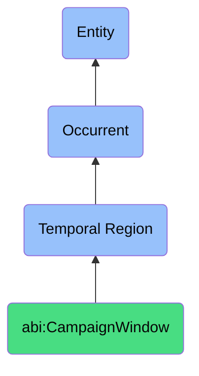

# CampaignWindow

## Definition
A campaign window is a specific type of temporal region (bfo:0000008) that represents a deliberately planned, bounded time interval designated for coordinated marketing, sales, promotional, or engagement activities, with defined start and end dates that establish the operational timeframe for the execution of strategic initiatives, content distribution, audience targeting, and performance measurement, often characterized by specific themes, goals, channels, or seasonal contexts.

## Hierarchy in BFO


## Ontological Schema (TBox)
```turtle
abi:CampaignWindow a owl:Class ;
  rdfs:subClassOf bfo:0000008 ;
  rdfs:label "Campaign Window" ;
  skos:definition "A time-bounded marketing or engagement period." .

bfo:0000008 a owl:Class ;
  rdfs:label "Temporal Region" ;
  skos:definition "A time span or interval in which occurrents take place." .

abi:has_start_datetime a owl:DatatypeProperty ;
  rdfs:domain abi:CampaignWindow ;
  rdfs:range xsd:dateTime ;
  rdfs:label "has start datetime" .

abi:has_end_datetime a owl:DatatypeProperty ;
  rdfs:domain abi:CampaignWindow ;
  rdfs:range xsd:dateTime ;
  rdfs:label "has end datetime" .

abi:has_campaign_name a owl:DatatypeProperty ;
  rdfs:domain abi:CampaignWindow ;
  rdfs:range xsd:string ;
  rdfs:label "has campaign name" .

abi:has_campaign_theme a owl:DatatypeProperty ;
  rdfs:domain abi:CampaignWindow ;
  rdfs:range xsd:string ;
  rdfs:label "has campaign theme" .

abi:has_target_audience a owl:ObjectProperty ;
  rdfs:domain abi:CampaignWindow ;
  rdfs:range abi:AudienceSegment ;
  rdfs:label "has target audience" .

abi:includes_marketing_channel a owl:ObjectProperty ;
  rdfs:domain abi:CampaignWindow ;
  rdfs:range abi:MarketingChannel ;
  rdfs:label "includes marketing channel" .

abi:contains_campaign_activity a owl:ObjectProperty ;
  rdfs:domain abi:CampaignWindow ;
  rdfs:range abi:CampaignActivity ;
  rdfs:label "contains campaign activity" .

abi:has_performance_metric a owl:ObjectProperty ;
  rdfs:domain abi:CampaignWindow ;
  rdfs:range abi:PerformanceMetric ;
  rdfs:label "has performance metric" .

abi:aligns_with_business_objective a owl:ObjectProperty ;
  rdfs:domain abi:CampaignWindow ;
  rdfs:range abi:BusinessObjective ;
  rdfs:label "aligns with business objective" .

abi:has_budget_allocation a owl:DatatypeProperty ;
  rdfs:domain abi:CampaignWindow ;
  rdfs:range xsd:decimal ;
  rdfs:label "has budget allocation" .

abi:has_seasonal_context a owl:DatatypeProperty ;
  rdfs:domain abi:CampaignWindow ;
  rdfs:range xsd:string ;
  rdfs:label "has seasonal context" .
```

## Ontological Instance (ABox)
```turtle
ex:ValentinesCampaign2024 a abi:CampaignWindow ;
  rdfs:label "Valentine's Day Campaign 2024" ;
  abi:has_start_datetime "2024-02-10T00:00:00Z"^^xsd:dateTime ;
  abi:has_end_datetime "2024-02-15T23:59:59Z"^^xsd:dateTime ;
  abi:has_campaign_name "Valentine's Love & Gifts" ;
  abi:has_campaign_theme "Celebrate Love with Special Offers" ;
  abi:has_target_audience ex:CouplesSegment, ex:GiftGiversSegment ;
  abi:includes_marketing_channel ex:EmailChannel, ex:SocialMediaChannel, ex:WebsitePromotion ;
  abi:contains_campaign_activity ex:ValentinesEmailDrip, ex:SocialMediaContest, ex:LimitedTimeOffers ;
  abi:has_performance_metric ex:ConversionRate, ex:RevenueGenerated, ex:EngagementMetrics ;
  abi:aligns_with_business_objective ex:Q1RevenueTaget, ex:CustomerEngagementGoal ;
  abi:has_budget_allocation "25000.00"^^xsd:decimal ;
  abi:has_seasonal_context "Valentine's Day" .

ex:SummerSaleCampaign2023 a abi:CampaignWindow ;
  rdfs:label "Summer Clearance Sale 2023" ;
  abi:has_start_datetime "2023-07-15T00:00:00Z"^^xsd:dateTime ;
  abi:has_end_datetime "2023-08-15T23:59:59Z"^^xsd:dateTime ;
  abi:has_campaign_name "Summer Clearance Blowout" ;
  abi:has_campaign_theme "End of Season Savings" ;
  abi:has_target_audience ex:PriceConsciousShoppers, ex:SeasonalBuyers ;
  abi:includes_marketing_channel ex:PaidSearch, ex:DisplayAds, ex:EmailCampaign, ex:RetailSignage ;
  abi:contains_campaign_activity ex:InventoryClearancePromotion, ex:LoyaltyMemberEarlyAccess, ex:InfluencerPartnerships ;
  abi:has_performance_metric ex:InventoryReduction, ex:AOV, ex:ROAS ;
  abi:aligns_with_business_objective ex:InventoryTurnoverGoal, ex:Q3SalesTarget ;
  abi:has_budget_allocation "42000.00"^^xsd:decimal ;
  abi:has_seasonal_context "Summer Season End" .

ex:ProductLaunchCampaign a abi:CampaignWindow ;
  rdfs:label "New Product Launch Campaign" ;
  abi:has_start_datetime "2023-09-01T00:00:00Z"^^xsd:dateTime ;
  abi:has_end_datetime "2023-10-15T23:59:59Z"^^xsd:dateTime ;
  abi:has_campaign_name "Introducing Revolution X" ;
  abi:has_campaign_theme "The Future Has Arrived" ;
  abi:has_target_audience ex:EarlyAdopters, ex:ExistingCustomers, ex:TechEnthusiasts ;
  abi:includes_marketing_channel ex:PressRelease, ex:InfluencerMarketing, ex:ContentMarketing, ex:ProductDemos ;
  abi:contains_campaign_activity ex:ProductRevealEvent, ex:PreOrderPromotion, ex:EducationalWebinars ;
  abi:has_performance_metric ex:ProductAwareness, ex:PreOrderConversions, ex:MediaMentions ;
  abi:aligns_with_business_objective ex:MarketShareGrowth, ex:ProductLineExpansion ;
  abi:has_budget_allocation "75000.00"^^xsd:decimal ;
  abi:has_seasonal_context "Fall Product Launch Season" .
```

## Examples
1. "Valentine's push ran during CampaignWindow Feb 10–15" - A promotional initiative for Valentine's Day was executed during a specific campaign window in February.

2. "Email sequences are scheduled within the CampaignWindow boundaries" - Marketing communication timing is constrained by the defined start and end dates of a campaign.

3. "Performance metrics are compared across different CampaignWindow instances" - Analysis compares results from different campaign periods to evaluate effectiveness.

4. "The holiday CampaignWindow includes multiple promotional events" - A campaign window can contain multiple related marketing activities under a unified theme.

5. "Advertising spend is concentrated during peak CampaignWindow days" - Budget allocation may be strategically distributed across different segments of the campaign period.

## Related Classes
- **bfo:0000008 (Temporal Region)** - The parent class of CampaignWindow.
- **abi:MarketingTimeframe** - A broader temporal region for marketing activities.
- **abi:PromoEvent** - A specific event or promotion that occurs within a campaign window.
- **abi:CampaignActivity** - Activities or actions that take place during a campaign window.
- **abi:MarketingChannel** - Communication channels used during campaign windows.
- **abi:CampaignPerformanceMetric** - Measurements used to evaluate campaign effectiveness.
- **abi:SeasonalContext** - Seasonal factors that influence campaign timing and themes. 