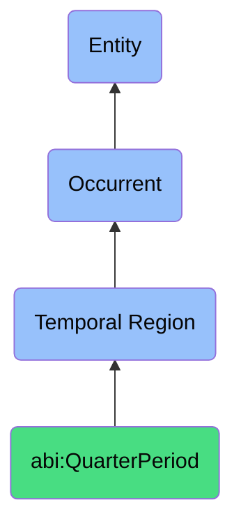

# QuarterPeriod

## Definition
A quarter period is a specific type of temporal region (bfo:0000008) that represents a standardized three-month interval used in financial, business, and operational contexts, often aligned with fiscal or calendar quarters, providing a conventional time frame for recurring processes such as reporting, planning, forecasting, performance evaluation, and comparative analysis within organizational cycles.

## Hierarchy in BFO


## Ontological Schema (TBox)
```turtle
abi:QuarterPeriod a owl:Class ;
  rdfs:subClassOf bfo:0000008 ;
  rdfs:label "Quarter Period" ;
  skos:definition "A defined interval representing fiscal quarters." .

bfo:0000008 a owl:Class ;
  rdfs:label "Temporal Region" ;
  skos:definition "A time span or interval in which occurrents take place." .

abi:has_start_datetime a owl:DatatypeProperty ;
  rdfs:domain abi:QuarterPeriod ;
  rdfs:range xsd:dateTime ;
  rdfs:label "has start datetime" .

abi:has_end_datetime a owl:DatatypeProperty ;
  rdfs:domain abi:QuarterPeriod ;
  rdfs:range xsd:dateTime ;
  rdfs:label "has end datetime" .

abi:has_quarter_number a owl:DatatypeProperty ;
  rdfs:domain abi:QuarterPeriod ;
  rdfs:range xsd:integer ;
  rdfs:label "has quarter number" .

abi:has_fiscal_year a owl:DatatypeProperty ;
  rdfs:domain abi:QuarterPeriod ;
  rdfs:range xsd:integer ;
  rdfs:label "has fiscal year" .

abi:has_quarter_designation a owl:DatatypeProperty ;
  rdfs:domain abi:QuarterPeriod ;
  rdfs:range xsd:string ;
  rdfs:label "has quarter designation" .

abi:belongs_to_fiscal_year a owl:ObjectProperty ;
  rdfs:domain abi:QuarterPeriod ;
  rdfs:range abi:FiscalYear ;
  rdfs:label "belongs to fiscal year" .

abi:contains_monthly_period a owl:ObjectProperty ;
  rdfs:domain abi:QuarterPeriod ;
  rdfs:range abi:MonthlyPeriod ;
  rdfs:label "contains monthly period" .

abi:encompasses_business_process a owl:ObjectProperty ;
  rdfs:domain abi:QuarterPeriod ;
  rdfs:range bfo:0000015 ;
  rdfs:label "encompasses business process" .
```

## Ontological Instance (ABox)
```turtle
ex:Q4_2025 a abi:QuarterPeriod ;
  rdfs:label "Q4 2025" ;
  abi:has_start_datetime "2025-10-01T00:00:00Z"^^xsd:dateTime ;
  abi:has_end_datetime "2025-12-31T23:59:59Z"^^xsd:dateTime ;
  abi:has_quarter_number "4"^^xsd:integer ;
  abi:has_fiscal_year "2025"^^xsd:integer ;
  abi:has_quarter_designation "Q4 FY2025" ;
  abi:belongs_to_fiscal_year ex:FiscalYear2025 ;
  abi:contains_monthly_period ex:October2025, ex:November2025, ex:December2025 ;
  abi:encompasses_business_process ex:Q4ForecastingProcess, ex:YearEndReporting, ex:AnnualBudgetPlanning .

ex:Q1_2024 a abi:QuarterPeriod ;
  rdfs:label "Q1 2024" ;
  abi:has_start_datetime "2024-01-01T00:00:00Z"^^xsd:dateTime ;
  abi:has_end_datetime "2024-03-31T23:59:59Z"^^xsd:dateTime ;
  abi:has_quarter_number "1"^^xsd:integer ;
  abi:has_fiscal_year "2024"^^xsd:integer ;
  abi:has_quarter_designation "Q1 FY2024" ;
  abi:belongs_to_fiscal_year ex:FiscalYear2024 ;
  abi:contains_monthly_period ex:January2024, ex:February2024, ex:March2024 ;
  abi:encompasses_business_process ex:QuarterlyPerformanceReview, ex:Q1SalesPlanning, ex:TaxPreparation .

ex:Q2_FY2023_Custom a abi:QuarterPeriod ;
  rdfs:label "Q2 FY2023 Custom Period" ;
  abi:has_start_datetime "2023-02-01T00:00:00Z"^^xsd:dateTime ;
  abi:has_end_datetime "2023-04-30T23:59:59Z"^^xsd:dateTime ;
  abi:has_quarter_number "2"^^xsd:integer ;
  abi:has_fiscal_year "2023"^^xsd:integer ;
  abi:has_quarter_designation "Q2 FY2023 (Custom)" ;
  abi:belongs_to_fiscal_year ex:FiscalYear2023_Custom ;
  abi:contains_monthly_period ex:February2023, ex:March2023, ex:April2023 ;
  abi:encompasses_business_process ex:MidYearReview, ex:ProductLaunchCycle, ex:MarketingCampaignEvaluation .
```

## Examples
1. "ActofForecasting occurred within Q4 2025 (a QuarterPeriod)" - A financial forecasting process took place during the fourth quarter of the fiscal year 2025.

2. "The quarterly review process is scheduled for the last two weeks of each QuarterPeriod" - Performance review processes are consistently scheduled relative to quarter boundaries.

3. "Q2 2024 QuarterPeriod contains the annual shareholder meeting" - A specific corporate governance event is scheduled within a particular quarter.

4. "Budget allocation is determined at the beginning of each QuarterPeriod" - Resource planning occurs at regular intervals defined by quarters.

5. "Performance metrics are compared across consecutive QuarterPeriod instances" - Business analysis uses quarters as standard intervals for trend analysis.

## Related Classes
- **bfo:0000008 (Temporal Region)** - The parent class of QuarterPeriod.
- **abi:FiscalYear** - A temporal region representing a complete fiscal year, containing multiple quarter periods.
- **abi:MonthlyPeriod** - A temporal region representing a month, contained within quarter periods.
- **abi:ReportingPeriod** - A temporal region specifically defined for reporting purposes.
- **abi:BusinessCycle** - A temporal region representing recurring business patterns.
- **abi:FinancialTimeframe** - A temporal region defined for financial purposes.
- **abi:QuarterlyProcess** - Processes that typically occur within or are aligned with quarter periods. 