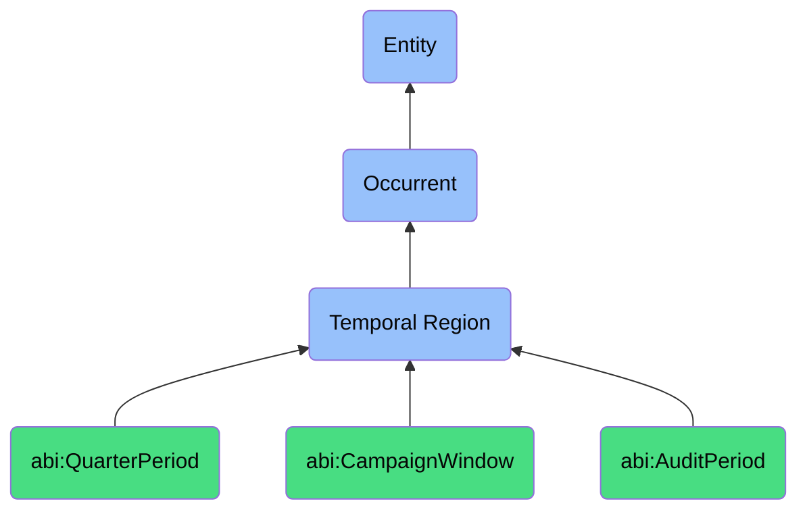

# TemporalRegion

## Definition
A temporal region (bfo:0000008) is an occurrent that represents a time span or interval in which processes, events, and other occurrents take place, providing a framework for temporal measurement, ordering, and relationships between occurrents, and serving as a container for temporal parts and boundaries of processes that unfold in time.

## Hierarchy in BFO


## Ontological Schema (TBox)
```turtle
bfo:0000008 a owl:Class ;
  rdfs:label "Temporal Region" ;
  skos:definition "A time span or interval in which occurrents take place." .

abi:QuarterPeriod a owl:Class ;
  rdfs:subClassOf bfo:0000008 ;
  rdfs:label "Quarter Period" ;
  skos:definition "A defined interval representing fiscal quarters." .

abi:CampaignWindow a owl:Class ;
  rdfs:subClassOf bfo:0000008 ;
  rdfs:label "Campaign Window" ;
  skos:definition "A time-bounded marketing or engagement period." .

abi:AuditPeriod a owl:Class ;
  rdfs:subClassOf bfo:0000008 ;
  rdfs:label "Audit Period" ;
  skos:definition "A bounded window during which logs or actions are reviewed." .

abi:has_start_datetime a owl:DatatypeProperty ;
  rdfs:domain bfo:0000008 ;
  rdfs:range xsd:dateTime ;
  rdfs:label "has start datetime" .

abi:has_end_datetime a owl:DatatypeProperty ;
  rdfs:domain bfo:0000008 ;
  rdfs:range xsd:dateTime ;
  rdfs:label "has end datetime" .

abi:has_duration a owl:DatatypeProperty ;
  rdfs:domain bfo:0000008 ;
  rdfs:range xsd:duration ;
  rdfs:label "has duration" .

abi:has_calendar_designation a owl:DatatypeProperty ;
  rdfs:domain bfo:0000008 ;
  rdfs:range xsd:string ;
  rdfs:label "has calendar designation" .

abi:contains_temporal_region a owl:ObjectProperty ;
  rdfs:domain bfo:0000008 ;
  rdfs:range bfo:0000008 ;
  rdfs:label "contains temporal region" .

abi:temporally_contains a owl:ObjectProperty ;
  rdfs:domain bfo:0000008 ;
  rdfs:range bfo:0000003 ;
  rdfs:label "temporally contains" .
```

## Ontological Instance (ABox)
```turtle
ex:FiscalYear2023 a bfo:0000008 ;
  rdfs:label "Fiscal Year 2023" ;
  abi:has_start_datetime "2023-01-01T00:00:00Z"^^xsd:dateTime ;
  abi:has_end_datetime "2023-12-31T23:59:59Z"^^xsd:dateTime ;
  abi:has_duration "P1Y"^^xsd:duration ;
  abi:has_calendar_designation "FY2023" ;
  abi:contains_temporal_region ex:Q1_2023, ex:Q2_2023, ex:Q3_2023, ex:Q4_2023 ;
  abi:temporally_contains ex:AnnualBudgetingProcess, ex:YearlyReportingCycle .

ex:Q4_2023 a abi:QuarterPeriod ;
  rdfs:label "Q4 2023" ;
  abi:has_start_datetime "2023-10-01T00:00:00Z"^^xsd:dateTime ;
  abi:has_end_datetime "2023-12-31T23:59:59Z"^^xsd:dateTime ;
  abi:has_duration "P3M"^^xsd:duration ;
  abi:has_calendar_designation "Q4 FY2023" ;
  abi:temporally_contains ex:Q4ForecastingProcess, ex:YearEndReviewProcess .

ex:HolidayCampaign2023 a abi:CampaignWindow ;
  rdfs:label "Holiday Marketing Campaign 2023" ;
  abi:has_start_datetime "2023-11-15T00:00:00Z"^^xsd:dateTime ;
  abi:has_end_datetime "2023-12-24T23:59:59Z"^^xsd:dateTime ;
  abi:has_duration "P39D"^^xsd:duration ;
  abi:has_calendar_designation "Holiday 2023" ;
  abi:temporally_contains ex:BlackFridayPromotionEvent, ex:HolidayEmailCampaign .

ex:FirstQuarterAudit2023 a abi:AuditPeriod ;
  rdfs:label "Q1 2023 Compliance Audit Period" ;
  abi:has_start_datetime "2023-01-01T00:00:00Z"^^xsd:dateTime ;
  abi:has_end_datetime "2023-03-31T23:59:59Z"^^xsd:dateTime ;
  abi:has_duration "P3M"^^xsd:duration ;
  abi:has_calendar_designation "Q1 2023 Audit" ;
  abi:temporally_contains ex:ComplianceReviewProcess, ex:DataPrivacyAuditEvent .
```

## Related Classes
- **bfo:0000003 (Occurrent)** - The parent class of Temporal Region, representing entities that unfold through time.
- **bfo:0000038 (One-dimensional Temporal Region)** - A temporal region with one dimension, such as a time point or interval.
- **bfo:0000038 (Zero-dimensional Temporal Region)** - A temporal region with no dimensions, such as an instant or moment.
- **abi:DateTimePoint** - A specific point in time without duration.
- **abi:RecurrencePattern** - A pattern defining how temporal regions repeat over time.
- **abi:TemporalRelationship** - Relationships between temporal regions, such as before, after, or during. 