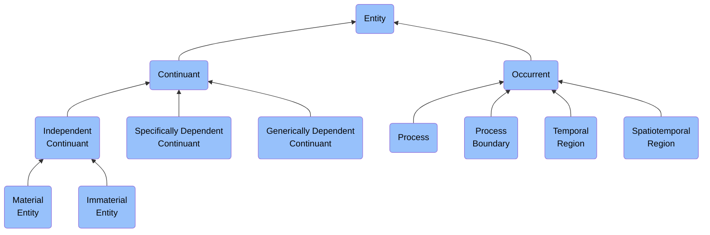

# ABI Ontology

> [!WARNING]
> This folder and the documents in this folder are currently under development. Content may be incomplete or subject to change. Contact us if you have any question: support@naas.ai

This is the root folder for the **ABI Ontology**, a comprehensive enterprise ontology framework built on the Basic Formal Ontology (BFO). The ABI Ontology provides semantic models for representing entities, processes, and relationships across multiple domains of enterprise operations.

## Ontology Structure

The ABI Ontology is organized according to the following principles:

### Basic Formal Ontology (BFO) Foundation

All classes in the ABI Ontology are grounded in BFO's fundamental distinction between:

- **Continuants**: Entities that persist through time (e.g., organizations, roles, systems)
- **Occurrents**: Entities that unfold in time (e.g., processes, events, temporal regions)



### Domain Foundries

The ontology is divided into domain-specific **Foundries**, each focusing on a particular aspect of enterprise operations:

- **Enterprise Management Foundry**: Core business operations, organizational structures, and management processes
- **Cyber Security Foundry**: Security agents, operations, threats, and protective measures
- **ESG Foundry**: Environmental, Social, and Governance entities and processes
- **Data & Analytics Foundry**: Information assets, analytics processes, and data governance
- **Finance & Accounting Foundry**: Financial assets, transactions, and reporting processes

Each foundry maintains the same BFO-based structure of Continuants and Occurrents, but applies it to domain-specific concepts.

## Folder Organization

```
/docs/ontology/
├── foundries/                     # Domain-specific ontology modules
│   ├── enterprise_management/     # Business operations and management
│   │   ├── Continuant/           # Persistent entities (orgs, roles, etc.)
│   │   └── Occurrent/            # Time-bound processes and events
│   │
│   ├── cyber_security/           # Security and protection domain
│   │   ├── Continuant/           # Security agents, assets, etc.
│   │   └── Occurent/             # Security processes, events, etc.
│   │
│   └── [other foundries]/        # Additional domain-specific modules
│
├── common/                        # Shared ontology components
│   ├── upper/                    # Upper-level shared classes
│   └── patterns/                 # Reusable ontology patterns
│
└── reference/                     # Documentation and guidelines
    ├── modeling_principles/      # Ontology modeling guidelines
    └── examples/                 # Usage examples and patterns
```

## Key Principles

The ABI Ontology follows these design principles:

1. **BFO Conformance**: All classes properly align with BFO's distinctions and hierarchies
2. **Modularity**: Domain-specific concepts are organized into cohesive foundries
3. **Reusability**: Common patterns and classes are shared across foundries
4. **Clarity**: Clear definitions and examples for all ontological entities
5. **Practical Application**: Designed for real-world enterprise use cases

## Usage

This ontology can be used for:

- Enterprise architecture modeling
- Business process management
- Information integration
- Decision support systems
- Compliance and governance
- Knowledge representation and reasoning

## Ontology Classes

Each class in the ABI Ontology follows a standard documentation format:

- **Definition**: Precise description of the entity
- **BFO Hierarchy**: Position in the BFO class hierarchy
- **Properties**: Relevant object and data properties
- **Examples**: Real-world instances of the class

For specifics of each foundry, see the README files in their respective directories.
