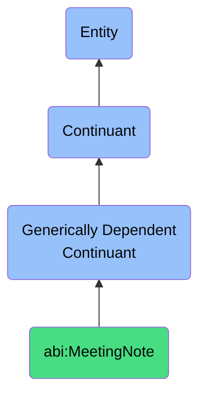

# MeetingNote

## Definition
A meeting note is a generically dependent continuant that documents key points and decisions from a scheduled discussion.

## Hierarchy in BFO

## Related Classes
- **abi:Transcript** - A generically dependent continuant that provides a verbatim or summarized textual representation of spoken dialogue captured during a conversation.
- **abi:Report** - A generically dependent continuant that communicates structured analysis or findings about a specific topic.
- **abi:Invoice** - A generically dependent continuant that records a payment request for goods or services delivered. 