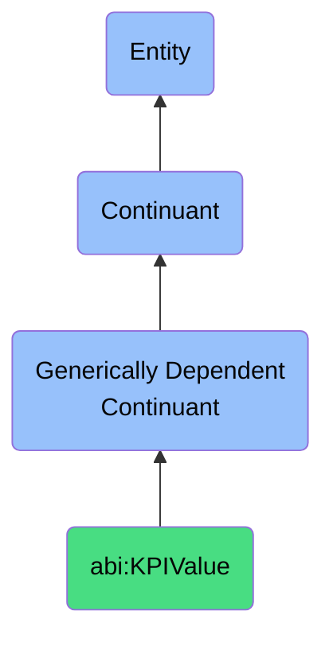

# KPIValue

## Definition
A KPI value is a generically dependent continuant that provides a measured outcome that quantifies performance against a defined business objective.

## Hierarchy in BFO

## Related Classes
- **abi:EngagementMetric** - A generically dependent continuant that provides a quantifiable measure reflecting the degree of interaction between users and content or campaigns.
- **abi:Forecast** - A generically dependent continuant that provides a data projection estimating future states or outcomes based on historical or modeled inputs.
- **abi:TrustScore** - A generically dependent continuant that represents a numerical or ordinal value estimating the perceived reliability of an entity or claim. 