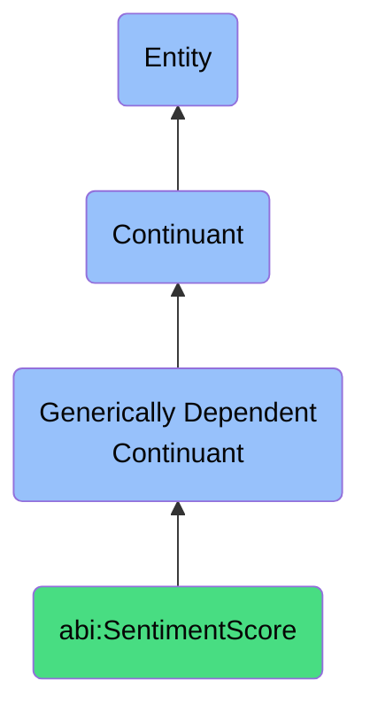

# SentimentScore

## Definition
A sentiment score is a generically dependent continuant that provides a semantic evaluation characterizing the emotional valence of a statement, message, or document.

## Hierarchy in BFO

## Related Classes
- **abi:ConfidenceScore** - A generically dependent continuant that provides a scalar measure expressing the strength or certainty of a prediction, classification, or evaluation.
- **abi:TrustScore** - A generically dependent continuant that represents a numerical or ordinal value estimating the perceived reliability of an entity or claim.
- **abi:EngagementMetric** - A generically dependent continuant that provides a quantifiable measure reflecting the degree of interaction between users and content or campaigns. 