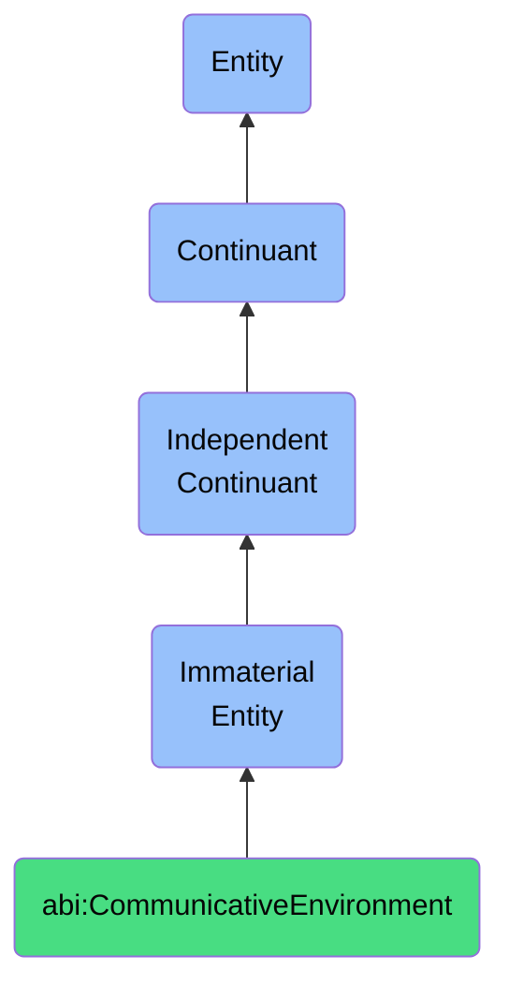

# CommunicativeEnvironment

## Definition
A communicative environment is an immaterial entity that constitutes the structured space within which agents exchange information, characterized by its communicative affordances, constraints, and established protocols that govern interactions and information flow.

## Hierarchy in BFO


## Ontological Schema (TBox)
```turtle
abi:CommunicativeEnvironment a owl:Class ;
  rdfs:subClassOf bfo:0000141 ;
  rdfs:label "Communicative Environment" ;
  skos:definition "An immaterial entity that constitutes the structured space within which agents exchange information, characterized by its communicative affordances, constraints, and established protocols that govern interactions and information flow." .

abi:has_communication_channel a owl:ObjectProperty ;
  rdfs:domain abi:CommunicativeEnvironment ;
  rdfs:range abi:CommunicationChannel ;
  rdfs:label "has communication channel" .

abi:enforces_protocol a owl:ObjectProperty ;
  rdfs:domain abi:CommunicativeEnvironment ;
  rdfs:range abi:CommunicationProtocol ;
  rdfs:label "enforces protocol" .

abi:enables_interaction_pattern a owl:ObjectProperty ;
  rdfs:domain abi:CommunicativeEnvironment ;
  rdfs:range abi:InteractionPattern ;
  rdfs:label "enables interaction pattern" .

abi:has_noise_level a owl:DatatypeProperty ;
  rdfs:domain abi:CommunicativeEnvironment ;
  rdfs:range xsd:float ;
  rdfs:label "has noise level" .
```

## Ontological Instance (ABox)
```turtle
ex:DigitalWorkplaceEnvironment a abi:CommunicativeEnvironment ;
  rdfs:label "Digital Workplace Environment" ;
  abi:has_communication_channel ex:EmailSystem, ex:InstantMessaging, ex:VideoConferencing ;
  abi:enforces_protocol ex:CorporateCommunicationGuideline, ex:DataSecurityProtocol ;
  abi:enables_interaction_pattern ex:AsynchronousCollaboration, ex:RealTimeCoordination ;
  abi:has_noise_level "0.35"^^xsd:float .

ex:AcademicConferenceEnvironment a abi:CommunicativeEnvironment ;
  rdfs:label "Academic Conference Environment" ;
  abi:has_communication_channel ex:PanelDiscussion, ex:PosterPresentation, ex:QASession ;
  abi:enforces_protocol ex:PeerReviewStandard, ex:AcademicDiscourseEtiquette ;
  abi:enables_interaction_pattern ex:ExpertKnowledgeExchange, ex:NetworkingOpportunity ;
  abi:has_noise_level "0.25"^^xsd:float .
```

## Related Classes
- **abi:DiscourseContext** - An immaterial entity that shapes the interpretation and meaning of communication through shared knowledge, participants, and norms.
- **abi:ConversationalSpace** - An immaterial entity that delineates the bounded region where conversational exchanges occur, constrained by social, cultural, and technological factors.
- **abi:SocialInteractionField** - An immaterial entity that represents the domain of possibilities for social exchanges, constrained by social norms, roles, and expected behaviors. 