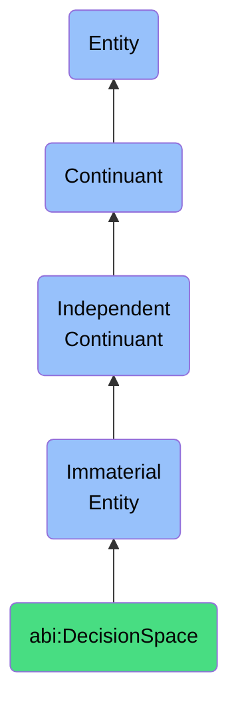

# DecisionSpace

## Definition
A decision space is an immaterial entity that represents the bounded area of viable choices, constraints, and influencing factors.

## Hierarchy in BFO


## Ontological Schema (TBox)
```turtle
abi:DecisionSpace a owl:Class ;
  rdfs:subClassOf bfo:0000141 ;
  rdfs:label "Decision Space" ;
  skos:definition "An immaterial structure representing the bounded area of viable choices, constraints, and influencing factors." .

abi:contains_decision a owl:ObjectProperty ;
  rdfs:domain abi:DecisionSpace ;
  rdfs:range abi:Decision ;
  rdfs:label "contains decision" .

abi:has_constraint a owl:ObjectProperty ;
  rdfs:domain abi:DecisionSpace ;
  rdfs:range abi:DecisionConstraint ;
  rdfs:label "has constraint" .

abi:influenced_by a owl:ObjectProperty ;
  rdfs:domain abi:DecisionSpace ;
  rdfs:range abi:InfluencingFactor ;
  rdfs:label "influenced by" .

abi:has_priority_ranking a owl:DatatypeProperty ;
  rdfs:domain abi:DecisionSpace ;
  rdfs:range xsd:string ;
  rdfs:label "has priority ranking" .
```

## Ontological Instance (ABox)
```turtle
ex:HiringDecisionSpace a abi:DecisionSpace ;
  rdfs:label "Short-term Hiring Decision Space" ;
  abi:contains_decision ex:HireNewDeveloper, ex:ContractTemporaryStaff ;
  abi:has_constraint ex:BudgetLimit, ex:HeadcountCap ;
  abi:influenced_by ex:DiversityGoals, ex:DeliveryTimelines ;
  abi:has_priority_ranking "1. Team needs, 2. Budget, 3. DE&I goals" .

ex:ProductFeatureDecisionSpace a abi:DecisionSpace ;
  rdfs:label "Q3 Product Feature Prioritization Space" ;
  abi:contains_decision ex:AddPaymentOptions, ex:EnhanceReporting ;
  abi:has_constraint ex:DevelopmentCapacity, ex:TechnicalFeasibility ;
  abi:influenced_by ex:CustomerFeedback, ex:CompetitiveAnalysis ;
  abi:has_priority_ranking "1. User impact, 2. Effort, 3. Strategic alignment" .
```

## Related Classes
- **abi:InsightScope** - An immaterial entity that defines the conceptual boundary of an analysis or insight.
- **abi:AuditTrail** - An immaterial entity that captures a temporal-logical sequence of actions, actors, and justifications.
- **abi:ValidationBoundary** - An immaterial entity that is a rule-defined scope where certain logical or business constraints are enforced. 