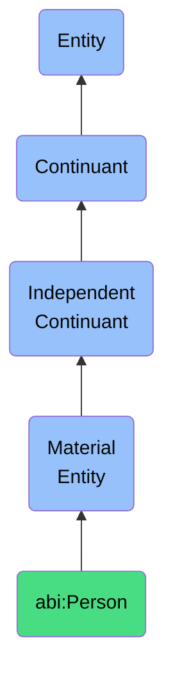

# Person

## Definition
A person is a material entity that has the capacity for intentional action, language, and social participation.

## Hierarchy in BFO


## Ontological Schema (TBox)
```turtle
abi:Person a owl:Class ;
  rdfs:subClassOf bfo:0000040 ;
  rdfs:label "Person" ;
  skos:definition "A material entity that has the capacity for intentional action, language, and social participation." .

abi:has_role a owl:ObjectProperty ;
  rdfs:domain abi:Person ;
  rdfs:range abi:Role ;
  rdfs:label "has role" .

abi:participates_in a owl:ObjectProperty ;
  rdfs:domain abi:Person ;
  rdfs:range abi:Process ;
  rdfs:label "participates in" .
```

## Ontological Instance (ABox)
```turtle
ex:JohnDoe a abi:Person ;
  rdfs:label "John Doe" ;
  abi:has_role ex:ProjectManager ;
  abi:participates_in ex:ProjectXReview .

ex:JaneSmith a abi:Person ;
  rdfs:label "Jane Smith" ;
  abi:has_role ex:DomainExpert ;
  abi:participates_in ex:AICritique, ex:ObservationValidation .
```

## Related Classes
- **abi:HumanExpert** - A material entity that is a person possessing recognized domain knowledge and participates in review, validation, or creation processes.
- **abi:Organization** - A material entity that is a collective coordinating the behavior and resources of individuals to achieve goals.
- **abi:AIAssistant** - A material entity that is a software-controlled agent performing tasks on behalf of a user but represented ontologically as a service-deployed entity with memory, identity, and role. 