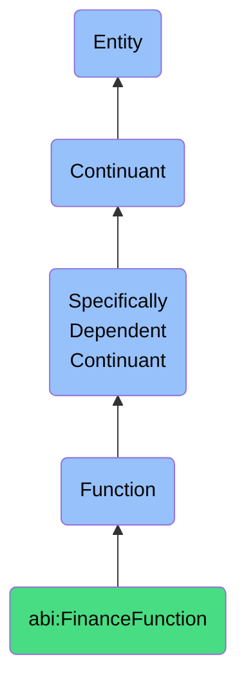

# FinanceFunction

## Definition
A finance function is a specifically dependent continuant that inheres in its bearer, providing capabilities to process, analyze, calculate, project, or reconcile monetary values, financial data, or economic indicators to support financial operations, planning, reporting, or decision-making within an organization.

## Hierarchy in BFO


## Ontological Schema (TBox)
```turtle
abi:FinanceFunction a owl:Class ;
  rdfs:subClassOf bfo:0000034 ;
  rdfs:label "Finance Function" ;
  skos:definition "A function related to processing, analyzing, calculating, or reconciling financial and monetary information." .

abi:inheres_in a owl:ObjectProperty ;
  rdfs:domain abi:FinanceFunction ;
  rdfs:range abi:FinancialProcessor ;
  rdfs:label "inheres in" .

abi:processes_financial_data a owl:ObjectProperty ;
  rdfs:domain abi:FinanceFunction ;
  rdfs:range abi:FinancialData ;
  rdfs:label "processes financial data" .

abi:follows_accounting_rules a owl:ObjectProperty ;
  rdfs:domain abi:FinanceFunction ;
  rdfs:range abi:AccountingRule ;
  rdfs:label "follows accounting rules" .

abi:produces_financial_output a owl:ObjectProperty ;
  rdfs:domain abi:FinanceFunction ;
  rdfs:range abi:FinancialOutput ;
  rdfs:label "produces financial output" .

abi:supports_financial_decision a owl:ObjectProperty ;
  rdfs:domain abi:FinanceFunction ;
  rdfs:range abi:FinancialDecision ;
  rdfs:label "supports financial decision" .

abi:uses_calculation_method a owl:ObjectProperty ;
  rdfs:domain abi:FinanceFunction ;
  rdfs:range abi:CalculationMethod ;
  rdfs:label "uses calculation method" .

abi:integrates_with_financial_system a owl:ObjectProperty ;
  rdfs:domain abi:FinanceFunction ;
  rdfs:range abi:FinancialSystem ;
  rdfs:label "integrates with financial system" .

abi:has_accuracy_level a owl:DatatypeProperty ;
  rdfs:domain abi:FinanceFunction ;
  rdfs:range xsd:decimal ;
  rdfs:label "has accuracy level" .

abi:has_time_horizon a owl:DatatypeProperty ;
  rdfs:domain abi:FinanceFunction ;
  rdfs:range xsd:string ;
  rdfs:label "has time horizon" .

abi:has_currency_unit a owl:DatatypeProperty ;
  rdfs:domain abi:FinanceFunction ;
  rdfs:range xsd:string ;
  rdfs:label "has currency unit" .
```

## Ontological Instance (ABox)
```turtle
# FinanceFunction is a parent class with subclasses:
# - abi:ForecastCashFunction
# - abi:ComputeRevenueFunction
# - abi:ReconcileBankFlowFunction
# and other finance-related functions
```

## Related Classes
- **abi:ForecastCashFunction** - A specialized function for estimating future cash flows.
- **abi:ComputeRevenueFunction** - A specialized function for calculating revenue metrics.
- **abi:ReconcileBankFlowFunction** - A specialized function for matching internal and external financial transactions.
- **abi:AnalysisFunction** - A broader function that may incorporate financial analysis as part of a larger evaluation.
- **abi:PredictiveFunction** - A function focused on making predictions, which may include financial forecasting. 