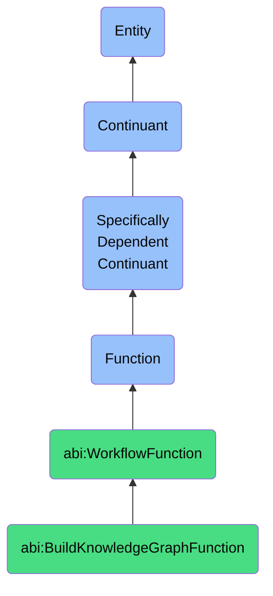

# BuildKnowledgeGraphFunction

## Definition
A build knowledge graph function is a specifically dependent continuant that inheres in its bearer, providing the capability to transform structured and unstructured data into interconnected semantic networks of entities, relationships, and properties that represent domain knowledge in a machine-readable format, enabling contextual understanding, inference, and knowledge discovery.

## Hierarchy in BFO


## Ontological Schema (TBox)
```turtle
abi:BuildKnowledgeGraphFunction a owl:Class ;
  rdfs:subClassOf abi:WorkflowFunction ;
  rdfs:label "Build Knowledge Graph Function" ;
  skos:definition "A function that transforms structured/unstructured data into a semantic network." .

abi:WorkflowFunction a owl:Class ;
  rdfs:subClassOf bfo:0000034 ;
  rdfs:label "Workflow Function" ;
  skos:definition "A function that enables coordination, execution, or management of operational sequences, data flows, or agent interactions." .

abi:inheres_in a owl:ObjectProperty ;
  rdfs:domain abi:BuildKnowledgeGraphFunction ;
  rdfs:range abi:KnowledgeGraphBuilder ;
  rdfs:label "inheres in" .

abi:processes_data_source a owl:ObjectProperty ;
  rdfs:domain abi:BuildKnowledgeGraphFunction ;
  rdfs:range abi:DataSource ;
  rdfs:label "processes data source" .

abi:applies_ontology a owl:ObjectProperty ;
  rdfs:domain abi:BuildKnowledgeGraphFunction ;
  rdfs:range abi:DomainOntology ;
  rdfs:label "applies ontology" .

abi:extracts_entity a owl:ObjectProperty ;
  rdfs:domain abi:BuildKnowledgeGraphFunction ;
  rdfs:range abi:Entity ;
  rdfs:label "extracts entity" .

abi:identifies_relationship a owl:ObjectProperty ;
  rdfs:domain abi:BuildKnowledgeGraphFunction ;
  rdfs:range abi:Relationship ;
  rdfs:label "identifies relationship" .

abi:populates_knowledge_graph a owl:ObjectProperty ;
  rdfs:domain abi:BuildKnowledgeGraphFunction ;
  rdfs:range abi:KnowledgeGraph ;
  rdfs:label "populates knowledge graph" .

abi:uses_extraction_technique a owl:ObjectProperty ;
  rdfs:domain abi:BuildKnowledgeGraphFunction ;
  rdfs:range abi:ExtractionTechnique ;
  rdfs:label "uses extraction technique" .

abi:maintains_graph_consistency a owl:ObjectProperty ;
  rdfs:domain abi:BuildKnowledgeGraphFunction ;
  rdfs:range abi:ConsistencyRule ;
  rdfs:label "maintains graph consistency" .

abi:has_confidence_threshold a owl:DatatypeProperty ;
  rdfs:domain abi:BuildKnowledgeGraphFunction ;
  rdfs:range xsd:decimal ;
  rdfs:label "has confidence threshold" .

abi:has_processing_frequency a owl:DatatypeProperty ;
  rdfs:domain abi:BuildKnowledgeGraphFunction ;
  rdfs:range xsd:string ;
  rdfs:label "has processing frequency" .

abi:has_scaling_capacity a owl:DatatypeProperty ;
  rdfs:domain abi:BuildKnowledgeGraphFunction ;
  rdfs:range xsd:string ;
  rdfs:label "has scaling capacity" .
```

## Ontological Instance (ABox)
```turtle
ex:ABIBackendCompanySnapshotGraphFunction a abi:BuildKnowledgeGraphFunction ;
  rdfs:label "ABI Backend Company Snapshot Knowledge Graph Function" ;
  abi:inheres_in ex:ABIBackendSystem ;
  abi:processes_data_source ex:CompanyDataWarehouse, ex:FinancialReportCorpus, ex:IndustryNewsFeeds ;
  abi:applies_ontology ex:EnterpriseOntology, ex:IndustryTaxonomy, ex:BusinessRelationshipSchema ;
  abi:extracts_entity ex:CompanyEntity, ex:ProductEntity, ex:ExecutiveEntity, ex:IndustryTrendEntity ;
  abi:identifies_relationship ex:OwnershipRelation, ex:PartnershipRelation, ex:CompetitorRelation ;
  abi:populates_knowledge_graph ex:EnterpriseKnowledgeGraph ;
  abi:uses_extraction_technique ex:NamedEntityRecognition, ex:RelationExtraction, ex:DocumentClassification ;
  abi:maintains_graph_consistency ex:TemporalConsistencyRule, ex:CrossSourceValidationRule ;
  abi:has_confidence_threshold "0.85"^^xsd:decimal ;
  abi:has_processing_frequency "Monthly with incremental updates" ;
  abi:has_scaling_capacity "Up to 10,000 companies with full relationship mapping" .

ex:ResearchTeamScientificLiteratureGraphFunction a abi:BuildKnowledgeGraphFunction ;
  rdfs:label "Research Team Scientific Literature Knowledge Graph Function" ;
  abi:inheres_in ex:ResearchKnowledgeSystem ;
  abi:processes_data_source ex:PubMedDatabase, ex:ResearchPaperRepository, ex:ClinicalTrialsRegistry ;
  abi:applies_ontology ex:BiomedicineOntology, ex:DiseaseClassification, ex:DrugInteractionSchema ;
  abi:extracts_entity ex:DiseaseEntity, ex:TreatmentEntity, ex:BiomarkerEntity, ex:ResearchFinidingEntity ;
  abi:identifies_relationship ex:TreatmentEfficacyRelation, ex:CausalRelation, ex:ContraindicationRelation ;
  abi:populates_knowledge_graph ex:BiomedicalKnowledgeGraph ;
  abi:uses_extraction_technique ex:ContextualLanguageModel, ex:CitationNetworkAnalysis, ex:StatisticalRelationMining ;
  abi:maintains_graph_consistency ex:EvidenceGradingRule, ex:ClinicalValidationRule ;
  abi:has_confidence_threshold "0.92"^^xsd:decimal ;
  abi:has_processing_frequency "Weekly with daily literature updates" ;
  abi:has_scaling_capacity "Over 5 million research papers with full evidence trail" .
```

## Related Classes
- **abi:TriggerAgentFunction** - A function that can initiate knowledge graph building based on specific conditions.
- **abi:ExecuteWorkflowFunction** - A function that may include knowledge graph building as part of a workflow sequence.
- **abi:QueryKnowledgeGraphFunction** - A function focused on retrieving information from knowledge graphs.
- **abi:DataIntegrationFunction** - A function that preprocesses and integrates data before knowledge graph construction.
- **abi:GraphAnalysisFunction** - A function that performs analytics and inference operations on knowledge graphs. 