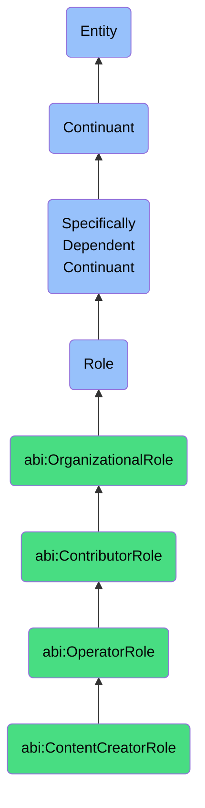

# ContentCreatorRole

## Definition
A content creator role is a specifically dependent continuant that an agent bears when engaged in producing, editing, curating, or managing content for distribution to target audiences, including responsibilities for maintaining content quality, adherence to style guidelines, and optimization for specific distribution channels.

## Hierarchy in BFO


## Ontological Schema (TBox)
```turtle
abi:ContentCreatorRole a owl:Class ;
  rdfs:subClassOf abi:OperatorRole ;
  rdfs:label "Content Creator Role" ;
  skos:definition "A role that an agent bears when producing, editing, or managing content for distribution across various channels." .

abi:OperatorRole a owl:Class ;
  rdfs:subClassOf abi:ContributorRole ;
  rdfs:label "Operator Role" ;
  skos:definition "A contributor role focused on executing specific operational functions with specialized skills in a particular domain." .

abi:has_bearer a owl:ObjectProperty ;
  rdfs:domain abi:ContentCreatorRole ;
  rdfs:range abi:Agent ;
  rdfs:label "has bearer" .

abi:creates_content_type a owl:ObjectProperty ;
  rdfs:domain abi:ContentCreatorRole ;
  rdfs:range abi:ContentType ;
  rdfs:label "creates content type" .

abi:publishes_to_channel a owl:ObjectProperty ;
  rdfs:domain abi:ContentCreatorRole ;
  rdfs:range abi:DistributionChannel ;
  rdfs:label "publishes to channel" .

abi:follows_style_guide a owl:ObjectProperty ;
  rdfs:domain abi:ContentCreatorRole ;
  rdfs:range abi:StyleGuide ;
  rdfs:label "follows style guide" .

abi:targets_audience a owl:ObjectProperty ;
  rdfs:domain abi:ContentCreatorRole ;
  rdfs:range abi:Audience ;
  rdfs:label "targets audience" .

abi:collaborates_with a owl:ObjectProperty ;
  rdfs:domain abi:ContentCreatorRole ;
  rdfs:range abi:OrganizationalRole ;
  rdfs:label "collaborates with" .

abi:reports_to a owl:ObjectProperty ;
  rdfs:domain abi:ContentCreatorRole ;
  rdfs:range abi:TeamLeadRole ;
  rdfs:label "reports to" .

abi:uses_content_tool a owl:ObjectProperty ;
  rdfs:domain abi:ContentCreatorRole ;
  rdfs:range abi:ContentCreationTool ;
  rdfs:label "uses content tool" .

abi:has_specialization a owl:DatatypeProperty ;
  rdfs:domain abi:ContentCreatorRole ;
  rdfs:range xsd:string ;
  rdfs:label "has specialization" .

abi:has_experience_level a owl:DatatypeProperty ;
  rdfs:domain abi:ContentCreatorRole ;
  rdfs:range xsd:string ;
  rdfs:label "has experience level" .

abi:has_role_start_date a owl:DatatypeProperty ;
  rdfs:domain abi:ContentCreatorRole ;
  rdfs:range xsd:date ;
  rdfs:label "has role start date" .
```

## Ontological Instance (ABox)
```turtle
ex:AyaBlogWriterRole a abi:ContentCreatorRole ;
  rdfs:label "Aya's Blog Writer Role" ;
  abi:has_bearer ex:AyaPerson ;
  abi:creates_content_type ex:BlogPost, ex:WhitePaper, ex:CaseStudy ;
  abi:publishes_to_channel ex:CorporateBlog, ex:LinkedInChannel, ex:MediumChannel ;
  abi:follows_style_guide ex:TechBrandStyleGuide, ex:ContentMarketingStyleGuide ;
  abi:targets_audience ex:TechnicalDecisionMakers, ex:EnterpriseITLeaders ;
  abi:collaborates_with ex:MarketingManagerRole, ex:GraphicDesignerRole, ex:ProductManagerRole ;
  abi:reports_to ex:ContentTeamLeadRole ;
  abi:uses_content_tool ex:WordPressTool, ex:GoogleDocsTool, ex:GrammarlyTool, ex:AhrefsSEOTool ;
  abi:has_specialization "Technical Writing, SEO Optimization" ;
  abi:has_experience_level "Senior" ;
  abi:has_role_start_date "2020-05-15"^^xsd:date .

ex:JamesVideoProducerRole a abi:ContentCreatorRole ;
  rdfs:label "James's Video Producer Role" ;
  abi:has_bearer ex:JamesPerson ;
  abi:creates_content_type ex:InstructionalVideo, ex:ProductDemonstration, ex:CustomerTestimonial ;
  abi:publishes_to_channel ex:YouTubeChannel, ex:LinkedInChannel, ex:CompanyWebsiteMediaSection ;
  abi:follows_style_guide ex:BrandVideoStyleGuide, ex:VideoBrandingStandards ;
  abi:targets_audience ex:ProductUsers, ex:PotentialCustomers, ex:PartnerNetwork ;
  abi:collaborates_with ex:MarketingManagerRole, ex:ProductTrainerRole, ex:CustomerSuccessManagerRole ;
  abi:reports_to ex:DigitalMediaTeamLeadRole ;
  abi:uses_content_tool ex:AdobePremiereProTool, ex:AfterEffectsTool, ex:FinalCutProTool, ex:YouTubeStudioTool ;
  abi:has_specialization "Video Production, Motion Graphics, Storytelling" ;
  abi:has_experience_level "Mid-level" ;
  abi:has_role_start_date "2021-03-10"^^xsd:date .
```

## Related Classes
- **abi:EngineerRole** - A technical role that may collaborate with content creators on technical documentation or product explanations.
- **abi:AnalystRole** - A role that provides data insights that content creators may transform into content.
- **abi:MarketingManagerRole** - A role that often directs the content strategy that content creators execute.
- **abi:SalesDevelopmentRepresentativeRole** - A role that may use content created by content creators in their outbound prospecting efforts.
- **abi:GraphicDesignerRole** - A specialized creative role that collaborates with content creators on visual elements. 