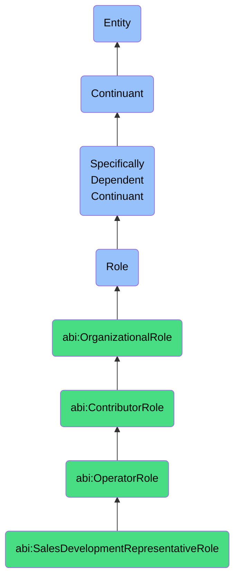

# SalesDevelopmentRepresentativeRole

## Definition
A sales development representative role is a specifically dependent continuant that an agent bears when engaged in outbound prospecting, lead qualification, and early-stage pipeline development, acting as the critical first point of sales contact with potential customers to identify opportunities and prepare qualified leads for account executives.

## Hierarchy in BFO


## Ontological Schema (TBox)
```turtle
abi:SalesDevelopmentRepresentativeRole a owl:Class ;
  rdfs:subClassOf abi:OperatorRole ;
  rdfs:label "Sales Development Representative Role" ;
  skos:definition "A role that an agent bears when focused on outbound prospecting and lead qualification in the early stages of the sales process." .

abi:has_bearer a owl:ObjectProperty ;
  rdfs:domain abi:SalesDevelopmentRepresentativeRole ;
  rdfs:range abi:Agent ;
  rdfs:label "has bearer" .

abi:targets_market_segment a owl:ObjectProperty ;
  rdfs:domain abi:SalesDevelopmentRepresentativeRole ;
  rdfs:range abi:MarketSegment ;
  rdfs:label "targets market segment" .

abi:covers_territory a owl:ObjectProperty ;
  rdfs:domain abi:SalesDevelopmentRepresentativeRole ;
  rdfs:range abi:SalesTerritory ;
  rdfs:label "covers territory" .

abi:qualifies_leads a owl:ObjectProperty ;
  rdfs:domain abi:SalesDevelopmentRepresentativeRole ;
  rdfs:range abi:Lead ;
  rdfs:label "qualifies leads" .

abi:conducts_outreach a owl:ObjectProperty ;
  rdfs:domain abi:SalesDevelopmentRepresentativeRole ;
  rdfs:range abi:OutreachActivity ;
  rdfs:label "conducts outreach" .

abi:uses_sales_methodology a owl:ObjectProperty ;
  rdfs:domain abi:SalesDevelopmentRepresentativeRole ;
  rdfs:range abi:SalesMethodology ;
  rdfs:label "uses sales methodology" .

abi:transfers_qualified_leads_to a owl:ObjectProperty ;
  rdfs:domain abi:SalesDevelopmentRepresentativeRole ;
  rdfs:range abi:AccountExecutiveRole ;
  rdfs:label "transfers qualified leads to" .

abi:reports_to a owl:ObjectProperty ;
  rdfs:domain abi:SalesDevelopmentRepresentativeRole ;
  rdfs:range abi:SalesTeamLeadRole ;
  rdfs:label "reports to" .

abi:uses_sales_tool a owl:ObjectProperty ;
  rdfs:domain abi:SalesDevelopmentRepresentativeRole ;
  rdfs:range abi:SalesTool ;
  rdfs:label "uses sales tool" .

abi:has_quota a owl:DatatypeProperty ;
  rdfs:domain abi:SalesDevelopmentRepresentativeRole ;
  rdfs:range xsd:integer ;
  rdfs:label "has quota" .

abi:has_language_proficiency a owl:DatatypeProperty ;
  rdfs:domain abi:SalesDevelopmentRepresentativeRole ;
  rdfs:range xsd:string ;
  rdfs:label "has language proficiency" .

abi:has_role_start_date a owl:DatatypeProperty ;
  rdfs:domain abi:SalesDevelopmentRepresentativeRole ;
  rdfs:range xsd:date ;
  rdfs:label "has role start date" .
```

## Ontological Instance (ABox)
```turtle
ex:MarcFrenchSDRRole a abi:SalesDevelopmentRepresentativeRole ;
  rdfs:label "Marc's Sales Development Representative Role for France" ;
  abi:has_bearer ex:MarcPerson ;
  abi:targets_market_segment ex:EnterpriseRetailSegment, ex:MidMarketManufacturingSegment ;
  abi:covers_territory ex:FranceSalesTerritory, ex:BelgiumSalesTerritory ;
  abi:qualifies_leads ex:FrenchRetailLeads, ex:BelgianManufacturingLeads ;
  abi:conducts_outreach ex:ColdCallingActivity, ex:LinkedInOutreachActivity, ex:EmailCampaignActivity ;
  abi:uses_sales_methodology ex:MEDDICMethodology, ex:SandlerSellingSystem ;
  abi:transfers_qualified_leads_to ex:EuropeAccountExecutiveRole ;
  abi:reports_to ex:EMEASalesTeamLeadRole ;
  abi:uses_sales_tool ex:SalesforceTool, ex:OutreachTool, ex:LinkedInSalesNavigatorTool, ex:ZoomInfoTool ;
  abi:has_quota "25"^^xsd:integer ;
  abi:has_language_proficiency "French (Native), English (Fluent), German (Basic)" ;
  abi:has_role_start_date "2022-01-10"^^xsd:date .

ex:PriyaUKTechSDRRole a abi:SalesDevelopmentRepresentativeRole ;
  rdfs:label "Priya's Technology SDR Role for UK Market" ;
  abi:has_bearer ex:PriyaPerson ;
  abi:targets_market_segment ex:FinTechSegment, ex:HealthTechSegment, ex:InsurTechSegment ;
  abi:covers_territory ex:UnitedKingdomSalesTerritory ;
  abi:qualifies_leads ex:UKFinTechLeads, ex:UKHealthTechLeads ;
  abi:conducts_outreach ex:PersonalizedEmailOutreachActivity, ex:IndustryEventNetworkingActivity, ex:SocialSellingActivity ;
  abi:uses_sales_methodology ex:BANTMethodology, ex:ChallengeSaleMethodology ;
  abi:transfers_qualified_leads_to ex:TechnologySectorAccountExecutiveRole ;
  abi:reports_to ex:UKSalesTeamLeadRole ;
  abi:uses_sales_tool ex:HubspotTool, ex:GongTool, ex:DemandbaseTool, ex:CrystalKnowsTool ;
  abi:has_quota "20"^^xsd:integer ;
  abi:has_language_proficiency "English (Native), Hindi (Fluent), Punjabi (Native)" ;
  abi:has_role_start_date "2021-07-15"^^xsd:date .
```

## Related Classes
- **abi:AccountExecutiveRole** - A sales role that receives qualified leads from SDRs and is responsible for closing deals.
- **abi:ContentCreatorRole** - A role that creates sales enablement content that SDRs use in their outreach efforts.
- **abi:MarketingManagerRole** - A role that develops campaigns and materials that generate leads for SDRs.
- **abi:SalesOperationsRole** - A role that defines processes and provides tools to support SDR efficiency.
- **abi:CustomerSuccessManagerRole** - A role that works with customers post-sale, sometimes providing referrals back to SDRs. 