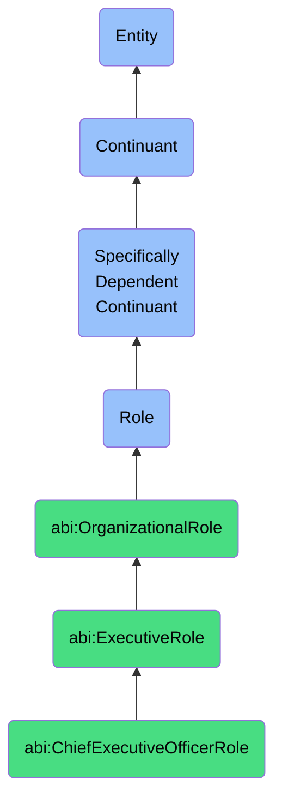

# ChiefExecutiveOfficerRole

## Definition
A chief executive officer role is a specifically dependent continuant that an agent bears when holding overall responsibility for strategic and operational leadership within an organization, characterized by ultimate decision-making authority, organizational vision setting, and accountability for company performance.

## Hierarchy in BFO


## Ontological Schema (TBox)
```turtle
abi:ChiefExecutiveOfficerRole a owl:Class ;
  rdfs:subClassOf bfo:0000023 ;
  rdfs:label "Chief Executive Officer Role" ;
  skos:definition "A role that an agent bears when holding overall responsibility for strategic and operational leadership within an organization, characterized by ultimate decision-making authority, organizational vision setting, and accountability for company performance." .

abi:ExecutiveRole a owl:Class ;
  rdfs:subClassOf bfo:0000023 ;
  rdfs:label "Executive Role" ;
  skos:definition "A high-level organizational role with significant decision-making authority and strategic responsibility." .

abi:OrganizationalRole a owl:Class ;
  rdfs:subClassOf bfo:0000023 ;
  rdfs:label "Organizational Role" ;
  skos:definition "A role that a person or agent bears in a formal organizational structure." .

abi:has_bearer a owl:ObjectProperty ;
  rdfs:domain abi:ChiefExecutiveOfficerRole ;
  rdfs:range abi:Agent ;
  rdfs:label "has bearer" .

abi:realized_in a owl:ObjectProperty ;
  rdfs:domain abi:ChiefExecutiveOfficerRole ;
  rdfs:range abi:LeadershipProcess ;
  rdfs:label "realized in" .

abi:has_responsibility a owl:ObjectProperty ;
  rdfs:domain abi:ChiefExecutiveOfficerRole ;
  rdfs:range abi:OrganizationalResponsibility ;
  rdfs:label "has responsibility" .

abi:has_authority_over a owl:ObjectProperty ;
  rdfs:domain abi:ChiefExecutiveOfficerRole ;
  rdfs:range abi:OrganizationalUnit ;
  rdfs:label "has authority over" .

abi:reports_to a owl:ObjectProperty ;
  rdfs:domain abi:ChiefExecutiveOfficerRole ;
  rdfs:range abi:BoardOfDirectors ;
  rdfs:label "reports to" .

abi:has_role_start_date a owl:DatatypeProperty ;
  rdfs:domain abi:ChiefExecutiveOfficerRole ;
  rdfs:range xsd:date ;
  rdfs:label "has role start date" .
```

## Ontological Instance (ABox)
```turtle
ex:JeremyCEORole a abi:ChiefExecutiveOfficerRole ;
  rdfs:label "Jeremy's CEO Role at Naas" ;
  abi:has_bearer ex:JeremyPerson ;
  abi:realized_in ex:StrategicLeadershipProcess, ex:ExecutiveDecisionMakingProcess ;
  abi:has_responsibility ex:CompanyStrategyResponsibility, ex:OrganizationalPerformanceResponsibility ;
  abi:has_authority_over ex:NaasOrganization ;
  abi:reports_to ex:NaasBoardOfDirectors ;
  abi:has_role_start_date "2022-01-15"^^xsd:date .

ex:ElizabethCEORole a abi:ChiefExecutiveOfficerRole ;
  rdfs:label "Elizabeth's CEO Role at TechCorp" ;
  abi:has_bearer ex:ElizabethPerson ;
  abi:realized_in ex:CorporateTransformationProcess, ex:InnovationLeadershipProcess ;
  abi:has_responsibility ex:MarketExpansionResponsibility, ex:InvestorRelationsResponsibility ;
  abi:has_authority_over ex:TechCorpOrganization ;
  abi:reports_to ex:TechCorpBoardOfDirectors ;
  abi:has_role_start_date "2020-07-01"^^xsd:date .
```

## Related Classes
- **abi:ChiefOperatingOfficerRole** - An executive role focused on day-to-day operations and execution of company strategy.
- **abi:ChiefTechnologyOfficerRole** - An executive role responsible for technological vision and strategy.
- **abi:ChiefMarketingOfficerRole** - An executive role focused on brand development, marketing strategy, and customer acquisition.
- **abi:VicePresidentRole** - A senior management role typically overseeing specific business functions or divisions. 