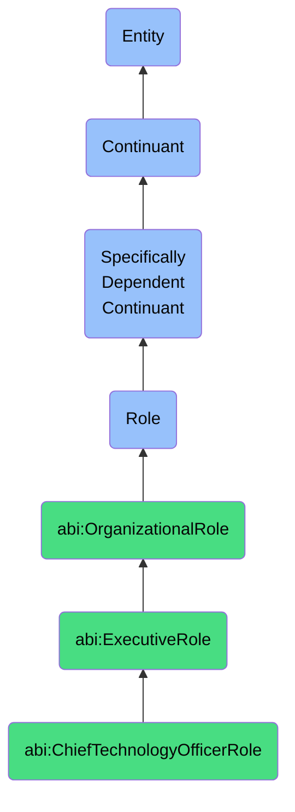

# ChiefTechnologyOfficerRole

## Definition
A chief technology officer role is a specifically dependent continuant that an agent bears when responsible for overseeing the technological vision, strategy, architecture, and innovation activities of an organization, characterized by leadership in technical decision-making, evaluation of emerging technologies, and alignment of technological capabilities with business objectives.

## Hierarchy in BFO


## Ontological Schema (TBox)
```turtle
abi:ChiefTechnologyOfficerRole a owl:Class ;
  rdfs:subClassOf bfo:0000023 ;
  rdfs:label "Chief Technology Officer Role" ;
  skos:definition "A role that an agent bears when responsible for overseeing the technological vision, strategy, architecture, and innovation activities of an organization, characterized by leadership in technical decision-making, evaluation of emerging technologies, and alignment of technological capabilities with business objectives." .

abi:ExecutiveRole a owl:Class ;
  rdfs:subClassOf bfo:0000023 ;
  rdfs:label "Executive Role" ;
  skos:definition "A high-level organizational role with significant decision-making authority and strategic responsibility." .

abi:has_bearer a owl:ObjectProperty ;
  rdfs:domain abi:ChiefTechnologyOfficerRole ;
  rdfs:range abi:Agent ;
  rdfs:label "has bearer" .

abi:realized_in a owl:ObjectProperty ;
  rdfs:domain abi:ChiefTechnologyOfficerRole ;
  rdfs:range abi:TechnologyLeadershipProcess ;
  rdfs:label "realized in" .

abi:has_responsibility a owl:ObjectProperty ;
  rdfs:domain abi:ChiefTechnologyOfficerRole ;
  rdfs:range abi:TechnologyResponsibility ;
  rdfs:label "has responsibility" .

abi:oversees_technology_domain a owl:ObjectProperty ;
  rdfs:domain abi:ChiefTechnologyOfficerRole ;
  rdfs:range abi:TechnologyDomain ;
  rdfs:label "oversees technology domain" .

abi:directs_technical_team a owl:ObjectProperty ;
  rdfs:domain abi:ChiefTechnologyOfficerRole ;
  rdfs:range abi:TechnicalTeam ;
  rdfs:label "directs technical team" .

abi:establishes_technology_roadmap a owl:ObjectProperty ;
  rdfs:domain abi:ChiefTechnologyOfficerRole ;
  rdfs:range abi:TechnologyRoadmap ;
  rdfs:label "establishes technology roadmap" .

abi:reports_to a owl:ObjectProperty ;
  rdfs:domain abi:ChiefTechnologyOfficerRole ;
  rdfs:range abi:ChiefExecutiveOfficerRole ;
  rdfs:label "reports to" .

abi:has_technical_expertise a owl:DatatypeProperty ;
  rdfs:domain abi:ChiefTechnologyOfficerRole ;
  rdfs:range xsd:string ;
  rdfs:label "has technical expertise" .

abi:has_role_start_date a owl:DatatypeProperty ;
  rdfs:domain abi:ChiefTechnologyOfficerRole ;
  rdfs:range xsd:date ;
  rdfs:label "has role start date" .
```

## Ontological Instance (ABox)
```turtle
ex:AmelCTORole a abi:ChiefTechnologyOfficerRole ;
  rdfs:label "Amel's CTO Role in Ontology Infrastructure Division" ;
  abi:has_bearer ex:AmelPerson ;
  abi:realized_in ex:OntologyInfrastructureLeadership, ex:TechnicalVisionDevelopment ;
  abi:has_responsibility ex:TechnicalArchitectureResponsibility, ex:InnovationStrategyResponsibility ;
  abi:oversees_technology_domain ex:KnowledgeGraphDomain, ex:OntologyModelingDomain ;
  abi:directs_technical_team ex:OntologyEngineeringTeam, ex:SemanticTechnologyTeam ;
  abi:establishes_technology_roadmap ex:OntologyInfrastructureRoadmap ;
  abi:reports_to ex:DivisionCEORole ;
  abi:has_technical_expertise "Knowledge Representation, Semantic Web Technologies, Graph Databases" ;
  abi:has_role_start_date "2022-01-15"^^xsd:date .

ex:DanielCTORole a abi:ChiefTechnologyOfficerRole ;
  rdfs:label "Daniel's CTO Role at AI Solutions Company" ;
  abi:has_bearer ex:DanielPerson ;
  abi:realized_in ex:AIStrategyDevelopment, ex:TechnicalPartnershipManagement ;
  abi:has_responsibility ex:MachineLearningInfrastructureResponsibility, ex:TechnicalInnovationResponsibility ;
  abi:oversees_technology_domain ex:MachineLearningDomain, ex:ComputerVisionDomain, ex:NLPDomain ;
  abi:directs_technical_team ex:AIResearchTeam, ex:MLEngineeringTeam ;
  abi:establishes_technology_roadmap ex:AITechnologyRoadmap ;
  abi:reports_to ex:CompanyCEORole ;
  abi:has_technical_expertise "Machine Learning, Neural Networks, Large Language Models, Computer Vision" ;
  abi:has_role_start_date "2021-07-01"^^xsd:date .
```

## Related Classes
- **abi:ChiefExecutiveOfficerRole** - The highest-ranking executive role with overall responsibility for organizational strategy and performance.
- **abi:ChiefInformationOfficerRole** - An executive role focused on information systems, digital infrastructure, and IT service delivery.
- **abi:ChiefDataOfficerRole** - An executive role responsible for enterprise data strategy, governance, and analytics capabilities.
- **abi:VicePresidentOfEngineeringRole** - A senior management role overseeing engineering teams and technical implementation. 