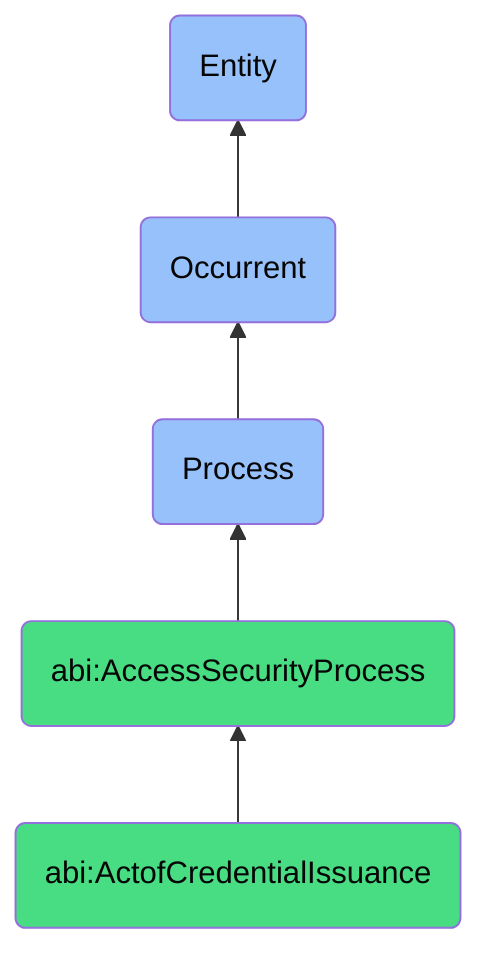

# ActofCredentialIssuance

## Definition
An act of credential issuance is an occurrent process that unfolds through time, involving the generation, assignment, distribution, and activation of authentication materials, access tokens, security certificates, or access credentials to authorized entities, enabling them to establish identity and access protected resources in accordance with defined security policies, access requirements, and authentication mechanisms through procedures that ensure secure delivery, activation verification, and proper documentation of credential creation and assignment.

## Hierarchy in BFO


## Ontological Schema (TBox)
```turtle
abi:ActofCredentialIssuance a owl:Class ;
  rdfs:subClassOf abi:AccessSecurityProcess ;
  rdfs:label "Act of Credential Issuance" ;
  skos:definition "A process that generates and delivers a new secret, token, or password to an authorized party." .

abi:AccessSecurityProcess a owl:Class ;
  rdfs:subClassOf bfo:0000015 ;
  rdfs:label "Access Security Process" ;
  skos:definition "A time-bound process focused on securing and governing who/what can access what and how that access is authenticated." .

abi:has_issuance_authority a owl:ObjectProperty ;
  rdfs:domain abi:ActofCredentialIssuance ;
  rdfs:range abi:IssuanceAuthority ;
  rdfs:label "has issuance authority" .

abi:issues_credential_type a owl:ObjectProperty ;
  rdfs:domain abi:ActofCredentialIssuance ;
  rdfs:range abi:CredentialType ;
  rdfs:label "issues credential type" .

abi:issues_to_recipient a owl:ObjectProperty ;
  rdfs:domain abi:ActofCredentialIssuance ;
  rdfs:range abi:CredentialRecipient ;
  rdfs:label "issues to recipient" .

abi:grants_resource_access a owl:ObjectProperty ;
  rdfs:domain abi:ActofCredentialIssuance ;
  rdfs:range abi:ResourceAccess ;
  rdfs:label "grants resource access" .

abi:follows_issuance_policy a owl:ObjectProperty ;
  rdfs:domain abi:ActofCredentialIssuance ;
  rdfs:range abi:IssuancePolicy ;
  rdfs:label "follows issuance policy" .

abi:uses_delivery_method a owl:ObjectProperty ;
  rdfs:domain abi:ActofCredentialIssuance ;
  rdfs:range abi:DeliveryMethod ;
  rdfs:label "uses delivery method" .

abi:produces_issuance_record a owl:ObjectProperty ;
  rdfs:domain abi:ActofCredentialIssuance ;
  rdfs:range abi:IssuanceRecord ;
  rdfs:label "produces issuance record" .

abi:has_issuance_timestamp a owl:DatatypeProperty ;
  rdfs:domain abi:ActofCredentialIssuance ;
  rdfs:range xsd:dateTime ;
  rdfs:label "has issuance timestamp" .

abi:has_credential_expiry a owl:DatatypeProperty ;
  rdfs:domain abi:ActofCredentialIssuance ;
  rdfs:range xsd:dateTime ;
  rdfs:label "has credential expiry" .

abi:has_issuance_trigger a owl:DatatypeProperty ;
  rdfs:domain abi:ActofCredentialIssuance ;
  rdfs:range xsd:string ;
  rdfs:label "has issuance trigger" .
```

## Ontological Instance (ABox)
```turtle
ex:BackendServiceAPIKeyIssuance a abi:ActofCredentialIssuance ;
  rdfs:label "New Backend Bot API Key Issuance" ;
  abi:has_issuance_authority ex:APISecurityTeam, ex:APIGatewayAdministrator ;
  abi:issues_credential_type ex:APIKey, ex:ServiceAccountCredential ;
  abi:issues_to_recipient ex:DataProcessingBot, ex:AnalyticsPipeline ;
  abi:grants_resource_access ex:DataAPIAccess, ex:LoggingSystemAccess, ex:StorageSystemAccess ;
  abi:follows_issuance_policy ex:ServiceAccountStandard, ex:LeastPrivilegePolicy, ex:SecretManagementGuidelines ;
  abi:uses_delivery_method ex:SecretManagerInjection, ex:EncryptedConfiguration ;
  abi:produces_issuance_record ex:KeyRegistryEntry, ex:AccessAuditLog, ex:ServiceConfiguration ;
  abi:has_issuance_timestamp "2023-11-10T09:15:00Z"^^xsd:dateTime ;
  abi:has_credential_expiry "2024-11-10T09:15:00Z"^^xsd:dateTime ;
  abi:has_issuance_trigger "New Service Deployment" .

ex:DeploymentRunnerAccessTokenIssuance a abi:ActofCredentialIssuance ;
  rdfs:label "Temporary Vault Access Token for Deployment Runner" ;
  abi:has_issuance_authority ex:VaultAdministrator, ex:SecurityOrchestrationSystem ;
  abi:issues_credential_type ex:TemporaryAccessToken, ex:OAuth2Token ;
  abi:issues_to_recipient ex:CICDPipeline, ex:DeploymentAutomation ;
  abi:grants_resource_access ex:SecretVaultAccess, ex:ConfigurationRepositoryAccess, ex:InfrastructureProvisioningAccess ;
  abi:follows_issuance_policy ex:JustInTimeAccess, ex:TemporaryCredentialPolicy, ex:AutomatedWorkflowSecurity ;
  abi:uses_delivery_method ex:EnvironmentVariableInjection, ex:SecureTokenExchange ;
  abi:produces_issuance_record ex:TokenActivityLog, ex:DeploymentAuthorizationRecord ;
  abi:has_issuance_timestamp "2023-11-18T14:30:00Z"^^xsd:dateTime ;
  abi:has_credential_expiry "2023-11-18T16:30:00Z"^^xsd:dateTime ;
  abi:has_issuance_trigger "Deployment Workflow Initiation" .
```

## Related Classes
- **abi:ActofFacilityAccessReview** - A process that may precede physical credential issuance.
- **abi:ActofServerAccessReview** - A process that may precede digital credential issuance.
- **abi:ActofCredentialRotation** - A process that replaces existing credentials with new ones.
- **abi:ActofCredentialRevocation** - A process that may occur when issued credentials need to be invalidated.
- **abi:ActofCredentialAudit** - A process that reviews whether credentials were properly issued.
- **abi:AccessRequestProcess** - A process that initiates credential issuance upon approval.
- **abi:UserProvisioningProcess** - A broader process that includes credential issuance for new users. 