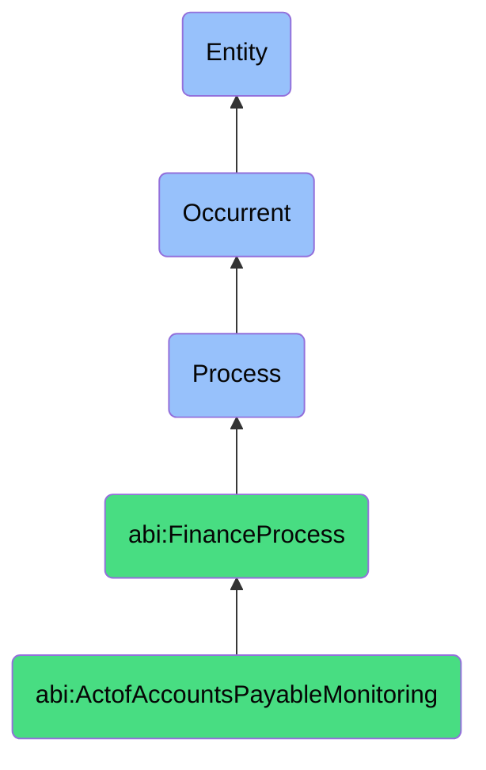

# ActofAccountsPayableMonitoring

## Definition
An act of accounts payable monitoring is an occurrent process that unfolds through time, involving the systematic tracking, analysis, and management of outstanding financial obligations to vendors, suppliers, and service providers, including payment scheduling, cash outflow planning, and vendor relationship management, to optimize payment timing, capture available discounts, and maintain operational continuity.

## Hierarchy in BFO


## Ontological Schema (TBox)
```turtle
abi:ActofAccountsPayableMonitoring a owl:Class ;
  rdfs:subClassOf abi:FinanceProcess ;
  rdfs:label "Act of Accounts Payable Monitoring" ;
  skos:definition "A process that monitors outgoing payments owed to vendors or service providers." .

abi:FinanceProcess a owl:Class ;
  rdfs:subClassOf bfo:0000015 ;
  rdfs:label "Finance Process" ;
  skos:definition "A time-bound activity related to the management, tracking, and optimization of financial resources and obligations." .

abi:has_payables_monitor a owl:ObjectProperty ;
  rdfs:domain abi:ActofAccountsPayableMonitoring ;
  rdfs:range abi:PayablesMonitor ;
  rdfs:label "has payables monitor" .

abi:tracks_vendor_invoice a owl:ObjectProperty ;
  rdfs:domain abi:ActofAccountsPayableMonitoring ;
  rdfs:range abi:VendorInvoice ;
  rdfs:label "tracks vendor invoice" .

abi:schedules_payment_due_date a owl:ObjectProperty ;
  rdfs:domain abi:ActofAccountsPayableMonitoring ;
  rdfs:range abi:PaymentDueDate ;
  rdfs:label "schedules payment due date" .

abi:prioritizes_vendor_payment a owl:ObjectProperty ;
  rdfs:domain abi:ActofAccountsPayableMonitoring ;
  rdfs:range abi:VendorPayment ;
  rdfs:label "prioritizes vendor payment" .

abi:evaluates_payment_discount a owl:ObjectProperty ;
  rdfs:domain abi:ActofAccountsPayableMonitoring ;
  rdfs:range abi:PaymentDiscount ;
  rdfs:label "evaluates payment discount" .

abi:produces_payables_report a owl:ObjectProperty ;
  rdfs:domain abi:ActofAccountsPayableMonitoring ;
  rdfs:range abi:PayablesReport ;
  rdfs:label "produces payables report" .

abi:plans_cash_outflow a owl:ObjectProperty ;
  rdfs:domain abi:ActofAccountsPayableMonitoring ;
  rdfs:range abi:CashOutflowPlan ;
  rdfs:label "plans cash outflow" .

abi:has_monitoring_date a owl:DatatypeProperty ;
  rdfs:domain abi:ActofAccountsPayableMonitoring ;
  rdfs:range xsd:date ;
  rdfs:label "has monitoring date" .

abi:has_total_payables_amount a owl:DatatypeProperty ;
  rdfs:domain abi:ActofAccountsPayableMonitoring ;
  rdfs:range xsd:decimal ;
  rdfs:label "has total payables amount" .

abi:has_average_payment_term a owl:DatatypeProperty ;
  rdfs:domain abi:ActofAccountsPayableMonitoring ;
  rdfs:range xsd:integer ;
  rdfs:label "has average payment term" .
```

## Ontological Instance (ABox)
```turtle
ex:MonthlyOperatingExpenseMonitoring a abi:ActofAccountsPayableMonitoring ;
  rdfs:label "Monthly Operating Expense Monitoring Process" ;
  abi:has_payables_monitor ex:FinanceAssistant ;
  abi:tracks_vendor_invoice ex:CloudServiceInvoice, ex:SupportContractInvoice ;
  abi:schedules_payment_due_date ex:NetThirtyPaymentTerm, ex:ImmediatePaymentTerm ;
  abi:prioritizes_vendor_payment ex:CriticalInfrastructurePayment, ex:OptionalServicePayment ;
  abi:evaluates_payment_discount ex:EarlyPaymentDiscount ;
  abi:produces_payables_report ex:MonthlyVendorPaymentSummary, ex:UpcomingPaymentSchedule ;
  abi:plans_cash_outflow ex:FebruaryCashOutflow ;
  abi:has_monitoring_date "2023-01-31"^^xsd:date ;
  abi:has_total_payables_amount "15000.00"^^xsd:decimal ;
  abi:has_average_payment_term "25"^^xsd:integer .

ex:QuarterlyCapitalExpenditureMonitoring a abi:ActofAccountsPayableMonitoring ;
  rdfs:label "Quarterly Capital Expenditure Monitoring Process" ;
  abi:has_payables_monitor ex:ProcurementManager ;
  abi:tracks_vendor_invoice ex:HardwareSupplierInvoice, ex:SoftwareLicenseInvoice ;
  abi:schedules_payment_due_date ex:MilestonedPaymentSchedule, ex:NetSixtyPaymentTerm ;
  abi:prioritizes_vendor_payment ex:InfrastructureUpgradePayment, ex:ExpansionProjectPayment ;
  abi:evaluates_payment_discount ex:VolumeDiscountIncentive, ex:LongTermContractDiscount ;
  abi:produces_payables_report ex:CapitalExpenditureAnalysis, ex:VendorPerformanceReport ;
  abi:plans_cash_outflow ex:Q2CapitalDeployment ;
  abi:has_monitoring_date "2023-03-30"^^xsd:date ;
  abi:has_total_payables_amount "78500.00"^^xsd:decimal ;
  abi:has_average_payment_term "45"^^xsd:integer .
```

## Related Classes
- **abi:ActofForecasting** - A process that projects future financial obligations and cash requirements.
- **abi:ActofCashReconciliation** - A process that verifies payment execution against planned payables.
- **abi:ActofBudgeting** - A process that allocates resources for anticipated expenses.
- **abi:VendorManagementProcess** - A process for maintaining relationships with suppliers.
- **abi:PaymentApprovalProcess** - A process that authorizes payment of monitored payables. 