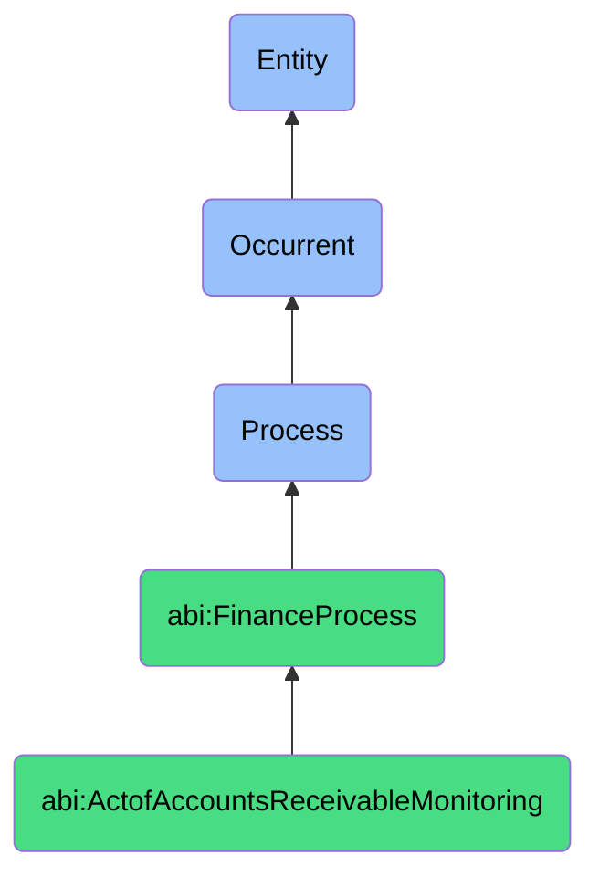

# ActofAccountsReceivableMonitoring

## Definition
An act of accounts receivable monitoring is an occurrent process that unfolds through time, involving the systematic tracking, analysis, and management of outstanding customer payments, including aging analysis, collection activities, and cash flow projections, to ensure timely receipt of funds, minimize bad debt risk, and maintain financial liquidity.

## Hierarchy in BFO


## Ontological Schema (TBox)
```turtle
abi:ActofAccountsReceivableMonitoring a owl:Class ;
  rdfs:subClassOf abi:FinanceProcess ;
  rdfs:label "Act of Accounts Receivable Monitoring" ;
  skos:definition "A process that tracks incoming payments owed by customers." .

abi:FinanceProcess a owl:Class ;
  rdfs:subClassOf bfo:0000015 ;
  rdfs:label "Finance Process" ;
  skos:definition "A time-bound activity related to the management, tracking, and optimization of financial resources and obligations." .

abi:has_monitoring_agent a owl:ObjectProperty ;
  rdfs:domain abi:ActofAccountsReceivableMonitoring ;
  rdfs:range abi:MonitoringAgent ;
  rdfs:label "has monitoring agent" .

abi:tracks_customer_payment a owl:ObjectProperty ;
  rdfs:domain abi:ActofAccountsReceivableMonitoring ;
  rdfs:range abi:CustomerPayment ;
  rdfs:label "tracks customer payment" .

abi:analyzes_invoice_status a owl:ObjectProperty ;
  rdfs:domain abi:ActofAccountsReceivableMonitoring ;
  rdfs:range abi:InvoiceStatus ;
  rdfs:label "analyzes invoice status" .

abi:applies_aging_criteria a owl:ObjectProperty ;
  rdfs:domain abi:ActofAccountsReceivableMonitoring ;
  rdfs:range abi:AgingCriteria ;
  rdfs:label "applies aging criteria" .

abi:initiates_collection_action a owl:ObjectProperty ;
  rdfs:domain abi:ActofAccountsReceivableMonitoring ;
  rdfs:range abi:CollectionAction ;
  rdfs:label "initiates collection action" .

abi:produces_receivables_report a owl:ObjectProperty ;
  rdfs:domain abi:ActofAccountsReceivableMonitoring ;
  rdfs:range abi:ReceivablesReport ;
  rdfs:label "produces receivables report" .

abi:impacts_cash_flow_forecast a owl:ObjectProperty ;
  rdfs:domain abi:ActofAccountsReceivableMonitoring ;
  rdfs:range abi:CashFlowForecast ;
  rdfs:label "impacts cash flow forecast" .

abi:has_monitoring_timestamp a owl:DatatypeProperty ;
  rdfs:domain abi:ActofAccountsReceivableMonitoring ;
  rdfs:range xsd:dateTime ;
  rdfs:label "has monitoring timestamp" .

abi:has_total_receivables_amount a owl:DatatypeProperty ;
  rdfs:domain abi:ActofAccountsReceivableMonitoring ;
  rdfs:range xsd:decimal ;
  rdfs:label "has total receivables amount" .

abi:has_days_sales_outstanding a owl:DatatypeProperty ;
  rdfs:domain abi:ActofAccountsReceivableMonitoring ;
  rdfs:range xsd:integer ;
  rdfs:label "has days sales outstanding" .
```

## Ontological Instance (ABox)
```turtle
ex:ThirtyDayAgingReceivablesMonitoring a abi:ActofAccountsReceivableMonitoring ;
  rdfs:label "30+ Day Aging Receivables Monitoring Process" ;
  abi:has_monitoring_agent ex:FinanceAssistant ;
  abi:tracks_customer_payment ex:EnterpriseLicensePayment, ex:ConsultingServicePayment ;
  abi:analyzes_invoice_status ex:InvoiceOverdue, ex:PartiallyPaidInvoice ;
  abi:applies_aging_criteria ex:ThirtyDayAgingBucket, ex:SixtyDayAgingBucket, ex:NinetyDayAgingBucket ;
  abi:initiates_collection_action ex:ReminderEmailSending, ex:ClientAccountManagerNotification ;
  abi:produces_receivables_report ex:AgingReceivablesReport, ex:CustomerPaymentHistoryReport ;
  abi:impacts_cash_flow_forecast ex:MonthlyLiquidityProjection ;
  abi:has_monitoring_timestamp "2023-11-01T09:30:00Z"^^xsd:dateTime ;
  abi:has_total_receivables_amount "285000.00"^^xsd:decimal ;
  abi:has_days_sales_outstanding "42"^^xsd:integer .

ex:WeeklyStripePaymentReconciliation a abi:ActofAccountsReceivableMonitoring ;
  rdfs:label "Weekly Stripe Payment Reconciliation Process" ;
  abi:has_monitoring_agent ex:RevenueOperationsSpecialist ;
  abi:tracks_customer_payment ex:DigitalSubscriptionPayment, ex:OnlineStorePayment ;
  abi:analyzes_invoice_status ex:AutomatedPaymentPending, ex:FailedPaymentTransaction ;
  abi:applies_aging_criteria ex:CurrentAgingBucket, ex:SevenDayAgingBucket ;
  abi:initiates_collection_action ex:PaymentRetryAutomation, ex:CardUpdateRequest ;
  abi:produces_receivables_report ex:WeeklyPaymentGatewayReport, ex:FailedTransactionReport ;
  abi:impacts_cash_flow_forecast ex:WeeklyRevenueProjection ;
  abi:has_monitoring_timestamp "2023-10-28T15:45:00Z"^^xsd:dateTime ;
  abi:has_total_receivables_amount "57500.00"^^xsd:decimal ;
  abi:has_days_sales_outstanding "12"^^xsd:integer .
```

## Related Classes
- **abi:ActofBilling** - A process that generates invoices which then become receivables.
- **abi:ActofRevenueRecognition** - A process often connected to receivables status.
- **abi:ActofCashReconciliation** - A process that confirms received payments against receivables.
- **abi:ActofForecasting** - A process that incorporates receivables data for financial projections.
- **abi:CollectionProcess** - A specialized process initiated when monitoring identifies overdue receivables. 