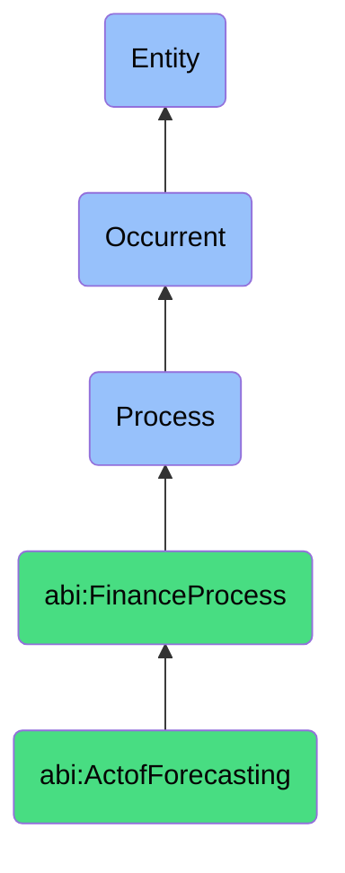

# ActofForecasting

## Definition
An act of forecasting is an occurrent process that unfolds through time, involving the systematic analysis of historical data, current trends, and environmental factors to make informed predictions about future financial performance, cash flow patterns, revenue trajectories, or expense levels, enabling proactive decision-making, resource allocation, and strategic planning under conditions of uncertainty.

## Hierarchy in BFO


## Ontological Schema (TBox)
```turtle
abi:ActofForecasting a owl:Class ;
  rdfs:subClassOf abi:FinanceProcess ;
  rdfs:label "Act of Forecasting" ;
  skos:definition "A process that predicts future cash flow, revenue, or cost trajectories based on current + historical data." .

abi:FinanceProcess a owl:Class ;
  rdfs:subClassOf bfo:0000015 ;
  rdfs:label "Finance Process" ;
  skos:definition "A time-bound activity related to the management, tracking, and optimization of financial resources and obligations." .

abi:has_forecasting_agent a owl:ObjectProperty ;
  rdfs:domain abi:ActofForecasting ;
  rdfs:range abi:ForecastingAgent ;
  rdfs:label "has forecasting agent" .

abi:analyzes_historical_data a owl:ObjectProperty ;
  rdfs:domain abi:ActofForecasting ;
  rdfs:range abi:HistoricalData ;
  rdfs:label "analyzes historical data" .

abi:applies_forecasting_model a owl:ObjectProperty ;
  rdfs:domain abi:ActofForecasting ;
  rdfs:range abi:ForecastingModel ;
  rdfs:label "applies forecasting model" .

abi:considers_business_driver a owl:ObjectProperty ;
  rdfs:domain abi:ActofForecasting ;
  rdfs:range abi:BusinessDriver ;
  rdfs:label "considers business driver" .

abi:incorporates_external_factor a owl:ObjectProperty ;
  rdfs:domain abi:ActofForecasting ;
  rdfs:range abi:ExternalFactor ;
  rdfs:label "incorporates external factor" .

abi:produces_forecast_output a owl:ObjectProperty ;
  rdfs:domain abi:ActofForecasting ;
  rdfs:range abi:ForecastOutput ;
  rdfs:label "produces forecast output" .

abi:informs_business_decision a owl:ObjectProperty ;
  rdfs:domain abi:ActofForecasting ;
  rdfs:range abi:BusinessDecision ;
  rdfs:label "informs business decision" .

abi:has_forecast_creation_date a owl:DatatypeProperty ;
  rdfs:domain abi:ActofForecasting ;
  rdfs:range xsd:date ;
  rdfs:label "has forecast creation date" .

abi:has_forecast_horizon a owl:DatatypeProperty ;
  rdfs:domain abi:ActofForecasting ;
  rdfs:range xsd:string ;
  rdfs:label "has forecast horizon" .

abi:has_forecast_confidence_level a owl:DatatypeProperty ;
  rdfs:domain abi:ActofForecasting ;
  rdfs:range xsd:decimal ;
  rdfs:label "has forecast confidence level" .
```

## Ontological Instance (ABox)
```turtle
ex:QuarterlyRevenueForecasting a abi:ActofForecasting ;
  rdfs:label "Quarterly Revenue Forecasting Process" ;
  abi:has_forecasting_agent ex:FinanceAssistant ;
  abi:analyzes_historical_data ex:PastQuarterSalesData, ex:PipelineConversionHistory, ex:SeasonalityPatterns ;
  abi:applies_forecasting_model ex:TimeSeriesAnalysis, ex:RegressionModel, ex:WeightedPipelineMethod ;
  abi:considers_business_driver ex:SalesFunnelMetrics, ex:MarketExpansionInitiative, ex:PricingStrategyChange ;
  abi:incorporates_external_factor ex:MarketCompetition, ex:EconomicIndicators, ex:IndustryTrends ;
  abi:produces_forecast_output ex:ThreeMonthRevenueProjection, ex:CustomerSegmentGrowthForecast ;
  abi:informs_business_decision ex:HiringPlanAdjustment, ex:MarketingBudgetAllocation ;
  abi:has_forecast_creation_date "2023-09-28"^^xsd:date ;
  abi:has_forecast_horizon "Q4 2023 - Q1 2024" ;
  abi:has_forecast_confidence_level "0.85"^^xsd:decimal .

ex:AnnualOperatingExpenseForecast a abi:ActofForecasting ;
  rdfs:label "Annual Operating Expense Forecast Process" ;
  abi:has_forecasting_agent ex:FinancialPlanningAnalyst ;
  abi:analyzes_historical_data ex:DepartmentalSpendingHistory, ex:VendorCostTrends, ex:HeadcountGrowthPatterns ;
  abi:applies_forecasting_model ex:BottomUpBuildModel, ex:DriverBasedForecast, ex:ScenarioAnalysis ;
  abi:considers_business_driver ex:PlannedInitiatives, ex:ProductRoadmap, ex:StaffingRequirements ;
  abi:incorporates_external_factor ex:InflationRate, ex:TechnologyCostTrends, ex:LaborMarketConditions ;
  abi:produces_forecast_output ex:DepartmentalBudgetProjection, ex:CostCategoryBreakdown, ex:QuarterlySpendForecast ;
  abi:informs_business_decision ex:CostOptimizationStrategy, ex:VendorRenegotiation, ex:CapitalAllocation ;
  abi:has_forecast_creation_date "2023-11-15"^^xsd:date ;
  abi:has_forecast_horizon "FY 2024" ;
  abi:has_forecast_confidence_level "0.78"^^xsd:decimal .
```

## Related Classes
- **abi:ActofBudgeting** - A process that allocates resources based on forecasts.
- **abi:ActofAccountsReceivableMonitoring** - A process that provides data for cash inflow forecasting.
- **abi:ActofAccountsPayableMonitoring** - A process that provides data for cash outflow forecasting.
- **abi:FinancialModelingProcess** - A specialized process used in creating forecasts.
- **abi:StrategicPlanningProcess** - A process that incorporates forecasts into long-term planning. 