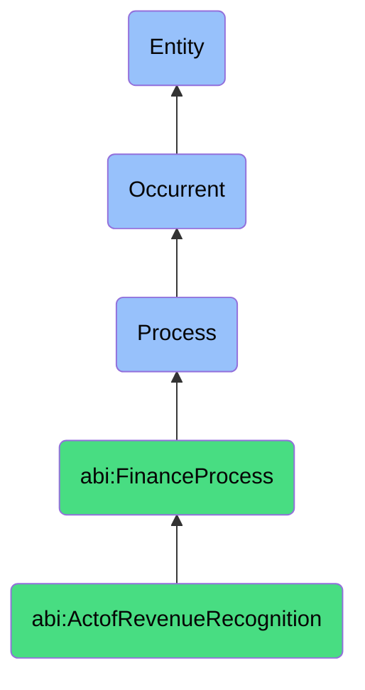

# ActofRevenueRecognition

## Definition
An act of revenue recognition is an occurrent process that unfolds through time, involving the formal acknowledgment and recording of revenue in financial statements according to applicable accounting standards, based on the completion of performance obligations, delivery milestones, passage of time, or usage metrics as specified in customer contracts, ensuring proper allocation of earnings to the appropriate accounting periods.

## Hierarchy in BFO


## Ontological Schema (TBox)
```turtle
abi:ActofRevenueRecognition a owl:Class ;
  rdfs:subClassOf abi:FinanceProcess ;
  rdfs:label "Act of Revenue Recognition" ;
  skos:definition "A process that recognizes revenue from contracts based on delivery, usage, or time-based milestones." .

abi:FinanceProcess a owl:Class ;
  rdfs:subClassOf bfo:0000015 ;
  rdfs:label "Finance Process" ;
  skos:definition "A time-bound activity related to the management, tracking, and optimization of financial resources and obligations." .

abi:has_recognition_agent a owl:ObjectProperty ;
  rdfs:domain abi:ActofRevenueRecognition ;
  rdfs:range abi:RecognitionAgent ;
  rdfs:label "has recognition agent" .

abi:recognizes_revenue_from_contract a owl:ObjectProperty ;
  rdfs:domain abi:ActofRevenueRecognition ;
  rdfs:range abi:RevenueContract ;
  rdfs:label "recognizes revenue from contract" .

abi:applies_accounting_standard a owl:ObjectProperty ;
  rdfs:domain abi:ActofRevenueRecognition ;
  rdfs:range abi:AccountingStandard ;
  rdfs:label "applies accounting standard" .

abi:identifies_performance_obligation a owl:ObjectProperty ;
  rdfs:domain abi:ActofRevenueRecognition ;
  rdfs:range abi:PerformanceObligation ;
  rdfs:label "identifies performance obligation" .

abi:confirms_delivery_milestone a owl:ObjectProperty ;
  rdfs:domain abi:ActofRevenueRecognition ;
  rdfs:range abi:DeliveryMilestone ;
  rdfs:label "confirms delivery milestone" .

abi:allocates_transaction_price a owl:ObjectProperty ;
  rdfs:domain abi:ActofRevenueRecognition ;
  rdfs:range abi:TransactionPrice ;
  rdfs:label "allocates transaction price" .

abi:records_in_financial_statement a owl:ObjectProperty ;
  rdfs:domain abi:ActofRevenueRecognition ;
  rdfs:range abi:FinancialStatement ;
  rdfs:label "records in financial statement" .

abi:has_recognition_date a owl:DatatypeProperty ;
  rdfs:domain abi:ActofRevenueRecognition ;
  rdfs:range xsd:date ;
  rdfs:label "has recognition date" .

abi:has_recognized_amount a owl:DatatypeProperty ;
  rdfs:domain abi:ActofRevenueRecognition ;
  rdfs:range xsd:decimal ;
  rdfs:label "has recognized amount" .

abi:has_accounting_period a owl:DatatypeProperty ;
  rdfs:domain abi:ActofRevenueRecognition ;
  rdfs:range xsd:string ;
  rdfs:label "has accounting period" .
```

## Ontological Instance (ABox)
```turtle
ex:OnboardingMilestoneRevenueRecognition a abi:ActofRevenueRecognition ;
  rdfs:label "Onboarding Milestone Revenue Recognition Process" ;
  abi:has_recognition_agent ex:RevenueAccountant ;
  abi:recognizes_revenue_from_contract ex:EnterpriseImplementationContract ;
  abi:applies_accounting_standard ex:ASC606Standard, ex:IFRS15Standard ;
  abi:identifies_performance_obligation ex:SystemImplementationObligation, ex:UserTrainingObligation ;
  abi:confirms_delivery_milestone ex:SystemConfigurationCompletion, ex:AdminUserTrainingDelivery ;
  abi:allocates_transaction_price ex:ImplementationFeeAllocation ;
  abi:records_in_financial_statement ex:Q1IncomeStatement ;
  abi:has_recognition_date "2023-03-31"^^xsd:date ;
  abi:has_recognized_amount "175000.00"^^xsd:decimal ;
  abi:has_accounting_period "Q1 2023" .

ex:SubscriptionUsageRevenueRecognition a abi:ActofRevenueRecognition ;
  rdfs:label "Monthly Subscription Usage Revenue Recognition Process" ;
  abi:has_recognition_agent ex:FinanceAssistant ;
  abi:recognizes_revenue_from_contract ex:SaaSSubscriptionAgreement ;
  abi:applies_accounting_standard ex:ASC606Standard ;
  abi:identifies_performance_obligation ex:SoftwarePlatformAccessObligation, ex:APIUsageObligation ;
  abi:confirms_delivery_milestone ex:MonthlyServiceDelivery, ex:APIConsumptionMeasurement ;
  abi:allocates_transaction_price ex:BaseSubscriptionAllocation, ex:UsageBasedAllocation ;
  abi:records_in_financial_statement ex:MonthlyRevenueReport ;
  abi:has_recognition_date "2023-10-31"^^xsd:date ;
  abi:has_recognized_amount "8500.00"^^xsd:decimal ;
  abi:has_accounting_period "October 2023" .
```

## Related Classes
- **abi:ActofBilling** - A process that typically precedes revenue recognition by issuing invoices.
- **abi:ActofContracting** - A process that establishes the agreement upon which revenue is recognized.
- **abi:ActofAccountsReceivableMonitoring** - A process that tracks payments for recognized revenue.
- **abi:FinancialReportingProcess** - A process that incorporates recognized revenue into financial reports.
- **abi:PerformanceObligationAssessmentProcess** - A process that evaluates completion of contract requirements. 