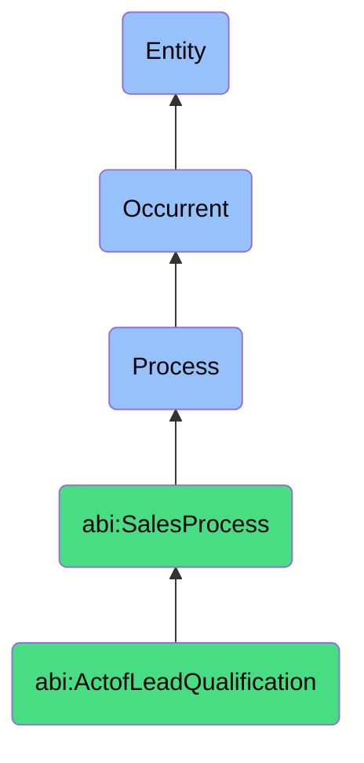

# ActofLeadQualification

## Definition
An act of lead qualification is an occurrent process that unfolds through time, involving the systematic evaluation and assessment of potential customers against predefined criteria such as fit, need, budget, authority, timing, and strategic alignment to determine their suitability for sales pipeline progression and resource investment, resulting in prioritization decisions that optimize sales efforts.

## Hierarchy in BFO


## Ontological Schema (TBox)
```turtle
abi:ActofLeadQualification a owl:Class ;
  rdfs:subClassOf abi:SalesProcess ;
  rdfs:label "Act of Lead Qualification" ;
  skos:definition "A process that determines whether a lead fits ideal criteria for sales pipeline progression." .

abi:SalesProcess a owl:Class ;
  rdfs:subClassOf bfo:0000015 ;
  rdfs:label "Sales Process" ;
  skos:definition "A time-bound interaction or conversion of relationships into economic transactions." .

abi:has_qualifier a owl:ObjectProperty ;
  rdfs:domain abi:ActofLeadQualification ;
  rdfs:range abi:LeadQualifier ;
  rdfs:label "has qualifier" .

abi:evaluates_lead a owl:ObjectProperty ;
  rdfs:domain abi:ActofLeadQualification ;
  rdfs:range abi:Lead ;
  rdfs:label "evaluates lead" .

abi:applies_qualification_criteria a owl:ObjectProperty ;
  rdfs:domain abi:ActofLeadQualification ;
  rdfs:range abi:QualificationCriteria ;
  rdfs:label "applies qualification criteria" .

abi:assesses_qualification_dimension a owl:ObjectProperty ;
  rdfs:domain abi:ActofLeadQualification ;
  rdfs:range abi:QualificationDimension ;
  rdfs:label "assesses qualification dimension" .

abi:uses_qualification_method a owl:ObjectProperty ;
  rdfs:domain abi:ActofLeadQualification ;
  rdfs:range abi:QualificationMethod ;
  rdfs:label "uses qualification method" .

abi:produces_qualification_result a owl:ObjectProperty ;
  rdfs:domain abi:ActofLeadQualification ;
  rdfs:range abi:QualificationResult ;
  rdfs:label "produces qualification result" .

abi:informs_sales_action a owl:ObjectProperty ;
  rdfs:domain abi:ActofLeadQualification ;
  rdfs:range abi:SalesAction ;
  rdfs:label "informs sales action" .

abi:has_qualification_timestamp a owl:DatatypeProperty ;
  rdfs:domain abi:ActofLeadQualification ;
  rdfs:range xsd:dateTime ;
  rdfs:label "has qualification timestamp" .

abi:has_qualification_score a owl:DatatypeProperty ;
  rdfs:domain abi:ActofLeadQualification ;
  rdfs:range xsd:decimal ;
  rdfs:label "has qualification score" .

abi:has_conversion_probability a owl:DatatypeProperty ;
  rdfs:domain abi:ActofLeadQualification ;
  rdfs:range xsd:decimal ;
  rdfs:label "has conversion probability" .
```

## Ontological Instance (ABox)
```turtle
ex:RevenueSizeICPMatchQualificationProcess a abi:ActofLeadQualification ;
  rdfs:label "Revenue and Team Size ICP Match Qualification Process" ;
  abi:has_qualifier ex:SalesAssistant ;
  abi:evaluates_lead ex:EnterpriseSoftwareLead, ex:MidMarketServiceProviderLead ;
  abi:applies_qualification_criteria ex:RevenueThresholdCriteria, ex:TeamSizeCriteria, ex:ICPAlignmentCriteria ;
  abi:assesses_qualification_dimension ex:BudgetDimension, ex:AuthorityDimension, ex:NeedDimension, ex:TimelineDimension ;
  abi:uses_qualification_method ex:ScoringMatrix, ex:DecisionTreeQualification ;
  abi:produces_qualification_result ex:QualifiedOpportunity, ex:NurtureTrackAssignment ;
  abi:informs_sales_action ex:AccountExecutiveAssignment, ex:SequentialOutreachPlan ;
  abi:has_qualification_timestamp "2023-09-18T11:45:00Z"^^xsd:dateTime ;
  abi:has_qualification_score "82.5"^^xsd:decimal ;
  abi:has_conversion_probability "0.65"^^xsd:decimal .

ex:BehavioralEngagementQualificationProcess a abi:ActofLeadQualification ;
  rdfs:label "Behavioral Engagement Qualification Process" ;
  abi:has_qualifier ex:MarketingQualificationEngine ;
  abi:evaluates_lead ex:WebinarAttendee, ex:ProductDemoRequestor ;
  abi:applies_qualification_criteria ex:EngagementScoreCriteria, ex:ContentConsumptionCriteria, ex:BuyingSignalCriteria ;
  abi:assesses_qualification_dimension ex:InterestDimension, ex:IntentDimension, ex:FitDimension ;
  abi:uses_qualification_method ex:BehavioralScoring, ex:PredictiveLeadScoring ;
  abi:produces_qualification_result ex:SalesReadyLead, ex:MarketingQualifiedLead ;
  abi:informs_sales_action ex:PriorityOutreachAction, ex:NurturePathAssignment ;
  abi:has_qualification_timestamp "2023-10-25T15:30:00Z"^^xsd:dateTime ;
  abi:has_qualification_score "73.0"^^xsd:decimal ;
  abi:has_conversion_probability "0.42"^^xsd:decimal .
```

## Related Classes
- **abi:ActofProspecting** - A process that identifies potential leads which then undergo qualification.
- **abi:ActofOutreach** - A process that initiates contact with leads before or after qualification.
- **abi:ActofMeeting** - A process that often follows qualification to further engage qualified leads.
- **abi:ActofDealCreation** - A process that formalizes opportunities after successful qualification.
- **abi:LeadScoringProcess** - A related process that quantifies lead value and readiness using scores. 